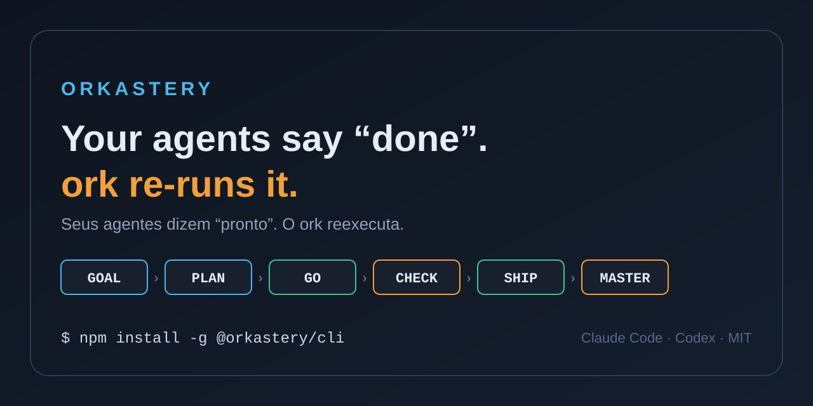
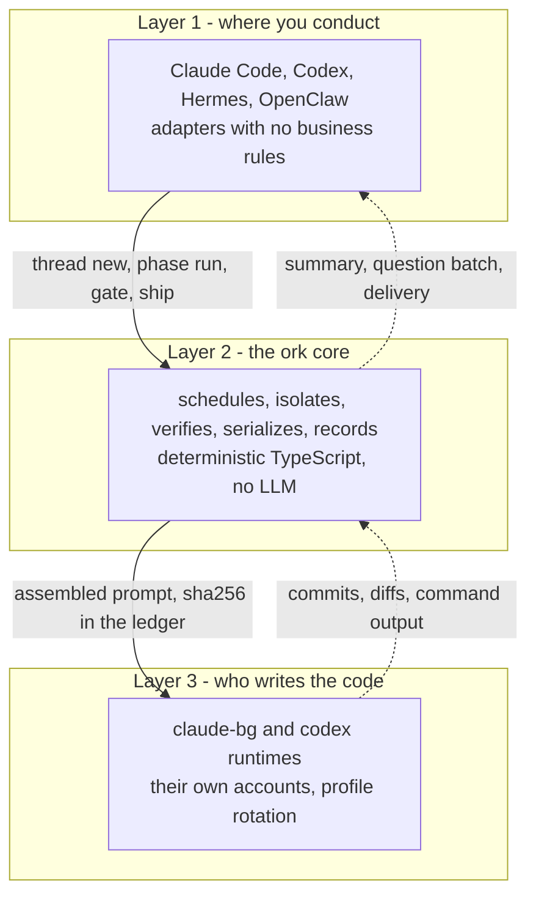
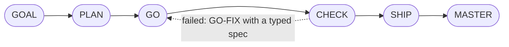

# Orkastery

**English** · [Português](README.pt-BR.md)

[](https://www.npmjs.com/package/@orkastery/cli) [](LICENSE)



> **In one sentence:** `ork` conducts AI coding agents (Claude Code and Codex) through parallel six-phase threads, checks every claim against the repository before it counts, and only calls you when the decision is really yours.

- **Status:** in daily use · on npm as [`@orkastery/cli`](https://www.npmjs.com/package/@orkastery/cli), with [changes per version](CHANGELOG.md) · reviewed on 2026-09-27
- **Proof:** GitHub CI on every PR: 1,553 core tests, 23 canaries and 18 skills with 193 assertions, zero failures (PR #28, 2026-09-27)
- **Product and roadmap:** [`docs/produto/`](docs/produto/README.md) and [`docs/roadmap/`](docs/roadmap/README.md), checked against the code by `ork docs verificar`
- **Language:** this page is the canonical entry point, mirrored in [Portuguese](README.pt-BR.md); the CLI and the docs are in Brazilian Portuguese today

```bash
npm install -g @orkastery/cli
ork demo          # 30 seconds: a false claim rejected, the fixed one accepted; no account, no model
ork doctor        # what holds on this machine right now; exits != 0 when blocked
ork init          # writes the orkastery.yaml for your repository
ork modos         # the four conduction modes
ork docs init     # product docs and roadmap in the standard, with lint
```

## Why it exists

- Coding agents got good. **Conducting agents did not.**
- Three agents in the same repository edit the same files, skip the same steps and hand over a report saying it worked. The report is the part that is worth nothing.
- Someone is missing between you and them: someone who holds the roadmap, isolates the loops, serializes the merge, re-runs the claim and only interrupts you when it matters.
- **`ork` takes that seat.** It is a deterministic TypeScript CLI, with no server and no embedded LLM.
- **Decisions sized for a full day.** Whoever conducts agents is also running dozens of other things. Every question `ork` brings you is short and organized, with alternatives and one recommendation, so you decide in seconds without rereading a wall of text. That lightness is a design goal, meant also for people with ADHD: it keeps you conducting instead of drowning.

## What changes for builders

| Without `ork` | With `ork` |
| --- | --- |
| The agent says the tests pass | `ork verify` re-runs the command on the real HEAD, and CI re-runs it again on a clean runner |
| You ask for status several times a day | An hourly summary says what is pending, urgent, blocking or critical |
| Every obvious decision becomes a question | The obvious one comes decided and reported; you change it if you want |
| The runtime account runs out and the roadmap stops | The same prompt continues on the next profile or on the fallback runtime |
| Two sessions step on the same file | One worktree per thread, and leases with a queue |
| The docs lie about the code | `ork docs verificar` fails the PR when a page drifts |

## How it works

Three layers, and business rules live only in the middle one:



### The thread: six phases no agent skips



| Phase | What it delivers | What `ork` requires to pass |
| --- | --- | --- |
| **GOAL** | Objective, done criteria, claims with a command | a claim without a command is refused (`claims.unverifiable`) |
| **PLAN** | Tasks, decisions, an executable verify per task | a plan without an executable verify does not become GO |
| **GO** | One atomic commit per task, in the thread's worktree | writing outside the worktree is blocked by a lease |
| **CHECK** | Verification against the baseline, plus independent CI | a failed claim becomes `claims.failed` or `verify.regression` |
| **SHIP** | Serialized merge with a proven push | only counts when `git ls-remote` matches the local SHA |
| **MASTER** | Typed postmortem and a conduction index | the index comes from the ledger; nobody types it |

### Four modes, chosen by #TAG

You write the #TAG in the request itself. The mode changes **where** the cycle waits for you; verifying the delivery is the same in all four.

| #TAG | Pauses | Cycle | What it is for |
| --- | --- | --- | --- |
| **#Classic** | 3 | `GOAL* / PLAN* / GO-CHECK* / SHIP-MASTER` | The `ork init` default: delicate premises |
| **#Maestro** | 1 | `GOAL-PLAN* / GO-CHECK-SHIP / MASTER` | A clear, quick solution |
| **#Auto** | 0 | `GOAL-PLAN-GO-CHECK-SHIP-MASTER` | Docs, studies, configuration, audits |
| **#Fast** | 0 | `GO` | A small, clear request that takes minutes; the push asks for authorization |

- `*` marks the block that pauses. Source of truth: `ork modos`.
- `#Look` and `#Ork` were retired on 2026-09-24 ([RM-043](docs/roadmap/RM-043-aposentadoria.md)); what was recorded with them stays readable forever.
- `#Fast` runs only GO, with a minimal proof: a focused test, a cheap claim or an absence declared in the ledger. It never authorizes a push on its own and never touches a public contract ([RM-042](docs/roadmap/RM-042-modo-fast.md)).

```text
The mode loosens the PAUSE. The mode NEVER loosens the VERIFICATION.
```

### Truth, not reports

- **A claim is a contract:** the statement, the file and the command that judges it, in `claims.jsonl`. There are even negative claims, checked by the command that would falsify them.
- **The baseline separates regression from debt:** `ork verify --baseline` records the world before GO.
- **Independent CHECK:** `ork ci prepare` exports the claims, and the GitHub `ork-verify` job re-runs them on the exact SHA.
- **Proven push:** by `git ls-remote`, never by the exit code of `git push`.
- **Prompt sha256 and the effective trio in the ledger:** the runtime, model and effort of each phase are facts, not statements.
- **19 typed gate reasons, each with its own retry action:** `ork retry policy`. `cost.violation` never gets an automatic retry.

### Layered human attention

- **Hourly summary:** how many items are pending, how many are urgent, how many block a thread, how many are critical, and "can I send them now?".
- **Batch:** with your yes, up to 5 objective questions at a time, each with alternatives a–d and one recommended; then up to 2 open ones, one at a time.
- **The obvious decision comes made:** `ork decisao registrar` keeps the why, how to change it and the cost of changing it now or later; you are informed.
- **An expired deadline waits or escalates, never approves.** An answer only counts with the HMAC proof of the authenticated channel; the agent never answers for you.
- **Times in your time zone:** `owner.timezone`, stated once per message.

### Runtimes and accounts

- **Two runtimes:** `claude-bg` (default) and `codex`, resolved by name in `core/src/runtimes.ts`; `ork setup` picks runtime, model and effort per block of each mode.
- **Accounts per profile:** `ork accounts add <id> --runtime R --dir D` runs the CLI's own login; `ork` never reads, copies or migrates a credential.
- **Rotation:** an exhausted quota or a lost login sends the same prompt to the next profile or to the block's fallback; a short rate limit waits in the queue.
- **Subscription only:** a paid key in the factory's environment is a `cost.violation`. Details and responsibilities in [SECURITY.md](SECURITY.md).

### Context and memory

- **Token gate:** decides between continuing in the session or opening another; without a measurement it does not rotate, and it says so.
- **Triaged handoff:** CRITICAL goes inline, IMPORTANT becomes a pointer with the moment to fetch it, SUMMARIZABLE goes with provenance.
- **Optional OrkMind:** with `memory: orkmind`, memory goes to the tenant's database; without it, it degrades to files with a typed reason.

### Documentation as code

- **Two versioned standards:** [product documentation](docs/padroes/documentacao-de-produto.md) and [product roadmap](docs/padroes/roadmap-de-produto.md), v1.1.
- **Three readers per page:** a person with ADHD (answer first, one idea per line), the parity checker, and AI agents (YAML frontmatter with stable IDs).
- **`ork docs verificar`:** fails a source, symbol, contract or command that no longer exists, a merge commit outside `main`, and incoherent status.
- **`ork docs sincronizar --escrever`:** writes only facts from the ledger and git (merge, phase) and regenerates tables and indexes.
- **In CI:** the `documentacao` job runs markdownlint and `ork docs verificar` on every PR.

## Install on your host

```bash
ork adapter list                     # the hosts and where each one installs
ork adapter install claude-code --dry-run
```

| Host | What gets installed |
| --- | --- |
| **claude-code** | A plugin with the catalog skills, phase subagents, the `/orkastery:ork` entry point and hooks |
| **codex** | The `$ork` entry point and the conduction catalog as project-local skills |
| **hermes** | A routing skill, the HITL ingress plugin and thread-opening scripts |
| **openclaw** | An extension with the `ork_*` tools, each one a CLI call |

- **Zero business rules in the host:** the #TAG becomes a mode because the host calls `ork modos --do-pedido`; the core validates it.
- **Installation with a receipt:** sha256 per file; a divergence on both sides asks for a decision, file by file.

## What exists today, and what does not

| Capability | Status |
| --- | --- |
| Threads, six phases, four modes, ledger, worktrees, leases, board | **works** |
| Claims, baseline, `verify` on the real HEAD, 19 typed reasons, GO-FIX | **works** |
| CI as an independent CHECK on the exact SHA | **works**; native protection of `main` depends on the GitHub plan ([RM-012](docs/roadmap/RM-012-ci-check-independente.md)) |
| `ork ship` with a proven push | **works** |
| Account rotation across profiles and runtimes | **works**; account state is still per project ([RM-040](docs/roadmap/RM-040-estado-de-conta-compartilhado.md)) |
| Layered HITL, a–d batch, decisions made and reported | **works** since 2026-09-24 ([RM-041](docs/roadmap/RM-041-hitl-invertido.md)); automatic hourly summary since 2026-09-25 ([RM-045](docs/roadmap/RM-045-pulse-enxuto.md)) |
| Documentation as code with parity in CI | **works** ([RM-044](docs/roadmap/RM-044-documentacao-como-codigo.md)) |
| `#Fast` mode: one phase, minimal proof, no push on its own | **works** since 2026-09-27 ([RM-042](docs/roadmap/RM-042-modo-fast.md)) |
| Roadmap item reservations across machines | **works** since 2026-09-27 ([RM-047](docs/roadmap/RM-047-fabrica-em-varias-maquinas.md)); thread state is still per machine |
| Stable local verify on a machine whose CPU the hypervisor steals | **does not exist**: on such a machine, the reliable proof is CI ([RM-037](docs/roadmap/RM-037-verify-rapido-e-confiavel.md)) |
| A `runtime_reported` measurement of the context window | **does not exist**: `claude-bg` does not expose context usage, and the gate says `unavailable` |
| Deterministic code graph | **planned** ([RM-031](docs/roadmap/RM-031-grafo-de-codigo.md)) |

The full picture, item by item and with git evidence, is in the [roadmap index](docs/roadmap/README.md).

## Verified in this tree

| Measure | Value | How to check |
| --- | --- | --- |
| Core tests | 1,553, zero failing (CI on 2026-09-27) | `npm --prefix core run test:ci` |
| Behavior canaries | 23, all green | `ork eval --so-canarios` |
| Skills corpus | 18 skills, 95 cases, 193 assertions | `ork eval --so-skills` |
| Product docs and roadmap | zero parity errors | `ork docs verificar` |
| Runtime dependencies | 4, pinned | `core/package.json` |

On a virtual machine whose CPU the hypervisor steals (the `steal` in `sar`), the local verify can overrun the tests' time windows. That is why the merge gate is the independent CI, and the fix is planned in [RM-037](docs/roadmap/RM-037-verify-rapido-e-confiavel.md).

## Documentation

The [docs home](docs/README.md) is organized by what you want to do now:

| Section | Start with |
| --- | --- |
| **Getting started** | [Quickstart](docs/comecar/quickstart.md): from zero to the first full cycle |
| **Guides** | [Modes](docs/guias/modos.md), [verification](docs/guias/verificacao.md), [human attention](docs/guias/sincronismo-hitl.md), [memory](docs/guias/memoria-e-handoff.md), [audits](docs/guias/auditoria.md) |
| **Reference** | [CLI](docs/referencia/cli.md) (the source is `ork --help`) and [contracts](docs/referencia/contratos/) |
| **Concepts** | [Overview](docs/conceitos/visao-geral.md) and [architecture](docs/conceitos/arquitetura.md) |
| **Product and roadmap** | [What exists](docs/produto/README.md) and [what comes next](docs/roadmap/README.md), checked against the code |

## Built with itself

- Orkastery is built with Orkastery: every change starts in a thread, with claims that CI re-runs on the exact SHA before the merge.
- Each thread's ledger stays on the machine that conducts it; what reaches this repository is the PR with the proof and the roadmap synced from git by `ork docs sincronizar`.
- More than one machine works in parallel: before starting, each one reserves the roadmap item (`ork roadmap pegar`), and two never take the same one.

## Ecosystem

| Project | What it is |
| --- | --- |
| **[orkastery](https://github.com/orkastery/orkastery)** | This repository: the `ork` core, the adapters, the skills and the auditors |
| **[OrkMind](https://github.com/orkastery/OrkMind)** | The memory layer: Postgres with pgvector, an ontology and tag search; optional |
| **orkastery-web** | The website and user docs, with the architecture one-pager |
| **[orkmind-web](https://github.com/orkastery/orkmind-web)** | The OrkMind web interface |

## Maestro in the conversation (code delivered, live activation pending)

- Say **`orkastery maestro`** in a host with the adapter installed: you get an overview with sources, gaps, threads, sessions, HITL and next actions. In the terminal: `ork maestro --json`.
- The query does not open work and does not grant a gate.
- **Top priority: HITL usability.** Questions in short bullets, with a recommendation and clear options; the UUID stays internal.
- Telegram is optional. There is no web control panel: Orkastery conducts in the conversation, and OrkMind keeps the knowledge.
- Status: code package delivered on 2026-09-19 (PR #13). Proof of activation in a new session per host is still pending ([RM-032](docs/roadmap/RM-032-bootstrap-maestro.md)).

## Credits and license

> **No metronome ever turned anyone into Bernstein.** Mastery is not tempo: it is knowing, after each performance, what you did, what it cost and how well it went, and being better at the next one. That is the phase we call MASTER, and it is why the project is called Orkastery (*or-KAS-te-ree*).

- Original implementation, [MIT](LICENSE) license, with [credit to those who came before](ATTRIBUTION.md).
- [Contributing](CONTRIBUTING.md) · [Security](SECURITY.md) · [Quickstart](docs/comecar/quickstart.md) · [Architecture](docs/conceitos/arquitetura.md)
