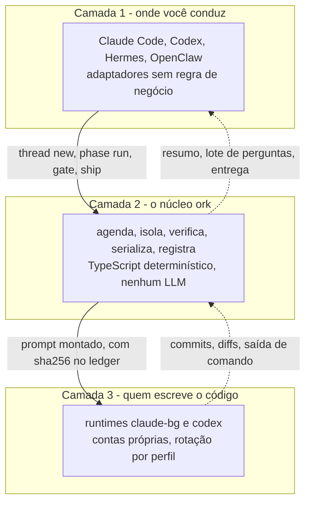
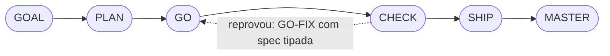

# Orkastery

[English](README.md) · **Português**

[](https://www.npmjs.com/package/@orkastery/cli) [](LICENSE)


> **Em uma frase:** o `ork` conduz agentes de IA (Claude Code e Codex) em threads paralelas de seis fases, confere cada afirmação contra o repositório antes de ela valer e só chama você quando a decisão é de fato sua.

- **Estado:** em uso diário · no npm como [`@orkastery/cli`](https://www.npmjs.com/package/@orkastery/cli), com as [mudanças por versão](CHANGELOG.md) · revisado em 27/09/2026
- **Prova:** CI no GitHub em todo PR: 2.733 testes do núcleo, 24 canários e 20 skills com 199 asserções, zero falhas (CI da `main` no PR #74, run 37102089623, 03/10/2026)
- **Produto e roadmap:** [`docs/produto/`](docs/produto/README.md) e [`docs/roadmap/`](docs/roadmap/README.md), conferidos contra o código por `ork docs verificar`
- **Idioma:** a página canônica é a [versão em inglês](README.md), e esta a espelha em português; o CLI e os docs estão em português do Brasil

```bash
npm install -g @orkastery/cli
ork demo          # 30 segundos: uma afirmação falsa reprovada e a corrigida aceita, sem conta nem modelo
ork doctor        # o que vale nesta máquina agora; sai != 0 se estiver bloqueado
ork init          # gera o orkastery.yaml; rode na raiz de um repositório git com pelo menos um commit
ork modos         # os quatro modos de condução
ork docs init     # documentação de produto e roadmap no padrão, com lint
```

## A primeira thread

O menor ciclo completo, no modo `#Fast` (uma fase só, o GO), logo depois do `ork init`. `<thread>` é o ID que o `ork thread new` imprime.

```bash
git add orkastery.yaml AGENTS.md && git commit -m "ork init"
ork thread new "pôr exclamação no greet" --modo fast
ork phase run <thread> GO --prompt "<o pedido>"      # o runtime do agente trabalha na worktree da thread
ork verify <thread>                                  # reexecuta as claims e o verify do manifesto no HEAD real
ork ship <thread> --para main --autorizar-push <você> # o #Fast nunca faz push sem a sua autorização
ork master <thread> --aceitar-omissao                # fecha a thread com o índice derivado do ledger
```

- Se o `phase run` parar com `runtime.workspace-untrusted`, rode `claude` uma vez na worktree, aceite a confiança e depois `ork retry run <thread>`. O `ork pulse` mostra a mesma instrução.
- Uma claim é o que o agente afirma mais o comando que a julga: `ork claims add <thread> <arquivo> --claim "<alegação>" --verificar "<comando>"`.

## Por que existe

- Agentes de código ficaram bons. **Conduzir agentes não ficou.**
- Três agentes no mesmo repositório editam os mesmos arquivos, pulam os mesmos passos e entregam um relatório dizendo que deu certo. O relatório é a parte que não vale nada.
- Falta alguém entre você e eles: que segure o roadmap, isole os loops, serialize o merge, reexecute a alegação e só interrompa você quando importa.
- **O `ork` ocupa esse lugar.** É um CLI determinístico, em TypeScript, sem servidor e sem LLM embutido.
- **Decisões do tamanho de um dia cheio.** Quem conduz agentes conduz também dezenas de outras frentes. Toda pergunta que o `ork` te traz é curta e organizada, com alternativas e uma recomendação, e se decide em segundos, sem reler um paredão de texto. Essa leveza é objetivo de projeto, pensado também para quem tem TDAH: é o que mantém você regendo, e não se afogando.

## O que muda para quem constrói

| Sem o `ork` | Com o `ork` |
| --- | --- |
| O agente diz que os testes passam | `ork verify` reexecuta o comando no HEAD real, e o CI reexecuta de novo num runner limpo |
| Você pergunta o status várias vezes por dia | Um resumo por hora diz o que está pendente, urgente, bloqueando ou crítico |
| Cada decisão óbvia vira pergunta | O óbvio vem decidido e informado; você muda se quiser |
| A conta do runtime esgota e o roadmap para | O mesmo prompt segue no próximo perfil ou no runtime de fallback |
| Duas sessões pisam no mesmo arquivo | Uma worktree por thread e leases com fila |
| A documentação mente sobre o código | `ork docs verificar` reprova o PR quando a página diverge |

## Como funciona

Três camadas, e a regra de negócio mora só no meio:



### A thread: seis fases que nenhum agente pula



| Fase | O que entrega | O que o `ork` exige para passar |
| --- | --- | --- |
| **GOAL** | Objetivo, critérios de pronto, claims com comando | claim sem comando é recusada (`claims.unverifiable`) |
| **PLAN** | Tarefas, decisões, verify executável por tarefa | plano sem verify executável não vira GO |
| **GO** | Um commit atômico por tarefa, na worktree da thread | escrita fora da worktree é barrada por lease |
| **CHECK** | Verificação contra a baseline e CI independente | claim reprovada vira `claims.failed` ou `verify.regression` |
| **SHIP** | Merge serializado com push provado | só vale quando `git ls-remote` bate com o SHA local |
| **MASTER** | POSTMORTEM tipado e índice de condução | o índice sai do ledger; ninguém digita |

### Quatro modos por #TAG

Você escreve a #TAG no próprio pedido. O modo muda **onde** o ciclo espera por você; a verificação da entrega é a mesma nos quatro.

| #TAG | Pausas | Ciclo | Para que serve |
| --- | --- | --- | --- |
| **#Classic** | 3 | `GOAL* / PLAN* / GO-CHECK* / SHIP-MASTER` | Padrão do `ork init`: premissas delicadas |
| **#Maestro** | 1 | `GOAL-PLAN* / GO-CHECK-SHIP / MASTER` | Solução clara e ágil |
| **#Auto** | 0 | `GOAL-PLAN-GO-CHECK-SHIP-MASTER` | Docs, estudos, configuração, auditoria |
| **#Fast** | 0 | `GO` | Pedido pequeno e claro, de minutos; o push pede autorização |

- `*` marca o bloco que pausa. Fonte de verdade: `ork modos`.
- `#Look` e `#Ork` foram aposentados em 24/09/2026 ([RM-043](docs/roadmap/RM-043-aposentadoria.md)); o que foi gravado neles continua legível para sempre.
- `#Fast` roda só a GO, com prova mínima: teste focado, claim barata ou ausência declarada no ledger. Não autoriza push sozinho e não toca contrato público ([RM-042](docs/roadmap/RM-042-modo-fast.md)).

```text
O modo afrouxa a PAUSA. O modo NUNCA afrouxa a VERIFICAÇÃO.
```

### Verdade, não relato

- **Claim é contrato:** alegação, arquivo e o comando que a julga, em `claims.jsonl`. Existe até alegação negativa, conferida pelo comando que a falsearia.
- **Baseline separa regressão de dívida:** `ork verify --baseline` grava o mundo antes do GO.
- **CHECK independente:** `ork ci prepare` exporta as claims e o job `ork-verify` do GitHub as reexecuta no SHA exato.
- **Push provado:** por `git ls-remote`, nunca pelo código de saída do `git push`.
- **Prompt com sha256 e trio efetivo no ledger:** runtime, modelo e esforço de cada fase são fato, não declaração.
- **22 motivos tipados de gate, cada um com a sua ação de retry:** `ork retry policy`. `cost.violation` nunca recebe retry automático.

### Atenção humana em camadas

- **Resumo por hora:** quantas pendências, quantas urgentes, quantas bloqueando uma thread, quantas críticas, e "posso mandar agora?".
- **Lote:** com o seu sim, até 5 perguntas objetivas por vez, cada uma com alternativas a–d e uma recomendada; depois até 2 abertas, uma por vez.
- **Decisão óbvia vem tomada:** `ork decisao registrar` guarda o porquê, como mudar e o custo de mudar agora ou depois; você é informado.
- **Prazo vencido espera ou escala, nunca aprova.** A resposta só vale com prova HMAC do canal autenticado; o agente nunca responde por você.
- **Horário no seu fuso:** `owner.timezone`, formato brasileiro, fuso dito uma vez por mensagem.

### Runtimes e contas

- **Dois runtimes:** `claude-bg` (padrão) e `codex`, resolvidos por nome em `core/src/runtimes.ts`; `ork setup` escolhe runtime, modelo e esforço por bloco de cada modo.
- **Contas por perfil:** `ork accounts add <id> --runtime R --dir D` roda o login do próprio CLI; o `ork` nunca lê, copia ou migra credencial.
- **Rotação:** cota esgotada ou login perdido mandam o mesmo prompt para o próximo perfil ou para o fallback do bloco; rate limit curto espera a janela na fila.
- **Só assinatura:** chave paga no ambiente da fábrica é `cost.violation`. Detalhe e responsabilidades em [SECURITY.md](SECURITY.md).

### Contexto e memória

- **Gate de tokens:** decide entre continuar na sessão ou abrir outra; sem medida, não rotaciona, e diz isso.
- **Handoff triado:** CRÍTICO vai inline, IMPORTANTE vira ponteiro com o momento de buscar, RESUMÍVEL vai com proveniência.
- **OrkMind opcional:** com `memory: orkmind`, a memória vai para a base do tenant; sem ela, degrada para arquivos com motivo tipado.

### Documentação como código

- **Dois padrões versionados:** [documentação de produto](docs/padroes/documentacao-de-produto.md) e [roadmap de produto](docs/padroes/roadmap-de-produto.md), v1.1.
- **Três leitores por página:** pessoa com TDAH (resposta primeiro, uma ideia por linha), verificador de paridade e agentes de IA (frontmatter YAML com IDs estáveis).
- **`ork docs verificar`:** reprova fonte, símbolo, contrato ou comando que não existe mais, commit de merge fora da `main` e estado incoerente.
- **`ork docs sincronizar --escrever`:** grava só fatos do ledger e do git (merge, fase) e regera tabelas e índices.
- **No CI:** o job `documentacao` roda o markdownlint e o `ork docs verificar` em todo PR.

## Instale no seu host

```bash
ork adapter list                     # os hosts e o destino de cada um
ork adapter install claude-code --dry-run
```

| Host | O que é instalado |
| --- | --- |
| **claude-code** | Plugin com as skills do catálogo, subagentes de fase, entrada `/orkastery:ork` e hooks |
| **codex** | Entrada `$ork` e catálogo de condução em skills locais do projeto |
| **hermes** | Skill roteadora, plugin de ingresso HITL e scripts de abertura de thread |
| **openclaw** | Extensão com as tools `ork_*`, cada uma uma chamada de CLI |

- **Zero regra de negócio no host:** a #TAG vira modo porque o host chama `ork modos --do-pedido`; quem valida é o núcleo.
- **Instalação com recibo:** sha256 por arquivo; divergência dos dois lados pede decisão, arquivo a arquivo.

## O que existe hoje e o que não existe

| Capacidade | Estado |
| --- | --- |
| Threads, seis fases, quatro modos, ledger, worktrees, leases, board | **funciona** |
| Claims, baseline, `verify` no HEAD real, 22 motivos tipados, GO-FIX | **funciona** |
| CI como CHECK independente no SHA exato | **funciona**; proteção nativa da `main` depende do plano do GitHub ([RM-012](docs/roadmap/RM-012-ci-check-independente.md)) |
| `ork ship` com push provado | **funciona** |
| Rotação de contas entre perfis e runtimes | **funciona**; estado da conta ainda é por projeto ([RM-040](docs/roadmap/RM-040-estado-de-conta-compartilhado.md)) |
| HITL em camadas, lote a–d, decisão tomada e informada | **funciona** desde 24/09/2026 ([RM-041](docs/roadmap/RM-041-hitl-invertido.md)); resumo automático de hora em hora desde 25/09/2026 ([RM-045](docs/roadmap/RM-045-pulse-enxuto.md)) |
| Documentação como código com paridade no CI | **funciona** ([RM-044](docs/roadmap/RM-044-documentacao-como-codigo.md)) |
| Verify local estável em máquina com CPU roubada pelo hipervisor | **não existe**: em máquina assim, a prova confiável é o CI ([RM-037](docs/roadmap/RM-037-verify-rapido-e-confiavel.md)) |
| Medida `runtime_reported` da janela de contexto | **não existe**: o `claude-bg` não expõe uso de contexto, e o gate diz `unavailable` |
| Modo `#Fast`: uma fase, prova mínima, sem push sozinho | **funciona** desde 27/09/2026 ([RM-042](docs/roadmap/RM-042-modo-fast.md)) |
| Reservas de item do roadmap entre máquinas | **funciona** desde 27/09/2026 ([RM-047](docs/roadmap/RM-047-fabrica-em-varias-maquinas.md)); o estado das threads ainda é por máquina |
| Grafo determinístico de código | **funciona** na CLI (`ork grafo`: índice, atualização incremental, consultas e contexto da thread, com a proveniência de cada aresta), em quem instala pelo npm desde a 0.5.3; as tools MCP e a dica no pedido da fase ficam atrás da flag `grafo.mcp`, desligada por padrão ([RM-031](docs/roadmap/RM-031-grafo-de-codigo.md)) |

O quadro completo, item por item e com evidência do git, está no [índice do roadmap](docs/roadmap/README.md).

## Verificado nesta árvore

| Medida | Valor | Como conferir |
| --- | --- | --- |
| Testes do núcleo | 2.733, zero falhando (CI de 03/10/2026) | `npm --prefix core run test:ci` |
| Canários de comportamento | 24, todos verdes | `ork eval --so-canarios` |
| Corpus das skills | 20 skills, 101 casos, 199 asserções | `ork eval --so-skills` |
| Documentação de produto e roadmap | zero erro de paridade | `ork docs verificar` |
| Dependências de runtime | 9, com versão fixa | `core/package.json` |

Em máquina virtual com CPU roubada pelo hipervisor (o `steal` do `sar`), o verify local pode estourar as janelas de tempo dos testes. Por isso o portão de merge é o CI independente, e a correção está planejada em [RM-037](docs/roadmap/RM-037-verify-rapido-e-confiavel.md).

## Documentação

A [página inicial dos docs](docs/README.md) organiza tudo pelo que você quer fazer agora:

| Seção | Comece por |
| --- | --- |
| **Começar** | [Quickstart](docs/comecar/quickstart.md): do zero ao primeiro ciclo completo |
| **Guias** | [Modos](docs/guias/modos.md), [verificação](docs/guias/verificacao.md), [atenção humana](docs/guias/sincronismo-hitl.md), [memória](docs/guias/memoria-e-handoff.md), [auditoria](docs/guias/auditoria.md) |
| **Referência** | [CLI](docs/referencia/cli.md) (a fonte é `ork --help`) e [contratos](docs/referencia/contratos/) |
| **Conceitos** | [Visão geral](docs/conceitos/visao-geral.md) e [arquitetura](docs/conceitos/arquitetura.md) |
| **Produto e roadmap** | [O que existe](docs/produto/README.md) e [o que vem](docs/roadmap/README.md), conferidos contra o código |

## Construído com ele mesmo

- O Orkastery é construído com Orkastery: cada mudança nasce numa thread, com claims que o CI reexecuta no SHA exato antes do merge.
- O ledger de cada thread fica na máquina que conduz; o que chega a este repositório é o PR com a prova e o roadmap sincronizado a partir do git por `ork docs sincronizar`.
- Mais de uma máquina trabalha em paralelo: antes de começar, cada uma reserva o item do roadmap (`ork roadmap pegar`), e duas nunca pegam o mesmo.

## Ecossistema

| Projeto | O que é |
| --- | --- |
| **[orkastery](https://github.com/orkastery/orkastery)** | Este repositório: o núcleo `ork`, os adaptadores, as skills e os auditores |
| **[OrkMind](https://github.com/orkastery/orkmind)** | A camada de memória: Postgres com pgvector, ontologia e busca por tag; opcional |
| **[orkastery.com](https://github.com/orkastery/orkastery.com)** | Site e documentação para usuários |
| **[orkmind.com](https://github.com/orkastery/orkmind.com)** | O site do OrkMind |

<!-- maestro-i32:begin -->
## Maestro na conversa (I-32: código entregue, ativação live pendente)

- Diga **`orkastery maestro`** no host com o adaptador instalado: sai um panorama com fontes, lacunas, threads, sessões, HITL e próximas ações. No terminal: `ork maestro --json`.
- A consulta não abre trabalho e não concede gate.
- **Prioridade máxima: usabilidade HITL.** Perguntas em tópicos curtos, com recomendação e opções claras; o UUID fica interno.
- Telegram é opcional. Sem controle web: o Orkastery conduz na conversa, e o OrkMind conserva o conhecimento.
- Estado: pacote de código entregue em 19/09/2026 (PR #13). A prova de ativação em sessão nova por host continua pendente ([RM-032](docs/roadmap/RM-032-bootstrap-maestro.md)).
<!-- maestro-i32:end -->

## Créditos e licença

> **Nenhum metrônomo transformou alguém em Bernstein.** Maestria não é andamento: é saber, depois de cada apresentação, o que você fez, quanto custou e quão bem foi feito, e ser melhor na próxima. Essa é a fase que chamamos de MASTER, e é por isso que o projeto se chama Orkastery.

- Implementação original, licença [MIT](LICENSE), com [crédito a quem veio antes](ATTRIBUTION.md).
- [Contribuir](CONTRIBUTING.md) · [Segurança](SECURITY.md) · [Quickstart](docs/comecar/quickstart.md) · [Arquitetura](docs/conceitos/arquitetura.md)
