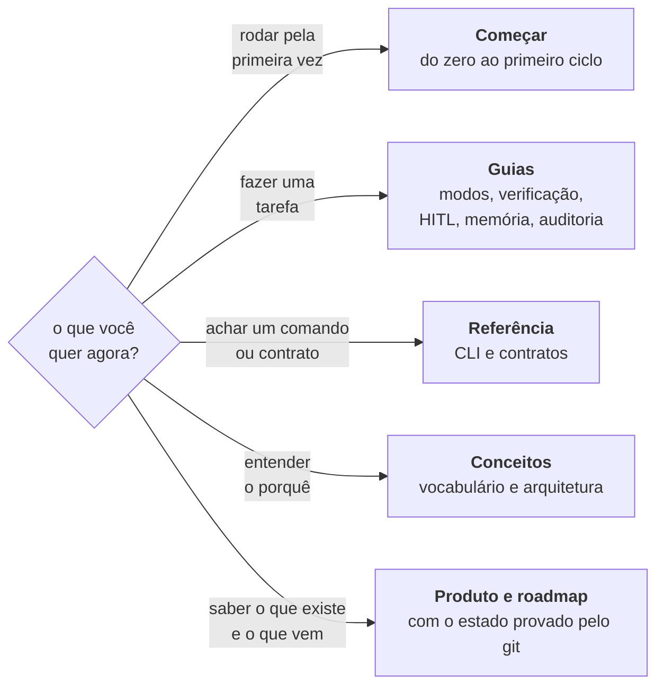

# Documentação do Orkastery

> **Em uma frase:** tudo o que você precisa para usar, entender e contribuir com o `ork`, organizado pelo que você quer fazer agora.

Se você ainda não sabe o que o produto faz, comece pelo [README](../README.md).

## Por onde entrar

## Começar

| Página | O que você leva |
| --- | --- |
| [Quickstart](comecar/quickstart.md) | Instalar, gerar o manifesto e fazer o primeiro ciclo completo |

## Guias

Cada guia resolve uma tarefa, com os comandos na ordem em que você vai usar.

| Guia | Use quando |
| --- | --- |
| [Modos de condução](guias/modos.md) | Você não sabe qual #TAG usar, ou quer entender o `#Fast` |
| [Verificação](guias/verificacao.md) | Você quer saber por que uma claim reprovou, e o que o retry faz |
| [Atenção humana (HITL)](guias/sincronismo-hitl.md) | Uma sessão parou esperando você, ou você quer o resumo por hora |
| [Memória e handoff](guias/memoria-e-handoff.md) | A janela de contexto encheu, ou você quer ligar o OrkMind |
| [Auditoria](guias/auditoria.md) | Você quer manter o produto saudável ao longo do tempo |
| [Onboarding do projeto](guias/onboarding.md) | Você está trazendo um repositório novo para o `ork` |
| [Várias máquinas](guias/varias-maquinas.md) | Você conduz o mesmo produto de mais de um computador, ou com mais de um builder |

## Referência

| Página | O que tem |
| --- | --- |
| [CLI](referencia/cli.md) | Todos os comandos, por tarefa (a fonte é `ork --help`) |
| [Contratos](referencia/contratos/) | Os contratos versionados que outros sistemas leem |
| [Capacidades do Maestro](referencia/maestro-capacidades.json) | O que cada host pode e não pode fazer, com a evidência de cada capacidade |

## Conceitos

| Página | O que explica |
| --- | --- |
| [Visão geral](conceitos/visao-geral.md) | O vocabulário inteiro em uma página: thread, bloco, fase, claim, lease |
| [Arquitetura](conceitos/arquitetura.md) | As três camadas, o mapa dos módulos e os fluxos de despacho e entrega |
| [Diagramas](conceitos/diagramas/README.md) | O ciclo, o espectro de modos, o paralelismo e os auditores em imagem |

## Produto e roadmap, como código

Produto e roadmap vivem em páginas com frontmatter, conferidas contra o código e o git em todo PR
(`ork docs verificar`).

| Documento | Para que serve |
| --- | --- |
| [Produto](produto/README.md) | O que o Orkastery é e faz hoje: plataforma, sistemas, módulos e features, com as fontes no código |
| [Roadmap](roadmap/README.md) | Um arquivo por item, com as sete dimensões de estado, o commit do merge e quem está com ele |
| [Padrões](padroes/documentacao-de-produto.md) | As regras de escrita e leitura para pessoa, verificador e agente |

## Governança

| Documento | Para que serve |
| --- | --- |
| [Contribuir](../CONTRIBUTING.md) | Como contribuir, o que um bom PR traz e como uma versão é publicada |
| [Segurança](../SECURITY.md) | Como reportar vulnerabilidade, e qual é a superfície real do produto |
| [Código de conduta](../CODE_OF_CONDUCT.md) | Como a comunidade se trata |
| [Créditos](../ATTRIBUTION.md) | A quem publicou primeiro as ideias em que o produto se apoia |
| [Mudanças por versão](../CHANGELOG.md) | O que mudou em cada versão publicada no npm |
| [Licença](../LICENSE) | MIT |
