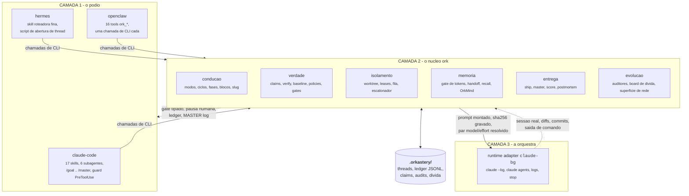
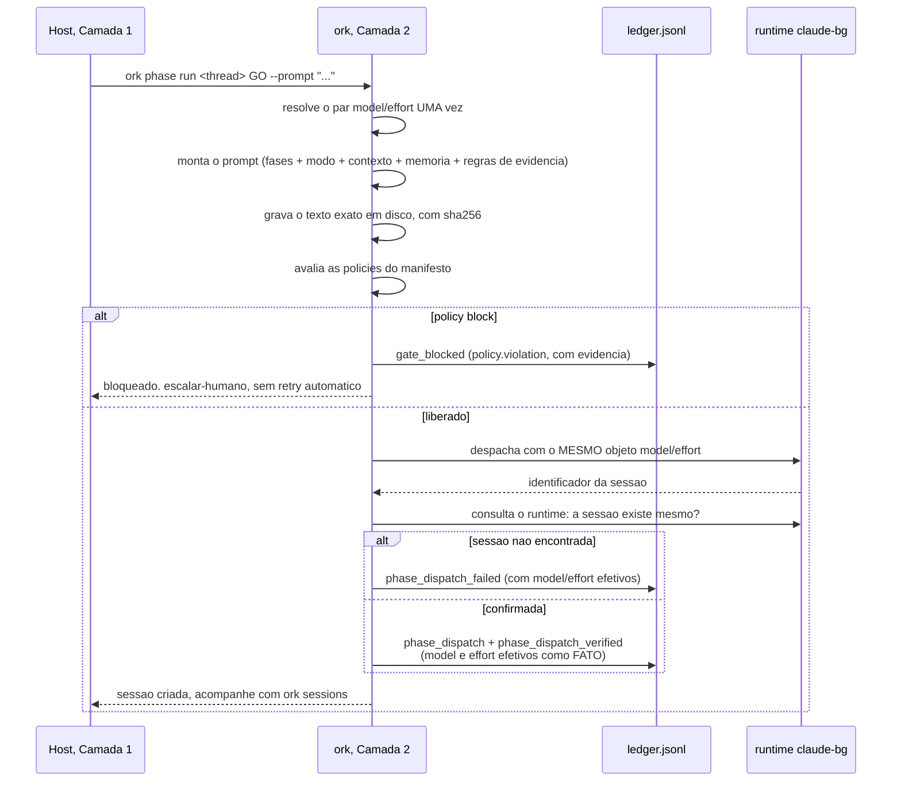
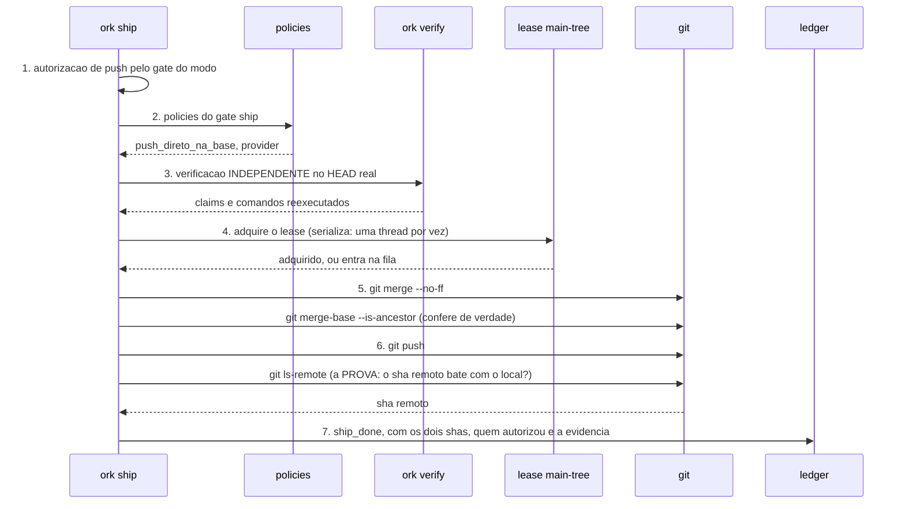
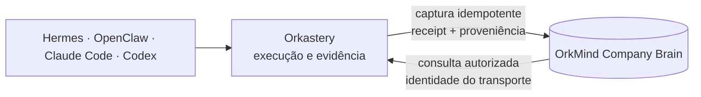

# Arquitetura

O Orkastery é um **núcleo CLI determinístico** com adaptadores nas duas pontas. Não há LLM
dentro do núcleo, não há servidor, não há banco obrigatório e não há dependência de runtime.

---

## 1. As três camadas



### Por que a fronteira é exatamente essa

| Camada | Pode | Não pode |
| --- | --- | --- |
| **1, host** | Apresentar gates, coletar o pedido, chamar o `ork` | Ter regra de negócio, validar modo, decidir gate |
| **2, núcleo** | Montar prompt, medir, verificar, serializar, registrar | Escrever código de produto, chamar LLM |
| **3, runtime** | Escrever cada linha de código | Decidir se o que escreveu vale |

A #TAG do pedido é extraida **pelo núcleo** (`ork modos --do-pedido`), mesmo quando quem
pergunta e o host. A validação contra `conduction.allowed_modes` também e do núcleo. Isso
existe para que dois hosts nunca divirjam sobre o que `#Maestro` significa.

---

## 2. O estado em disco

Tudo que o `ork` sabe está em arquivos legiveis, versionaveis e auditaveis.

```text
<projeto>/
├── orkastery.yaml                    # o manifesto: fonte unica, limite duro de 16 KB
├── .orkastery/
│   ├── threads/<id>/
│   │   ├── thread.json               # estado: modo, blocos, fase, base carimbada, sessoes
│   │   ├── ledger.jsonl              # APPEND-ONLY: toda decisao, com quem, evidencia e razao
│   │   ├── claims.jsonl              # alegacoes verificaveis e o comando que julga cada uma
│   │   ├── prompts/<slug>-<fase>-<sha8>.md   # o texto EXATO despachado, com sha256 no nome
│   │   ├── handoff.json              # triagem em 3 niveis, com proveniencia (mais o historico)
│   │   ├── POSTMORTEM.json           # classe de falha das 9 fixas, licoes
│   │   └── master-log.json           # contrato congelado ork.master-log/v1
│   ├── audits/<rodada>/              # prompt, achados, relatorio e ledger da rodada
│   ├── divida/board.jsonl            # board de divida APPEND-ONLY, com recorrencia
│   └── leases/                       # leases ativos, com TTL, e as filas por colisao
├── core/                             # o nucleo TypeScript
├── adapters/                         # os adaptadores de host (Camada 1)
├── skills/                           # as 17 skills finas do catalogo
├── references/                       # referencias de metodo citadas pelas skills
├── prompts/                          # templates de prompt do projeto (sobrescrevem os embutidos)
├── auditors/                         # templates dos packs de auditoria do projeto
└── eval/                             # canarios de comportamento e corpus das skills
```

Duas propriedades que valem mais do que parecem:

- **Append-only onde importa.** Ledger, claims e board de dívida só crescem. Uma claim retirada
  fica no histórico, com o motivo da retirada. História que pode ser reescrita não é auditoria.
- **Sem estado escondido.** Não há banco obrigatório, não há daemon, não há cache que só o
  produto entende. Se você quiser saber o que aconteceu, o `cat` resolve.

---

## 3. O núcleo, módulo por módulo

42 módulos em `core/src/`, cerca de 19.800 linhas de TypeScript. São agrupados aqui pelo papel,
não pela ordem alfabética.

### Condução

| Módulo | Papel |
| --- | --- |
| `index.ts` | O CLI: parse de argumentos e roteamento dos subcomandos |
| `modos.ts` | A matriz dos modos vivos, os aposentados que continuam sendo lidos, os invariantes e o parse da #TAG |
| `ciclos.ts` | As 5 variantes de ciclo e o que cada uma exige |
| `phase.ts` | Montagem do prompt da fase, despacho, reverificacao e leitura do ledger |
| `slug.ts` | O slug de 3 partes, a regex canonica e a rotação de sessão |
| `thread.ts` | Estado da thread em disco, base carimbada, pausas, listagem |
| `prompts.ts` | Templates de prompt, render e lint |
| `manifest.ts` | Leitura e validação do manifesto |
| `yaml.ts` | Leitor do subconjunto de YAML do manifesto, **sem dependência externa** |

### Verdade

| Módulo | Papel |
| --- | --- |
| `claims.ts` | Alegações verificaveis por thread, e a regra da alegação negativa |
| `verify.ts` | Reexecucao no HEAD real, baseline e classificação regressão versus dívida |
| `gates.ts` | O catálogo dos 12 motivos tipados e o registro de autorização humana |
| `policies.ts` | As policies do manifesto, executaveis, por gate e por severidade |
| `sandbox.ts` | Limites de execução dos comandos de verificação |

### Isolamento e paralelismo

| Módulo | Papel |
| --- | --- |
| `worktree.ts` | Worktree por thread: `ensure`, `sync`, `audit`, `release` |
| `leases.ts` | Leases com aquisição atômica e TTL, e a fila FIFO por colisão |
| `board.ts` | A visão única (`--all`) e o escalonador (`plan`) |
| `sessoes.ts` | Cruza o runtime real com o que as threads registraram |

### Memória e continuidade

| Módulo | Papel |
| --- | --- |
| `tokens.ts` | O gate de tokens: medida honesta da janela e veredito de rotação |
| `handoff.ts` | Triagem em 3 níveis, proveniência com sha256, e o recall dos ponteiros |
| `recall.ts` | Recuperação tardia por `retrieve_when`, com e sem OrkMind |
| `memoria.ts` | A camada de memória do projeto e a injeção por fase |
| `orkmind.ts` | Cliente do OrkMind como **adaptador**, com degradação tipada |

### Entrega

| Módulo | Papel |
| --- | --- |
| `ship.ts` | Merge `--no-ff` serializado, verificado, e push provado por `ls-remote` |
| `master.ts` | POSTMORTEM tipado, MASTER log no contrato congelado, score e batch |
| `ledger.ts` | O ledger JSONL append-only por thread |

### Autonomia

| Módulo | Papel |
| --- | --- |
| `retry.ts` | A política de retry tipada por motivo, e a retomada automática |
| `ratelimit.ts` | A fila **durável** de rate limit, com horário de reset |
| `fix.ts` | GO-FIX e CHECK-REVERIFY, com veredito por correção |

### Evolução e evidência

| Módulo | Papel |
| --- | --- |
| `auditoria.ts` | Os 7 packs, o estágio que os ativa e a postura de cada um |
| `auditrun.ts` | Rodada de auditoria: prompt, despacho, ingestão de achados, relatório |
| `divida.ts` | O board de dívida append-only e a recorrência |
| `superficie.ts` | Varredura deterministica da superfície de ataque de rede (SP8 a SP12) |
| `canarios.ts` | Os 6 canários de comportamento |
| `evalrunner.ts` | O corpus das skills finas e o runner de avaliação |
| `catalogo.ts` | O catálogo de skills e referências, com sha256 por arquivo |

### Contratos de inteligência (KG1)

| Módulo | Papel |
| --- | --- |
| `intelligence-graph-contract.ts` | Contrato `ork.code-artifact-graph/v1`: identidade canônica, proveniência por aresta e ACL, sem I/O |
| `intelligence-benchmark-contract.ts` | Contrato `ork.graph-benchmark/v1`: registro A/B e veredito puro, sem executar modelo |

### Ambiente e hosts

| Módulo | Papel |
| --- | --- |
| `doctor.ts` | Checks de ambiente, manifesto, abbrev, custo, memória e sessões |
| `init.ts` | Detecção do repositório e geração do `orkastery.yaml` |
| `hosts.ts` | Instalação dos adaptadores de Camada 1, com recibo e sha256 |
| `adapters/claude-bg.ts` | O runtime adapter: `claude --bg`, `claude agents`, logs e stop |
| `types.ts`, `util.ts` | Tipos compartilhados e utilitarios (exec, tabela, JSONL) |

---

## 4. O caminho de um despacho, passo a passo



O detalhe que carrega peso: o par `model`/`effort` e resolvido **uma única vez** e o **mesmo
objeto** vai ao runtime adapter e ao ledger. Isso torna impossível o ledger dizer um modelo e o
`claude --bg` receber outro.

---

## 5. O caminho de uma entrega



Qualquer passo que reprove grava `ship_blocked` com **motivo tipado**, e não avança. A ordem
dos sete passos e contrato e não muda por modo de condução.

---

## 6. O que o Orkastery deliberadamente não faz

Saber o que um produto recusa a ser diz mais do que a lista de features.

- **Não chama LLM.** O núcleo não tem cliente de API, não tem chave e não tem prompt de
  sistema próprio para si mesmo. Ele monta prompt para os outros.
- **Não contorna runtime.** Nada de spoofing de harness, extração de token OAuth ou
  compartilhamento de credencial. A rotação automática entre contas do mesmo runtime só
  acontece entre perfis que o próprio operador cadastrou e autenticou pelo CLI oficial, por
  esgotamento de cota, crédito ou limite do plano, nunca no rate limit comum e nunca por perfil
  de API paga (decisão do dono de 19/09/2026, em [SECURITY.md](../../SECURITY.md)). A policy
  `provider` bloqueia despacho redirecionado para provider pago quando a política declarada e
  `subscription-only`.
- **Não inventa metrica.** Onde a medida não existe, sai `unavailable`, e a decisão que
  dependia dela não é tomada. Uma lacuna nunca vira zero.
- **Não escreve fora da worktree da thread.** O lease e o guard do host impedem, e o
  `worktree audit` sai diferente de zero se a árvore divergir.
- **Não aceita self-report.** Nem do agente, nem do auditor, nem do próprio `ork` sobre o seu
  despacho.

---

## 7. Decisões de projeto, e o preço de cada uma

| Decisão | Ganho | Preço aceito |
| --- | --- | --- |
| Zero dependência de runtime | Instala em qualquer lugar com Node 20, sem árvore de deps para auditar | Um leitor de YAML próprio, restrito ao subconjunto do manifesto |
| Estado em arquivos, não em banco | `cat`, `grep` e `git diff` funcionam. Auditável sem ferramenta | Consulta pesada exige a camada OrkMind, que é opcional |
| CLI, não daemon | Sem processo residente, sem porta, sem superfície de ataque própria | Não há push de evento: o host consulta |
| OrkMind como adaptador | O produto funciona inteiro sem ele | Duas implementacoes de recall para manter coerentes, e um teste de degradação para cada uma |
| Motivos tipados, não mensagens | Retry, metrica e auditoria automatizaveis | Toda falha nova exige um motivo novo declarado, não uma string |
| Fases fixas, modos flexíveis | O método não se dilui | Quem quer pular uma fase precisa de outra ferramenta |

---

## 8. Company Brain no corte C1

O Company Brain não substitui o estado local do Ork nem transforma o OrkMind em autoridade de execução. Ele acrescenta uma superfície governada de conhecimento com duas direções explícitas:



O schema versionado distingue entidades, relações, eventos e referências. `prod → proj → init` conserva a identidade do portfólio; a dimensão legada `project` não é reinterpretada. Captura da factory inclui fases, HITL, decisões, resultados, claims e artefatos com origem e chave idempotente.

Leitura e escrita têm autoridades diferentes. A identidade vem do transporte autenticado. Escrita exige revisão esperada quando o registro é editável; versões anteriores permanecem em histórico append-only. No fluxo protegido do Ork, ativação exige hash do plano, aceite explícito, lease, receipt e readback. `reconcile` e `rollback` não apagam o evento original.

O B1 roda sobre PostgreSQL, sem fixture nem fallback em produção, com documentos e decisões nativos, referências fixadas e CAS transacional com `SELECT ... FOR UPDATE`.

Escopo ainda não entregue: B3–B7, K3–K7, cuidadores, Atlas, ponte semântica de dados e world model. A arquitetura completa desses cortes permanece no plano, não no contrato vigente.

## 9. Grafo determinístico no KG1

O [RM-031](../roadmap/RM-031-grafo-de-codigo.md) quer que as fases peçam só o contexto de que
precisam, por um grafo local de código e documentos. O KG1 entrega a primeira de três coisas
distintas, e só ela:

| Camada | O que é | Estado no KG1 |
| --- | --- | --- |
| Contrato | [grafo](../referencia/contratos/grafo-deterministico-kg1.md) e [benchmark](../referencia/contratos/benchmark-grafo-kg1.md) versionados, validação pura e corpus sintético | entregue |
| Serviço | extração, índice, consulta, incremental e consumo pelas fases (KG2 a KG5) | não existe |
| Evidência de economia | registro `measured` do benchmark, com recibos revisados | não existe |

O grafo é projeção descartável: não substitui o estado em arquivos do Ork nem o Company
Brain. O contrato do grafo não é emitido como evento do OrkMind e não amplia o schema
`orkmind.company-brain/v1`, que fica byte a byte. O caminho determinístico não usa vetor,
embedding nem similaridade; a busca semântica opcional do OrkMind continua separada.
Contrato válido não prova economia: só um registro medido, completo e aprovado pelo veredito
do benchmark pode sustentar essa afirmação.
