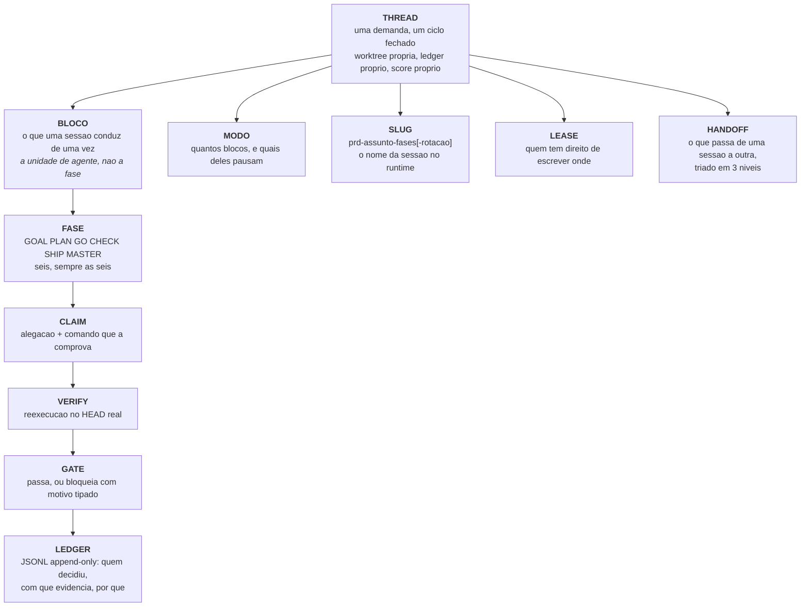

# Conceitos: o vocabulário do Orkastery

Uma página. Se um termo aparece em qualquer lugar do produto, ele está definido aqui.

---

## O mapa mental, em um diagrama



---

## Thread

Uma **looping thread** é uma demanda inteira conduzida como um ciclo fechado. Ela tem:

- um `id` (`prd-corrigirofil`), derivado do manifesto e do nome que você deu;
- uma **base carimbada**: a branch e o sha de onde ela nasceu, gravados no momento zero;
- uma **worktree git própria**, quando `worktree.por_thread` está ligado;
- um `ledger.jsonl` append-only é um `claims.jsonl`;
- um **modo de condução** e, opcionalmente, uma **variante de ciclo**;
- um **score humano** de 0 a 5 ao fim, sem exceção.

Estado em disco: `.orkastery/threads/<id>/`.

## Fase

As seis fases canonicas, e o que cada uma se compromete a entregar:

| Fase | Digito | Contrato |
| --- | --- | --- |
| `GOAL` | F1 | Objetivo verificável, impact map, critérios de sucesso, claims com comando. Não implementa. |
| `PLAN` | F2 | Tarefas, `touch_paths`, decisões D1..Dn com domicílio único, verify executável por tarefa. Não implementa. |
| `GO` | F3 | Implementação fatia por fatia, um commit atômico por tarefa, dentro da worktree da thread. |
| `CHECK` | F4 | Verificação contra a baseline (regressão versus dívida pré-existente), review, testes, segurança, performance. |
| `SHIP` | F5 | Merge serializado, push provado por comando, roadmap atualizado, plano de rollback. |
| `MASTER` | F6 | MASTER log com postmortem tipado, lições e o score humano. |

São **sempre seis**. Nenhum modo remove uma fase; os modos apenas agrupam fases em blocos.

## Bloco

Um **bloco** e o conjunto de fases que uma sessão de agente conduz de uma vez. Esta é a
distinção que mais confunde quem vem de outras ferramentas:

```text
A unidade de agente e o BLOCO, nao a fase.
```

No `#Classic`, `GO-CHECK` e um bloco: uma sessão só, que implementa e verifica, e depois para
e espera o veredito humano sobre as evidências. É por isso que o ledger grava o par
`model`/`effort` **por bloco**: e ali que o modelo efetivamente rodou.

Um bloco tem um `slugFases` (`goal`, `f34`, `full`) e uma marca de pausa: se ele para e espera
humano, e sobre o que espera.

## Modo de condução

Quatro modos, do mais vigiado ao mais autônomo, escolhidos por uma **#TAG no próprio pedido**.
Detalhe em [`modos.md`](../guias/modos.md).

| #TAG | Blocos | Pausas |
| --- | --- | --- |
| `#Classic` | 4 | 3 |
| `#Maestro` | 3 | 1 |
| `#Auto` | 1 | 0 |
| `#Fast` | 1 (só a GO) | 0 |

`#Look` e `#Ork` foram aposentados pela I-43. Escrever qualquer um dos dois recebe recusa
tipada; thread e recibo já gravados neles continuam sendo lidos para sempre.

**O modo afrouxa a pausa, nunca a verificação.** Fonte de verdade: `ork modos`.

## Variante de ciclo

Muda como a thread **nasce**, sem mexer em gate nenhum (`ork thread new --ciclo <variante>`):

| Variante | O que muda | Muda os blocos do modo |
| --- | --- | --- |
| `greenfield` | Começo do zero, worktree isolada obrigatória, partindo da base do manifesto | não |
| `merge-branch` | Parte de uma branch que já existe (`--branch`), sem criar branch nova | não |
| `goal-plan` | Funde GOAL e PLAN num bloco só: uma pausa a menos quando o modo os separava | **sim** |
| `gap` | Análise de lacuna: sem GO e sem SHIP. A lacuna é publicada como lacuna | **sim** |
| `feature-xl-faseada` | Feature grande em fatias: o PLAN se compromete com N fatias verificaveis | não |

## Slug de 3 partes

O nome da sessão no runtime, e o único identificador que você lê o dia inteiro:

```text
prd-corrigirofil-f34-2
 |        |       |  |
 |        |       |  +-- rotacao (opcional): a enesima sessao deste bloco, pelo gate de tokens
 |        |       +----- fases do bloco: goal | plan | go | check | ship | master | f34 | full
 |        +------------- assunto, ate 12 caracteres [a-z0-9], sem hifen interno
 +---------------------- produto: project.abbrev, ate 3 caracteres [a-z0-9]
```

A parte 2 não tem hífen interno **de propósito**: e o que mantém o parse determinístico. A
regex canonica é aplicada em toda geração e em todo `--slug` que você passar na mão.

Você olha `claude agents`, vê `prd-corrigirofil-f34-2`, e sabe: produto `prd`, assunto do
filtro, bloco GO-CHECK, segunda sessão do bloco.

## Claim

Uma **alegação verificável**: o que a fase afirma, mais o comando que julga a afirmação.

```bash
ork claims add <thread> src/relatorio.ts \
  --claim "o filtro respeita o fuso do usuario" \
  --verificar "npm test -- relatorio"
```

Existe **alegação negativa**: "isto nunca acontece". Ela é verificada pelo comando que a
falsearia. Uma claim sem comando é recusada com o motivo `claims.unverifiable`, e retirar uma
claim exige motivo, que fica no histórico.

## Baseline

O estado do mundo **antes do GO**, gravado por `ork verify --baseline`. Ela existe para
separar duas coisas que quase todo pipeline confunde:

- **regressão** (`verify.regression`): o comando passava antes e falha agora. E defeito desta
  thread, e tem alvo conhecido.
- **dívida pré-existente**: já falhava antes. E anotada, e **não imputada a thread da vez**.

Sem baseline, o motivo e `verify.failed`: o `ork` diz que o comando falhou, e não chuta de quem
e a culpa.

## Gate e motivo tipado

Um **gate** é um ponto do ciclo em que o `ork` decide se passa. Quando reprova, ele nunca
escreve prosa: escreve um dos **12 motivos tipados**, e cada motivo tem uma ação de retry
determinada. Ver [`verificacao.md`](../guias/verificacao.md).

Uma **pausa humana** e outra coisa: e o gate do modo, esperando a resposta ao pedido que
`ork gate request` abre. A resposta chega pelo canal autenticado e vai ao ledger com o assunto,
quem autorizou e o canal.

## Ledger

`.orkastery/threads/<id>/ledger.jsonl`, append-only. E a rastreabilidade da condução: toda
decisão autonoma precisa estar ali com **quem decidiu, com que evidência é por que**.

Alguns tipos de evento: `thread_created`, `phase_dispatch`, `phase_dispatch_verified`,
`autonomous_decision`, `human_gate`, `gate_blocked`, `gate_passed`, `claim_added`,
`baseline_recorded`, `verify_run`, `lease_acquired`, `lease_queued`, `ship_started`,
`ship_done`, `ship_blocked`, `token_gate`, `handoff_exported`, `handoff_recalled`,
`worktree_synced`, `postmortem_recorded`, `master_done`.

## Lease

Quem tem direito de escrever ou executar onde, com **TTL** e aquisição atômica. Seis famílias:

| Família | Protege |
| --- | --- |
| `main-tree` | A árvore de destino. **E o único gate de merge**: uma thread mergeia por vez |
| `worktree-write:<thread>` | A worktree de uma thread específica |
| `path:<glob>` | Uma região do código (`path:core/src/**`) |
| `board:<card>` | Um card do board |
| `service:<porta>` | Uma porta de serviço local |
| `exec:<thread>` | A **condução**: a execução na worktree da thread, um condutor por vez em qualquer canal (I-36) |

Famílias diferentes nunca colidem. Dentro de `path`, a colisão e por glob. Quem colide entra
numa **fila FIFO**, e não escreve por cima. A `exec` é diferente: quem chega depois recebe na
hora a recusa `conducao.em-andamento`, com quem conduz, e espera a vez só se pedir `--esperar`.

## Gate de tokens

Ao fim de cada bloco, antes do próximo despacho: **continuar na mesma sessão ou abrir uma
nova?** A decisão depende da ocupação da janela, e a **fonte da medida** e declarada:

| Fonte | O que e |
| --- | --- |
| `runtime_reported` | O runtime adapter sabe ler o uso de contexto. O `claude-bg` **ainda não sabe** |
| `estimated` | Há transcript em disco: estimativa por tamanho, com método e janela nominal declarados |
| `informada` | O host ou o operador passou a ocupação explicitamente (`--ocupacao`) |
| `unavailable` | Nada sabe medir. **Não rotaciona**, e o ledger diz que decidiu por ausência de medida |

Número inventado não entra aqui em nenhuma hipótese.

## Handoff e ponteiro

Quando o gate manda abrir sessão nova, a sessão que abre **não** recebe cópia integral da
anterior. Ela recebe um handoff triado:

| Nível | Vai como | Exemplo |
| --- | --- | --- |
| **CRÍTICO** | Inline, sempre | estado do mundo, decisões locked, critérios de sucesso, claims pendentes, baseline |
| **IMPORTANTE** | **Ponteiro** `path#ancora`, com `retrieve_when` | o relatório inteiro do CHECK anterior |
| **RESUMÍVEL** | Resumo curto, com proveniência | histórico de tentativas, logs, exploração já concluída |

Todo item carrega `source`, `location` e o `sha256` do arquivo de origem. Um **ponteiro** é um
endereço, não um conteúdo: `ork recall --fase CHECK` resolve só os ponteiros daquele momento,
e um ponteiro pedido fora do momento volta **sem o conteúdo**.

## Regime de memória

| Regime | O que e |
| --- | --- |
| `files` | O fallback honesto: handoff por arquivos, ponteiro `path#ancora`, recall por leitura dirigida |
| `orkmind` | A camada semântica do [OrkMind](https://github.com/orkastery/OrkMind) por cima, com busca por tag |

A degradação de `orkmind` para `files` tem **motivo tipado**, e o ciclo não para por causa
dela. `ork memory status` mostra o regime efetivo. Ver [`memoria-e-handoff.md`](../guias/memoria-e-handoff.md).

## POSTMORTEM e MASTER log

Duas peças que fecham toda thread:

- **`POSTMORTEM.json`**: o corpo estruturado, com **classe de falha das nove fixas**
  (`sem-falha`, `erro-de-spec`, `base-avancou`, `conflito`, `rate-limit`, `modelo`, `processo`,
  `scope-creep`, `outra`). Classe livre vira texto solto, e texto solto não agrega.
- **`master-log.json`**: o MASTER log no **contrato congelado** `ork.master-log/v1`. Os nomes
  dos campos são o contrato e não mudam. Mudar contrato exige versão nova, não campo novo.

## Score

Um número de 0 a 5, dado por um humano, com **justificativa obrigatória**, respondendo:

> De 0 a 5, quão inteligentemente isso foi entregue?

Metrica diz o custo. O score diz se o **caminho** foi esperto. Nos modos sem pausa de MASTER,
a entrega e aceita por omissao, com o indice derivado do ledger (`ork master`), e a nota
humana, quando vier, sobrescreve.

## Policy

Regras do manifesto que o `ork` **executa**, por gate e por severidade:

| Policy | Padrão | O que barra |
| --- | --- | --- |
| `provider` | `block` | Despacho redirecionado para provider pago quando a política e `subscription-only` |
| `segredo_em_prompt` | `block` | Segredo entrando no texto do prompt |
| `push_direto_na_base` | `block` | Push direto na branch base, sem passar pelo `ship` |

Severidade `block` para **qualquer** modo, inclusive o `#Auto`.

## Pack de auditoria

Um conjunto de regras que um auditor periódico aplica ao código ou ao ledger. São sete, e o
`stage` do manifesto decide quais estão ativos. Ver [`auditoria.md`](../guias/auditoria.md).

## Canario

Um cenário de comportamento que reproduz um jeito conhecido de a condução falhar. São seis, e
rodam em `ork eval --so-canarios`: `fx-happy`, `fx-hallucination`, `fx-stale-base`,
`fx-wiki-destroy`, `fx-schema-drift`, `fx-concurrency`.

## Skill fina

Uma instrução de método em markdown (`skills/<familia>/<nome>/SKILL.md`), com corpus de
avaliação próprio. São 17, com 87 casos e 174 assercoes, e rodam em `ork eval --so-skills`.
Skill sem corpus não entra no catálogo.

## Host e runtime

Duas coisas diferentes que usam o mesmo nome com frequência:

- **Host** (Camada 1): de onde você conduz. `claude-code`, `hermes`, `openclaw`. Zero regra de
  negócio: traduz intenção em chamada de `ork`.
- **Runtime** (Camada 3): quem executa e escreve código. Hoje o adapter `claude-bg`, que
  despacha `claude --bg`.

O Claude Code aparece nos dois papéis. Confundir os dois e o erro clássico.

<!-- maestro-i32:begin -->
## Maestro universal (I-32, candidato em GO)

`orkastery maestro` abre o panorama na conversa. Snapshot é projeção com origem,
instante e cobertura, sem autoridade própria. Thread sem objective, sessão órfã e
catálogo sem demanda vinculada são lacunas diferentes; o núcleo não infere vínculos.

Independência é vínculo de sessões/papéis comprovados, inclusive no mesmo harness.
Envelopes legados continuam legíveis e preservam seus hashes; um nome de runtime
não substitui evidência. A sessão executora não aprova gate nem revisa a si mesma.

Usabilidade HITL é prioridade máxima: tópicos, recomendação e escolhas compreensíveis,
com pedido/conexão correlacionados, resposta literal e cancelamento. Telegram é opcional;
ingresso indisponível não vira aceite. Permissão nativa de ferramenta não é gate humano.

Sem controle web. Orkastery conduz o trabalho; OrkMind conserva conhecimento e memória.
Testes simulados, verificação oficial, SHIP, ativação e publicação são evidências distintas.
<!-- maestro-i32:end -->
