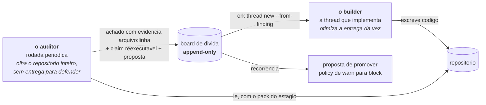
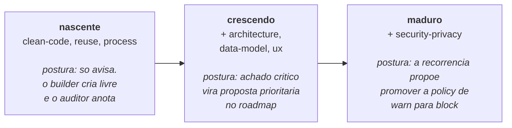

# Auditores periodicos, board de dívida e superfície de ataque

Um produto conduzido por agentes acumula dívida rápido, e por um motivo específico: o agente
otimiza a entrega da vez. Ele não lembra que já existe um utilitário que faz aquilo, não vê
que a mesma regra agora mora em dois módulos, e não percebe que a quarta rota nasceu sem
autenticação porque as três primeiras nasceram assim.

Os auditores periodicos existem para isso: **um segundo olhar, determinístico onde da, com
evidência obrigatória sempre**.

---

## 1. A premissa não negociável: quem cria não julga



O auditor **não conserta**. Ele acha, prova e propõe. Quem conserta é uma thread nova, aberta a
partir do achado, que passa pelo mesmo ciclo de seis fases que qualquer outra demanda.

E o auditor também **não tem direito a self-report**:

```bash
ork audit verify <rodada>     # reexecuta as claims dos achados
```

Um achado cuja claim não sobrevive a reexecucao não entra no board como verdade.

---

## 2. Hardening gradual por estágio

Cobrança de produto maduro em produto nascente mata a velocidade. Leniência de nascente em
produto maduro mata o produto. O `stage` do manifesto decide quais packs estão ativos.



```yaml
project:
  stage: nascente     # nascente | crescendo | maduro
```

```bash
ork audit packs                    # os 7 packs, o estagio que ativa cada um, e o que vale aqui
ork audit packs --pack reuse       # as regras de um pack, com a evidencia exigida por regra
```

A promoção de `warn` para `block` não é automática e não é opinião: **dois achados da mesma
regra propoem um controle, três propoem um bloqueante**. A recorrência e o argumento.

---

## 3. Os sete packs

### `clean-code` (ativo desde: nascente, fonte: código)

Legibilidade e manutenibilidade do código novo, sem reescrever o que já funciona.

| Regra | O que acha |
| --- | --- |
| `CC1` | Função ou arquivo muito acima da mediana do próprio repositório, sem razão declarada |
| `CC2` | Bloco idêntico repetido em 3 ou mais lugares |
| `CC3` | Nome que mente: a função faz o que o nome não diz, ou faz mais do que promete |
| `CC4` | Erro engolido: catch vazio, promise sem tratamento, código de saída ignorado |
| `CC5` | Comentário que descreve o "o que" (já óbvio no código) em vez do "por que" |

Repare no `CC1`: a mediana e **do próprio repositório**, não um número mágico de 50 linhas. Um
auditor que traz o padrão de outro projeto gera ruído, e ruído treina o time a ignorar achado.

### `reuse` (ativo desde: nascente, fonte: código)

Impedir que o produto cresça reimplementando o que ele mesmo já tem. **A dívida mais cara e a
mais silenciosa.**

| Regra | O que acha |
| --- | --- |
| `RU1` | Utilitário novo que reimplementa um utilitário já existente no repositório |
| `RU2` | Componente de interface duplicado fora do design system do produto |
| `RU3` | Dependência nova para fazer o que a stack já instalada faz |
| `RU4` | Regra de negócio repetida em dois módulos (fonte dupla de verdade) |

### `architecture` (ativo desde: crescendo, fonte: código)

| Regra | O que acha |
| --- | --- |
| `AR1` | Dependência ciclica entre módulos |
| `AR2` | Camada violada: o núcleo importando adaptador, a interface importando implementação |
| `AR3` | Responsabilidade sem dono único: a mesma decisão tomada em dois lugares |
| `AR4` | Acoplamento por estado global mutável entre módulos que deveriam ser independentes |
| `AR5` | Fronteira externa sem contrato tipado (entrada ou saída em `any` ou dicionário solto) |

### `data-model` (ativo desde: crescendo, fonte: código)

Evitar que o esquema fique impossível de corrigir depois que há dado real dentro.

| Regra | O que acha |
| --- | --- |
| `DM1` | Índice único que ignora soft-delete (a linha apagada continua bloqueando a nova) |
| `DM2` | Migração sem rollback declarado |
| `DM3` | Relação sem integridade referencial declarada no banco |
| `DM4` | Coluna nullable que o código trata como obrigatória, ou o contrário |
| `DM5` | Desnormalizacao sem dono declarado da sincronização |

### `ux` (ativo desde: crescendo, fonte: código)

Cobrir os estados que o builder não vê na sessão feliz de criação.

| Regra | O que acha |
| --- | --- |
| `UX1` | Estado vazio ausente: a lista sem itens não explica nada |
| `UX2` | Estado de erro sem ação de saída |
| `UX3` | Ação demorada sem retorno visual de progresso |
| `UX4` | Acessibilidade abaixo do mínimo: foco invisível, alvo sem rótulo, contraste insuficiente |
| `UX5` | Ação destrutiva sem confirmação nem desfazer |

### `security-privacy` (ativo desde: maduro, fonte: código)

O pack que só entra quando há usuário real, porque e quando dado de gente de verdade passa a
estar em jogo. Doze regras: segurança de código, LGPD, e a superfície de ataque de rede.

| Regra | O que acha |
| --- | --- |
| `SP1` | Segredo em código, em log ou em arquivo versionado (o trecho e omitido de propósito na evidência) |
| `SP2` | LGPD: dado pessoal em log, telemetria ou mensagem de erro |
| `SP3` | LGPD: dado pessoal armazenado sem prazo de retenção declarado |
| `SP4` | LGPD: coleta sem base legal registrada |
| `SP5` | LGPD: direito de exclusão sem caminho executável |
| `SP6` | Entrada de fronteira externa usada sem validação |
| `SP7` | Dependência com vulnerabilidade conhecida no manifesto de pacotes |
| `SP8` a `SP12` | Superfície de ataque de rede. Ver a seção 5 |

### `process` (ativo desde: maduro, fonte: **ledger**)

O único pack que audita o **método**, e não o produto. Ele lê o ledger, os POSTMORTEMs e os
MASTER logs, e propõe mudança no próprio Orkastery.

| Regra | O que acha |
| --- | --- |
| `PR1` | Entrega sem MASTER log (uma entrega sem MASTER log não aconteceu) |
| `PR2` | Thread entregue sem score humano registrado |
| `PR3` | O mesmo motivo tipado de gate reprovando de novo, em threads diferentes |
| `PR4` | Claim não-verificável recorrente: a fase alega e não declara como comprovar |
| `PR5` | Decisão autonoma sem evidência declarada no ledger |
| `PR6` | Classe de falha recorrente no POSTMORTEM sem controle correspondente |

O `PR3` é o mais interessante: se o mesmo motivo tipado reprova repetidamente em threads
diferentes, o problema não é a thread. E o método, ou o prompt, ou a skill.

---

## 4. Uma rodada de auditoria, de ponta a ponta

```bash
ork audit prompt <pack> [--since 7d]     # o prompt exato do pack, com o sha256 que vai ao ledger
ork audit run <pack> [--since 7d] [--dry-run]
ork audit list                           # as rodadas do projeto
ork audit show <rodada> [--ledger]       # contexto, achados e propostas
ork audit verify <rodada>                # reexecuta as claims dos achados
ork audit report <rodada> [--publicar]   # relatorio com o bloco OBRIGATORIO de propostas
```

### O contrato de um achado

Nenhum achado entra no board sem estas seis coisas:

| Campo | Por que é obrigatório |
| --- | --- |
| **evidência `arquivo:linha`** | Sem endereço, o achado não é verificável |
| **impacto** | Sem impacto, não da para priorizar |
| **fix sugerido** | Sem proposta, o achado e reclamação |
| **estimativa** | Sem custo, não entra em roadmap |
| **passo irreversível** | O que nesta correção não tem volta |
| **claim reexecutavel** | O comando que prova o achado, e que o `audit verify` roda de novo |

```bash
ork audit finding add <rodada> --regra RU1 --titulo "..." \
  --arquivo core/src/divida.ts:45 --impacto "..." --fix "..." --estimativa 2h \
  --severidade maior --verificar "grep -n ..."

ork audit ingest <rodada> --arquivo achados.json    # em lote, o que o auditor escreveu
```

### Governança de custo

Auditor roda sozinho, periodicamente, e custa. O manifesto declara a janela:

```yaml
audit:
  janela_ociosa: "22:00-06:00"   # fora dela, a rodada so anda com --agora <quem>
  effort: eco
  since_padrao: 7d
```

Fora da janela ociosa da assinatura, a rodada exige `--agora "<quem autorizou>"`. O auditor não
decide sozinho gastar no seu horário de trabalho.

---

## 5. Superfície de ataque de rede: SP8 a SP12

Esta é a parte do pack `security-privacy` que **não usa LLM nenhum**. E uma varredura
deterministica, e roda em qualquer lugar, inclusive em CI.

```bash
ork audit surface [<dir>] [--regra SP9] [--limite N] [--json]
ork audit surface --registrar <rodada>     # grava os achados no board da rodada
```

Ela sai com código diferente de zero quando há achado, então serve como gate de pipeline
diretamente.

### O que ela reconhece

Frameworks: **express, fastify, hono, koa, NestJS, Next.js, FastAPI, Flask, Django, gin,
echo**. Para cada definição de rota encontrada, confere a presença de guarda de autenticação,
limite de taxa, esquema de validação e restrição de rede, **no bloco da rota** e no arquivo.

| Regra | O que acha | Exemplo de achado real |
| --- | --- | --- |
| `SP8` | Rota sem camada de autenticação ou autorização | `rota POST /pedidos exposta sem camada de autenticacao` |
| `SP9` | Endpoint de administração ou operação exposto: admin, console, debug, swagger/openapi, health detalhado, metadados de cluster | `GET /debug/pprof exposto sem restricao de rede nem oAuth` |
| `SP10` | Rota sem limite de taxa, sujeita a brute-force, enumeração e DDoS de aplicação | `rota POST /login sem limite de taxa num caminho sujeito a brute-force` |
| `SP11` | CORS permissivo demais: origem global com credenciais habilitadas | `CORS com origem global E credenciais habilitadas` |
| `SP12` | Rota sem esquema de validação do payload na borda | `rota POST /pedidos sem esquema de validacao do payload na definicao` |

O `SP12` complementa o `SP6`: o `SP6` olha o **uso** do dado dentro do handler, o `SP12` olha a
**borda**, onde o payload entra.

### Três decisões estruturais

1. **A detecção roda sem LLM.** Localiza a definição de rota por framework e confere marcadores.
   Deterministica: mesma entrada, mesma saída, sempre.
2. **Detector e claim nunca divergem.** O comando de reexecucao de cada achado sai da **mesma
   lista de marcadores** que a detecção usou. Não existem duas listas para sair de sincronia.
3. **Incerteza e declarada, não escondida.** Onde a leitura não da confiança (middleware não
   reconhecido, framework não identificado, marcador presente no arquivo mas fora do bloco da
   rota), o achado sai com confiança `baixa`, severidade `menor`, e o título diz **REQUER
   CONFIRMAÇÃO HUMANA**.

Falso positivo disfarçado de certeza e o defeito que esse módulo existe para evitar. Um
scanner em que ninguém confia é um scanner que ninguém roda.

---

## 6. O board de dívida

Append-only, em `.orkastery/divida/board.jsonl`.

```bash
ork audit divida [--pack P] [--todos]
ork audit finding estado F3 resolvido     # aberto | adiado | resolvido | descartado
```

```text
  ID   PACK   REGRA  SEVERIDADE  CLAIM       ESTADO        EVIDENCIA               TITULO
  F1   reuse  RU1    maior       verificado  resolvido     core/src/divida.ts:45   divida.ts reimplementa o armazem jsonl das claims
  F3   reuse  RU1    menor       verificado  aberto        core/src/phase.ts:101   hashDoPrompt reimplementa sha256DoTexto de handoff.ts
  F5   reuse  RU1    menor       verificado  virou-thread  core/src/auditrun.ts:832 tabelaDoLedgerDaRodada reimplementa tabelaDoLedger
```

Quatro estados, e um deles e a ponte de volta para o ciclo:

| Estado | Significa |
| --- | --- |
| `aberto` | Achado válido, ainda não tratado |
| `adiado` | Decisão consciente de não tratar agora |
| `resolvido` | Corrigido, com a claim reexecutada |
| `descartado` | Não procede, com motivo |
| `virou-thread` | Uma thread foi aberta a partir dele |

### Do achado a thread

```bash
ork thread new "extrair o sha256 para util" --from-finding F3 --modo classic
```

A evidência, a claim e a proposta **viajam junto**. A thread nasce sabendo qual comando prova
que o problema existia, e o CHECK dela usa o mesmo comando para provar que não existe mais.

---

## 7. O board deste repositório, agora

O Orkastery roda os próprios auditores contra o próprio código, e o resultado está publicado.

- **F1 a F8** são achados do pack `reuse` contra `core/src/`, reais e nossos. Três estão
  resolvidos, um virou thread, e os outros continuam **abertos**, no board, com evidência
  `arquivo:linha`. Nenhum foi apagado por conveniência.
- **F9 a F21** são achados de `security-privacy` contra `eval/fixtures/superficie-de-rede/`,
  que são **arquivos deliberadamente vulneráveis**, escritos para provar que a varredura acha o
  que promete achar. Eles ficam no board porque o board e append-only, e o campo de arquivo
  diz claramente que são fixtures.

Essa distinção esta aqui de propósito. Um board de dívida que mistura defeito de produto com
fixture de teste seria exatamente o tipo de número enfeitado que este produto existe para
recusar.

## Processo desde nascente

`ork audit process --json` verifica entrega sem MASTER (PR1), entrega sem
ratificação humana (PR2) e o mesmo motivo de gate em threads diferentes (PR3).
`--registrar` materializa evidência e proposta no board, com comando reexecutável
por achado. MASTER proposto satisfaz a presença do log, mas continua pendente
de score humano. A postura em `nascente` é `warn`.
