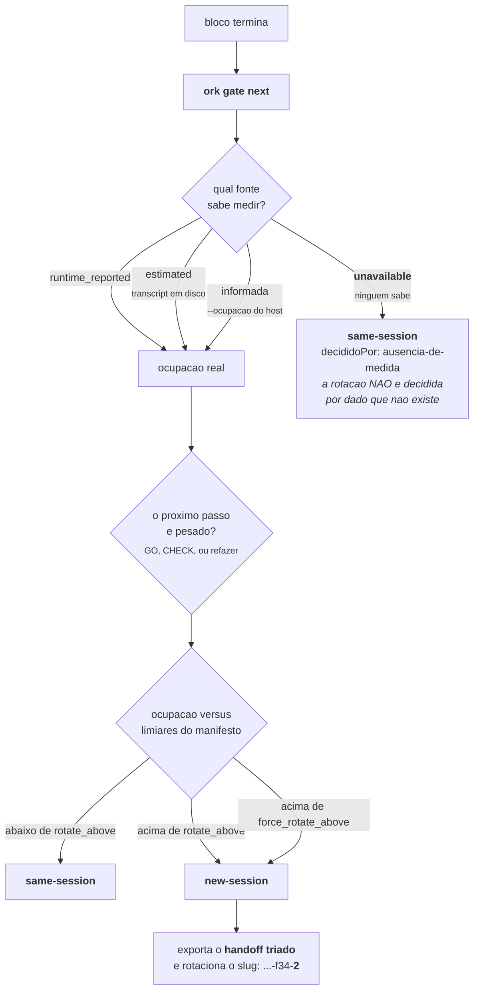
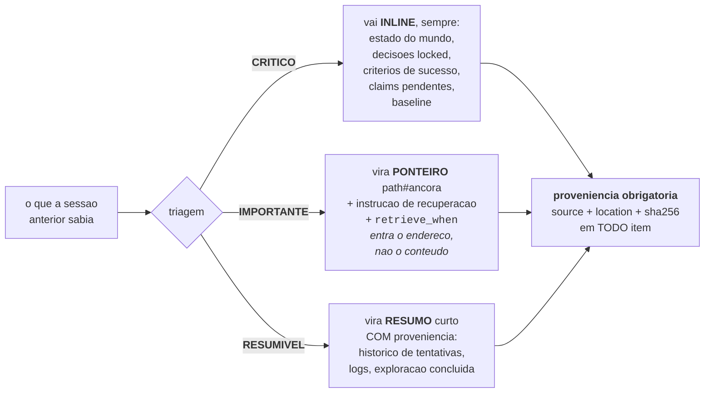
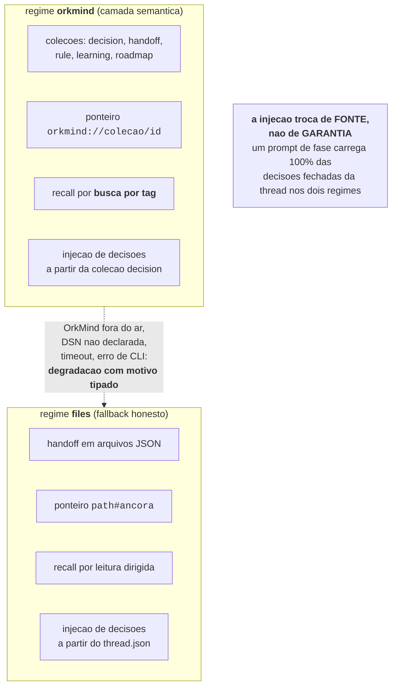

# Memória, gate de tokens e handoff

A janela de contexto acaba no meio da thread. Isso é um fato, não um bug, e a forma como uma
ferramenta lida com ele determina se a segunda sessão consegue trabalhar ou nasce sufocada.

A resposta comum e copiar a sessão anterior inteira para a próxima. Isso entrega uma sessão
nova já cheia, sem espaço para o trabalho que ela deveria fazer, e com o contexto mais
importante enterrado no meio de log de exploração.

O Orkastery faz o oposto: **mede antes de rotacionar, e tria antes de passar**.

---

## 1. O gate de tokens

Ao fim de cada bloco, **antes** de despachar o próximo passo:

```bash
ork gate next <thread> --proximo GO
```



### As quatro fontes de medida

Toda medida **declara a sua origem**. Esse campo não é cosmético: ele muda a decisão.

| Fonte | O que e | Estado hoje |
| --- | --- | --- |
| `runtime_reported` | O runtime adapter sabe ler o uso de contexto | **Não disponível**: o `claude-bg` não expõe uso de contexto (medido na versão 2.1.259 do runtime) |
| `estimated` | Há transcript em disco. Estimativa por tamanho, com método e janela nominal declarados na própria medida | Disponível com `--transcript` |
| `informada` | O host adaptador ou o operador passou a ocupação | Disponível com `--ocupacao 0..1` |
| `unavailable` | Nada sabe medir | O padrão hoje, sem `--transcript` nem `--ocupacao` |

A estimativa usa uma aproximação clássica para texto técnico, cerca de 4 bytes por token,
contra uma janela nominal declarada (200.000 por padrão). O número é uma estimativa, e ele
**se apresenta como estimativa**.

### A regra que da nome ao documento

```text
Numero inventado nao entra aqui em nenhuma hipotese.
```

Quando a fonte e `unavailable`, o veredito sai `same-session` com
`decididoPor: ausencia-de-medida`, e o ledger diz exatamente isso. Rotacionar uma sessão com
base num número chutado e pior do que não rotacionar: você paga o custo do handoff e perde o
contexto sem ter ganho nada verificável.

Isso vale também para o MASTER log: uma metrica indisponível aparece como `unavailable`, nunca
como zero. **Uma lacuna é publicada como lacuna.**

### Passo pesado

`GO`, `CHECK` e refazer uma fase reprovada são classificados como **passos pesados**: eles
consomem mais janela do que uma fase de leitura. O gate leva isso em conta antes de decidir
continuar na mesma sessão.

---

## 2. Handoff triado em três níveis

Quando o veredito e `new-session`, a sessão que abre não recebe cópia da anterior. Ela recebe
um handoff triado.

```bash
ork handoff export <thread> --proxima-fase GO
```



### Proveniência obrigatória

Todo item, dos três níveis, carrega `source`, `location` e o `sha256` do arquivo de origem.

Isso significa duas coisas na prática:

1. Nada entra no contexto da sessão seguinte sem dizer de onde veio.
2. Tudo o que **ficou de fora** está listado, com onde esta e como recuperar. O handoff não
   esconde o que descartou; ele publica o endereço.

---

## 3. Recuperação tardia: `ork recall`

O handoff em três níveis resolve metade do problema. A outra metade e **o momento**: não
adianta transformar um relatório em ponteiro se o ponteiro for resolvido na abertura da sessão,
porque aí o texto entrou de qualquer jeito.

O campo `retrieve_when` de cada ponteiro e a resposta:

```bash
ork recall <thread> --fase CHECK          # resolve SO os ponteiros marcados para o CHECK
ork recall <thread> --id ptr-3            # um ponteiro especifico
ork recall <thread> --todos               # todos, de qualquer momento
ork recall <thread> --fase GO --forcar    # ignora o momento, e DIZ que ignorou
ork recall <thread> --fase CHECK --sem-conteudo   # so os enderecos
```

A regra que faz a promessa valer:

> Um ponteiro de CHECK, pedido durante o GO, volta como `fora-do-momento`, **sem conteúdo**.

Não adianta ter momento declarado se o comando entrega o texto assim mesmo. O `--forcar` existe
para o humano, e o resultado declara que o momento foi ignorado.

```bash
ork handoff recall <thread> "<path#ancora>"   # resolve um ponteiro direto, sem passar pelo momento
```

---

## 4. Os dois regimes de memória



O regime efetivo e sempre visível:

```bash
ork memory status
```

```text
  pedido no manifesto   files
  regime efetivo        files
  tenant                orkastery
  variavel da base      (nao declarada)
  degradacao: modo.files
    correcao: memory.mode: orkmind + memory.database_url_env no manifesto

  O ciclo NAO para por isso: em regime files o handoff continua triado em 3 niveis,
  os ponteiros continuam `path#ancora` e `ork recall` continua resolvendo.
```

### Ligar o OrkMind

```yaml
memory:
  mode: orkmind
  tenant: orkastery
  # o NOME da variavel de ambiente com a DSN da base PROPRIA deste tenant.
  # nunca a DSN em si: o manifesto e versionado.
  database_url_env: "ORKASTERY_ORKMIND_DATABASE_URL"
  cli: orkmind
  timeout_ms: 15000
```

```bash
ork memory status --json
ork memory sync <thread>                         # somente atos desta thread; sem id, apenas policies
ork memory search --colecao handoff --tags '{"project":["orkastery"],"skill":["GOAL"]}' --json
```

### Três regras de integração que são código, não intenção

1. **Degradação honesta.** Se o OrkMind não responde, o regime efetivo vira `files` com motivo
   tipado, e o ciclo segue. Memória semântica **melhora** o produto; ela não é requisito dele.
2. **Isolamento por tenant, sem fallback.** A DSN vem do **nome** de uma variável de ambiente
   declarada no manifesto. Variável não declarada ou vazia **não** vira "usa a base padrão":
   vira degradação. Isso é o precedente de um incidente real, em que a memória de um produto
   foi parar na base de outro.
3. **Governança.** Publicações automáticas usam `source: agent`. A exceção é uma `decision`
   derivada de `human_gate` aprovado com autoria humana e evidência verificável, publicada
   com `source: human`. O cliente não cria `mandatory`, nem `rule`/`instruction` com
   prioridade `critical`. A exceção humana também não aceita prioridade crítica.

No Telegram, o recibo guarda um MAC do ingresso e o hash da opção respondida. No MCP local,
o recibo assinado vincula opção, estado, fase e assunto à chave privada em
`.orkastery/private/`. O sync confere o recibo contra o `hitl_requested` original e exige um
único `human_gate` para o pedido; uma recusa reescrita como aprovação é excluída. A fronteira
local é a conta do sistema operacional que executa o MCP: qualquer processo sob o mesmo UID,
inclusive um agente com acesso integral ao sistema de arquivos, pode ler a chave. Separe o
servidor MCP em outra conta ou sandbox quando precisar distingui-lo desses processos.

O OrkMind usa Python, Postgres e pgvector e mora [em outro
repositório](https://github.com/orkastery/OrkMind). O pacote npm do Orkastery distribui
`core/assets/orkmind_bridge.py`. O driver encontra o Python pelo shebang do executável
`orkmind` instalado e chama a biblioteca desse ambiente, incluindo o G3 nativo.
O checkout externo permanece intacto. JSON passa por stdin; a credencial exclusiva entra
somente no ambiente do filho. Erros do subprocesso são redigidos, sem refletir stderr ou
DSN. A ponte só instancia embedder na operação `embed`, que não recebe a DSN; a chave de
embedding, quando configurada, entra no ambiente do filho só nessa operação (veja
[Busca por significado](#busca-por-significado-embeddings)). Leitura, `add` e `handoff`
continuam sem embedder.

A base precisa ter o schema OrkMind inicializado. O health check não provisiona tabelas;
`memory.schema.absent` informa schema ausente e o regime efetivo degrada para `files`.
Na fábrica, somente `orkastery` está ativo, com a variável exclusiva acima. Outros tenants
permanecem reservados. Não há fallback para outra DSN.

### Busca por significado (embeddings)

A busca por tag continua sendo o caminho determinístico: é ela que monta o prompt, o recall e o
handoff, e duas execuções iguais montam o mesmo prompt. A busca por significado é uma superfície
**separada**, que acha pela paráfrase o que a tag e o FTS da mesma frase não acham. Todo
resultado dela sai marcado `deterministico: false`, e nada semântico entra no prompt sozinho.

Configuração, no bloco `memory` do manifesto. Sem o bloco, vale `provider: none` e a busca por
significado fica desligada:

```yaml
memory:
  # ... chaves de sempre ...
  embedding:
    provider: "openrouter"                        # none (padrao) | openrouter
    model: "qwen/qwen3-embedding-8b"
    dim: 1024
    api_key_env: "ORKASTERY_EMBEDDING_API_KEY"    # NOME da variavel, nunca o valor
    fallback_model: "intfloat/multilingual-e5-small"   # modelo local offline; vazio = sem fallback
    max_tokens_por_execucao: 1000000              # teto de cada ork memory index, conferido antes da rede
```

O manifesto recusa valor com cara de chave ou DSN em `api_key_env`, recusa nome da lista de
provider pago (a entrada do `ork` apaga esses nomes sob `subscription-only`) e recusa repetir
a variável da DSN. Use uma chave dedicada ao Orkastery, com limite de crédito no painel do
provider. Como a configuração de memória vem do manifesto canônico da raiz do projeto, o
bloco só vale nas worktrees depois de mesclado.

Os três comandos:

```bash
ork memory status --json            # estado sondado: chave (nome e presença), fallback, índices, cobertura
ork memory status --sondar          # uma chamada real pelo caminho ativo, com a latência medida
ork memory index --dry-run --json   # tokens e custo estimados, sem chave e sem chamar o provider
ork memory index                    # indexa o tenant (idempotente); --modelo primario|fallback|todos
ork memory search --texto "trocar de conta quando acaba a cota" --json
```

Como funciona:

- **Onde mora o vetor.** Num índice local e derivado, no estado canônico do projeto
  (`.orkastery/memoria/vetores/<tenant>/<modelo>-<dim>.json`, pasta 0700, arquivo 0600, fora
  do git). O OrkMind continua a fonte da verdade e nada é gravado na base. Cada vetor é
  chaveado por id, sha256 do conteúdo, modelo e dimensão: conteúdo que mudou reembeda só aquela
  entrada, e índice de outro modelo, dimensão, tenant ou base nunca é misturado. Cada máquina
  tem o seu, e reconstruí-lo é `ork memory index`.
- **O que é indexado.** Só o universo governado do tenant (as coleções do `ork`, com o filtro
  de injeção e de visibilidade da biblioteca). Conteúdo com padrão de segredo e entrada acima de
  24.000 caracteres ficam fora, contados no relatório; nada é truncado em silêncio. No fallback
  local, texto acima do contexto do modelo (512 tokens no `multilingual-e5-small`) é embedado
  pelo começo e aparece em `truncados` no relatório do `ork memory index`.
- **O ranking.** Cosseno da consulta contra o índice do mesmo modelo e dimensão, FTS da
  biblioteca filtrado pelo tenant, e fusão RRF (k = 60). A cadeia do vetor é primário, fallback
  local, nenhum; sem vetor, a busca cai para FTS e declara `origem` e `motivo`.
- **Degradação tipada, nunca queda de regime.** Chave ausente, provider fora, timeout, modelo
  local ausente, índice ausente, dimensão divergente e orçamento excedido têm motivo próprio
  (`embeddings.*`), separado dos motivos de degradação do regime. Sem embeddings, o regime
  `orkmind` e o recall por tag seguem idênticos.
- **Fallback local.** Roda offline na ponte (transformers em CPU, `local_files_only`), com o
  modelo baixado uma vez para o cache do Hugging Face da máquina; a ponte nunca baixa nada
  sozinha. Custa zero em dinheiro e alguns segundos de CPU por chamada fria, e usa um índice
  próprio, porque vetores de modelos diferentes não se comparam.

Custo e saída de conteúdo. O texto de cada entrada indexada e de cada consulta vai ao OpenRouter
e ao provedor que ele rotear; confira no painel do OpenRouter a opção que restringe provedores
que retêm ou treinam com entradas. O `ork` mostra estimativa, não fatura: tokens por
`ceil(caracteres / 3)` e o preço de uma tabela datada. Em 29/09/2026, `qwen/qwen3-embedding-8b`
custava US$ 0,01 por milhão de tokens de entrada; confira a qualquer momento com
`curl -s https://openrouter.ai/api/v1/embeddings/models`. O valor real fica no painel de
atividade do OpenRouter.

O que `subscription-only` cobre e o que não cobre. A política continua governando o despacho
de runtimes: nenhuma fase roda por provider pago. Embedding pago é opt-in separado e explícito
do bloco `memory.embedding`, com chave de nome próprio. Se a chave estiver no ambiente da
fábrica, as sessões despachadas também a herdam e podem usar a busca; por isso ela deve ser
dedicada e ter limite de crédito.

Reindexação de madrugada. O `ork` não instala cron. Se quiser, instale uma linha dentro da
janela ociosa declarada em `audit.janela_ociosa`, com a DSN e a chave no ambiente do cron. Com
`--modelo todos`, o comando sai 1 quando um dos alvos não indexa (por exemplo, sem a chave), e o
alvo que indexou fica gravado; o motivo de cada um está no JSON:

```bash
# 03:15, dentro de audit.janela_ociosa (22:00-06:00); ajuste o caminho do projeto
15 3 * * * cd /caminho/do/projeto && ork memory index --modelo todos --json >> .orkastery/memoria/index.log 2>&1
```

### Tags da fábrica e recall

| Tag | Valor |
| --- | --- |
| `project` | Tenant configurado, por exemplo `orkastery` |
| `skill` | Fase aplicável; no handoff, a fase de destino |
| `situation` | Classe, por exemplo `handoff` ou `human_gate`, e `thread:<id>` |
| `agent` | `runtime:modelo` observado; ausência histórica é `desconhecido:desconhecido` |

Aliases legados, como `orkastery-handoff` e `fase:GOAL`, continuam disponíveis.
Uma `decision/agent` já criada pela ponte conserva seu ID ao reaparecer em outra fase
ou runtime. As tags observadas são acumuladas; conteúdo, tenant, proveniência, source e
prioridade precisam permanecer iguais. A republicação não reatribui autoria. Entradas da
versão inicial da ponte só recebem essa atualização quando o fingerprint anterior é
recalculado e confere; presença de metadata isolada não autentica legado. Registros sem
essa prova, tags de outro tenant ou proveniência divergente são recusados. Uma repetição
sem tags novas também preserva a versão armazenada.
`ork recall <thread> --fase GOAL --json` descobre handoffs por tenant, thread e fase exatos.
Os ponteiros explícitos conservam `retrieve_when` e o fallback `path#ancora`. Erro de
exportação não significa coleção vazia: a descoberta reporta a falha mesmo quando algum
ponteiro consegue resolver pelo arquivo.

### Aprovação humana com origem verificável

```bash
ork gate request <thread>
ork gate answer <thread> <pedido> --resposta-stdin --origem telegram \
  --por telegram:<usuario> --mensagem telegram:<chat>:<mensagem>
```

A resposta Telegram chega em envelope assinado pelo gateway e correlacionado ao pedido.
Codex e Claude Code usam o formulário de elicitation do cliente MCP; os argumentos da tool
não aceitam resposta nem fabricam a capacidade local. Nos dois caminhos, o Ork grava o
gate antes de publicar memória. O recibo privado não contém a resposta bruta, é vinculado
ao evento e volta a ser autenticado em cada sync. `gate approve` e a API
`aprovarGateHumano` estão aposentados e recusam aprovação sem pedido.

O sync publica human gates somente da thread informada. Sem thread-id, publica apenas
policies do projeto; não inventaria nem publica atos humanos de outras threads. Exige evento aprovado, `source: human` e recibo autenticado do ingresso
Telegram ou MCP local. Preserva o evento original, a referência de linha, o SHA256 do evento e o da
evidência na metadata. Pendências, watchdog, automação, autores de agente ou ambíguos,
evento de outra thread e provas ausentes ou divergentes ficam excluídos com motivo.
Aprovação legada sem prova não ganha `source: human`. Reexecutar a publicação mantém o ID.
A aprovação persistida continua válida quando a memória falha. O CLI confirma o evento
e informa `memory.human.publication-pending`, com recuperação por `ork memory sync <thread>`.
`human_memory_sync_failed` conserva a pendência; somente recibo da aprovação específica
permite declarar publicação confirmada. Para gates vindos do Telegram, o processo de sync
precisa receber a chave do canal que assinou (`ORK_HITL_INGRESS_KEY_HERMES` ou
`ORK_HITL_INGRESS_KEY_OPENCLAW`; `ORK_HITL_INGRESS_KEY` só para o envelope `v1` legado); se
ela estiver ausente, o comando registra `credencial_ingresso_indisponivel` como falha e
retorna código diferente de zero.

### Export e migração pelo G3

```bash
ork handoff export <thread> --proxima-fase GOAL
ork memory inventory --escopo <thread-a,thread-b> --json
ork memory migrate --operadora <thread-operadora> --escopo <thread-a,thread-b> --dry-run --json
ork memory migrate --operadora <thread-operadora> --escopo <thread-a,thread-b> --json
```

O inventário é somente leitura e cobre exclusivamente o `handoff.json` atual e todos os
históricos `handoffs/` das threads explicitamente autorizadas. Pela decisão D23, a caixa
compartilhada `.orkastery/handoffs` e as threads fora da allowlist não são consultadas,
enumeradas, lidas nem hasheadas em nenhum momento: a allowlist limita a leitura, e não
apenas a seleção e a publicação.

Mudança de comportamento, registrada aqui de propósito: até a D23 o inventário percorria,
lia e hasheava a caixa avulsa antes de excluí-la do resultado. O achado CI04-01 do parecer
`CHECK-INTEGRACAO-I04-CODEX.md` mediu essa leitura fora do escopo, e o limite de leitura
instruído por Julio passou a prevalecer. O comportamento anterior e a evidência que o mediu
ficam preservados no histórico da thread; nenhum comando global novo foi criado para
substituí-lo. Escopo, tenant e as demais guardas não foram afrouxados.

Registra tenant, caminho, SHA256, bytes, origem, destino e motivo de inclusão ou exclusão
apenas das fontes autorizadas efetivamente inspecionadas. A ausência de uma fonte fora do
escopo neste resultado não afirma que ela não existe nem classifica o tenant dela.
Somente fontes confirmadas do tenant dentro da allowlist são migradas. Sem `--escopo`,
a operação reprova antes de ler as fontes. Threads protegidas são recusadas. Uma declaração
de `thread` escrita dentro do próprio JSON nunca autoriza nada: a propriedade da fonte vem
do diretório autorizado que a continha. Os handoffs que declaram outro repositório (`Repo alvo:`)
dentro de uma thread autorizada permanecem inventariados e excluídos, com seus arquivos preservados.

O export e a migração chamam `submeter_handoff` nativo, com `refacao=0`. As quatro seções
G3 são derivadas dos campos reais; ausências são declaradas. O `semantic_log` conserva
o JSON completo e `original_texto`, com os bytes originais. O resumo aponta para esse
pacote, ambos ligados à `session` nativa por `parent_id` e `package_id`. O readback
verifica a cadeia, tags, metadata e pacote integral antes de confirmar a operação.

A identidade usa tenant, caminho canônico da origem e hash. A mesma origem/hash retorna
os mesmos IDs sem aumentar contagens; caminhos diferentes têm identidades distintas,
mesmo quando contêm o mesmo snapshot. A base pode ter entries preexistentes, que são
preservadas. Fonte alterada durante a operação, inventário incompleto, G3 inválido ou
readback divergente reprova. A migração é aditiva e não remove arquivos nem registros.
`memory_migrated` e falhas ficam no ledger da operadora com `fonteThread`. Replay
confirmado não acrescenta evento de sucesso; os ledgers das fontes ficam intactos.

Os filtros nativos de injeção continuam ativos. Hashes longos no pacote integral podem
causar retenção pelo OrkMind; os resumos usam referências compactas, com os hashes
integrais preservados na metadata e no original. O readback de manutenção verifica
integridade sem mudar o que a busca governada permite recuperar.

`memory migrate` sai com código diferente de zero quando há falhas. `memory sync` também
reprova quando o manifesto pede `orkmind` e a publicação falha, inclusive na degradação.
Legado sem identidade comprovável retorna `memory.legacy.provenance-collision` e
continua contando como falha. Uma colisão de conteúdo com proveniência divergente é recusada, nunca
convertida em sucesso ou reescrita silenciosamente. O relatório conserva as falhas para
tratamento explícito. Quando o manifesto pede `files`, sync conserva código zero como
relatório informativo e declara que nada foi publicado. Os arquivos continuam utilizáveis;
esse resultado não constitui prova de publicação no banco.

Na contenção da I-06, os testes de migração e sync usam somente fixtures temporárias
e driver isolado. Recibos históricos permanecem preservados, sem serem apresentados
como nova execução de migração. A investigação específica de B4 leu apenas três IDs
de `rule`, com conexão somente leitura: hashes históricos iguais, `source: agent`
declarada, metadados vazios e autor ausente. Isso não autenticou a cadeia de origem;
`memory.legacy.provenance-collision` e o bloqueio de SHIP permanecem abertos.

O escopo dos escritores globais também precisa ser ativado explicitamente. O launcher
lê `monitor/pulse-write-scope.json` do projeto alvo; alertas fora da lista continuam
visíveis. Instalação e reconstrução de `core/dist` pertencem ao SHIP serializado,
seguidas de prova operacional escopada. A prova isolada do launcher não autoriza
migração global nem substitui CHECK completo sobre o HEAD final.

---

## 5. A propriedade que os dois regimes precisam preservar

Esta é a razão de o bloco de memória existir, e o teste que ele tem que passar:

> Um prompt de fase carrega **100 por cento** das decisões fechadas da thread, venham elas do
> `thread.json` (regime `files`) ou da coleção `decision` (regime `orkmind`).

A injeção **troca de fonte, não de garantia**. É por isso que ligar ou desligar o OrkMind não
muda o fluxo de quem lê o handoff, não muda o que o agente recebe de decisões fechadas, e não
muda o resultado da condução. Muda o custo de recuperar o que ficou de fora.

Se algum dia o OrkMind sumir do ecossistema, o Orkastery continua inteiro. Foi projetado assim
de propósito.

### Verificação após contenção da I-06

A suíte usa fixtures temporárias e drivers isolados. O teste de integração operacional foi
substituído; `ORK_I06_REQUIRE_REAL_DATABASE=1` não habilita migração no teste.
A ponte e o G3 instalado são exercitados com store em memória, sem banco operacional.
Recibos históricos do GO permanecem na I-06 e não representam nova observação real.
O incidente de 36 eventos na thread protegida permanece append-only; não é reparado
apagando eventos ou entries. Policy block exige correções comprovadas e CHECK completo.

### Preparação prospectiva e contrato de tentativa

`memory migrate --operacao-id ID` recupera recibos terminais de sucesso e falha com
`replay: true`. O mesmo ID retoma somente entradas ainda sem recibo. Para retentar uma
falha terminal, usar outro ID; sem ID o comando gera uma tentativa nova. A saída distingue
recuperação de execução; eventos históricos permanecem no ledger.

O preparo `memory-prospective --dry-run` exige recibo integral com modo `0600`, proprietário
atual e SHA-256 fornecido em `--recibo-sha256`, além de `--operadora`, `--escopo`, `--agente`
e `--tenant-nativo`. O tenant nativo é comparado ao rótulo do snapshot; `tags.project`
continua vinculada ao tenant lógico do manifesto. IDs e hashes privados chegam pelo
recibo, sem constantes no pacote. A API devolve o plano integral para arquivo restrito;
o CLI mostra apenas resumo. `--apply` permanece indisponível.

A proposta conserva todas as colunas, ACL e visibilidade `private`. O marcador in-band
`orkastery_prospective` guarda `historicalOrigin: unknown`, autoria prospectiva `agent`,
revisão de código, hash do recibo e original integral serializado com hash. O sync normal
valida esse contrato e retorna duplicate sem reescrever marcador, recibo ou ACL.
Fingerprints comprovam integridade do contrato, sem autenticar a autoria histórica.

O ensaio `orkmind_prospective.rehearse` aceita somente PostgreSQL sintético por socket
isolado, sem rede. Trava os três IDs em ordem, compara snapshot integral/versões/ACL,
usa `GovernedStore.update` com requester identificado e grava sidecar privado integral
na mesma transação. O rollback compensatório compara o estado resultante, restaura o
payload por updates governados, incrementa versões e preserva recibos anteriores.
Positivos possuem autor sintético previamente estabelecido; órfãs são recusadas.
A API instalada não oferece autoridade administrativa nomeada para as três órfãs.
A reconciliação integral permanece pendente: omitir requester após recusa ou ampliar
visibilidade não são opções autorizadas. Antes de expandir autoridade fora do escopo original,
o perfil explícito de fábrica permite avaliar C1..C4 sem atualizar essas rules. Nenhuma reconciliação,
migração global, ativação do cron ou onboarding operacional foi feita nesta rodada.

### Retomada 4: fixture externa, integridade e limites de ativação

A mesma claim C37 e `npm --prefix core test` aceitam
`ORK_NATIVE_FIXTURE_RECEIPT=/tmp/ork-prospective-fixture-.../receipt.json` no ambiente isolado.
O recibo `ork.native-fixture/v1` valida dono, modo `0600`, diretório próprio `0700`, socket Unix,
localização sem alias, identidade aleatória registrada no PostgreSQL, tenant sintético,
container/imagem identificados e validade temporal. Não recebe DSN operacional ou credencial.
O consumidor não chama Docker nem sudo. Ausência de fixture e de runtime local resulta em
`runtime.unavailable`, com falha do teste; não existe conversão em aprovado ou skip.

O provisionador opcional de desenvolvimento é `core/dist-test/test/native-fixture.js prepare
<responsável>`, após `npm --prefix core run build:test`. Ele usa somente imagem local identificada,
`--pull=never`, rede `none`, UID/GID do executor, armazenamento temporário e mount do socket recém
criado. O condutor prepara e limpa a fixture externa com `native-fixture.js cleanup <recibo>`;
recebe recibos de dono e cleanup. O prazo do recibo impede novos ensaios após expirar, mas não
substitui a limpeza. O teste que cria uma fixture local a limpa em `finally`. Cada ensaio usa um
schema UUID próprio, removido ao terminar; não limpa uma base compartilhada por confiar no nome.

O marcador prospectivo rejeita autoria `human` em qualquer caixa e mantém `source: agent`.
Adulteração é `memory.prospective.marker-invalid`, separada de transporte. Campos vêm de
`core/assets/orkmind-native-schema.json`; a ponte compara esse contrato com `MemoryEntry.model_fields`
antes do uso. Drift aditivo ou subtrativo falha em `memory.native.schema-mismatch`. TS e Python
comparam scope e exigem `protected` estritamente falso. Um recibo de rollback não pode ser
reutilizado como original: phase e rollbackOf são conferidos antes de qualquer update.

A prova nativa usa vetor inteiramente sintético de 1.024 dimensões e marcador de 22.909 bytes
por entrada, maior que o tamanho observado anteriormente. O recibo integral mediu 204.004 bytes;
uma execução de aplicação, leitura e seis syncs mediu cerca de 150 ms. O ensaio impõe limite
local de dez segundos para esse trecho. Isso prova essa carga nessa fixture, não um máximo do
backend ou uma estimativa operacional. A tentativa de 1.536 dimensões foi recusada pelo schema
nativo de 1.024. O snapshot original permanece integral e não alimenta fixtures. Negativas
nativas com marcador reduzido/adulterado comparam integralmente dados e recibos das tabelas.

A redação conserva custo linear ao tratar `://` dentro de credenciais. Texto sem separador
entre URLs pode ter os mesmos bytes de uma senha com esquemas e arrobas. Pela prioridade de
confidencialidade do aceite técnico G5 do condutor, o grupo ambíguo é redigido até a última
arroba; partes públicas podem se perder. A antiga expectativa de preservar URLs coladas byte a
byte foi alterada explicitamente em D21 e nas provas. URLs separadas por espaço, aspas, vírgula,
ponto e vírgula ou parênteses mantêm suas fronteiras. Esse aceite técnico não é score humano.

O perfil `fabrica` foi provado no CLI com PostgreSQL sintético: tenant efetivo, decisões de
human_gate confirmado, handoffs pelo G3 instalado, migração com original integral e recall
nativo por tags. As três rules sintéticas órfãs permaneceram intactas; sync integral, com
aceite sintético específico, recusou as três colisões. A escolha do perfil não conclui I-06:
a aceitação operacional dos critérios originais, CHECK, B4 integral e SHIP continuam pendentes.
Nenhuma nova ACL, auth externa, regra humana ou autoridade administrativa foi criada.

Publicação automática e pulse usam `ork activation`, com lease, hashes de plano/aceite/runtime,
recibo durável e disable compensatório. `monitor/pulse-write-scope.json` declara candidatos;
rebuild de `core/dist` sozinho não concede escrita. Alertas e deduplicação da I-01 continuam
em observação, e o contrato de MASTER da I-05 permanece intacto. Desativar conserva histórico.

## 6. Company Brain: memória não é autoridade

Desde o C1, o Ork pode capturar e consultar no OrkMind o recorte operacional da factory. O contrato inclui portfólio, fases, pedidos HITL, decisões, resultados, claims e artefatos. Isso amplia continuidade e descoberta; não amplia permissão.

Quatro fronteiras precisam permanecer visíveis:

1. **identidade** — é derivada do transporte autenticado, nunca escolhida em texto, username decorativo ou payload;
2. **acesso** — ACL é revalidada em cada leitura/escrita, inclusive para referência, backlink, cache, contagem e export;
3. **concorrência** — documentos e decisões editáveis usam revisão esperada; conflito preserva a versão vigente;
4. **ativação** — escrever no Brain pelo Ork exige plano com hash, aceite explícito, lease, receipt e readback.

Captura idempotente não significa escrita invisível. Outbox e receipts permitem distinguir intenção, tentativa, confirmação e reconciliação. Rollback é compensatório e conserva história. Uma DSN configurada não prova conexão; um health check não prova leitura autorizada; um teste com fixture não prova o backend operacional.

Hermes, OpenClaw, Claude Code e Codex chegam ao mesmo núcleo por adaptadores finos. A paridade exigida é de contrato, identidade e resultado, não de interface. No C1, os quatro hosts retornaram o mesmo conjunto de 13 entidades; esse readback encerra a prova do recorte, não os futuros B3–B7.

---

## 7. O loop de aprendizado (I-55)

A lição das threads fechadas volta sozinha no ciclo seguinte, em qualquer regime de memória. Ela
sai dos arquivos que o MASTER já grava (`POSTMORTEM.json` e `master-log.json`), não de prosa.

- **Onde volta:** no GOAL e no PLAN de toda thread nova do mesmo produto, como um item de
  `Memoria injetada` com a origem declarada. Com o OrkMind ligado, o GOAL já recebe a lição da
  coleção `learning`, e o agregado só entra no PLAN. A thread corrente nunca aprende consigo mesma.
- **O que diz:** os três bloqueios que mais apareceram e as duas classes de falha que mais
  fecharam thread, cada um com o comando que o evita, e as últimas notas de 1 a 3 com a
  justificativa do MASTER.
- **Quem ensina:** só thread fechada pelo MASTER, inclusive a aceita por omissão. `sem-falha` e
  `outra` não entram na recorrência; nota 0, que na prática é órfã encerrada, não é lição.

Quando a mesma falha aparece em **3 ou mais threads nos últimos 30 dias**, o `ork master` que
fecha a thread registra uma **proposta de policy** no ledger do projeto (`policy_proposta`),
uma vez por janela, com as threads que a sustentam. Proposta não bloqueia nada: ela vira policy
só quando o dono a declara em `policies:` no `orkastery.yaml`.

```bash
ork licoes          # o que volta no próximo GOAL e PLAN, e as propostas em vigor
ork licoes --json   # o mesmo, para agentes
```
