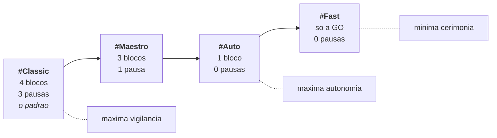
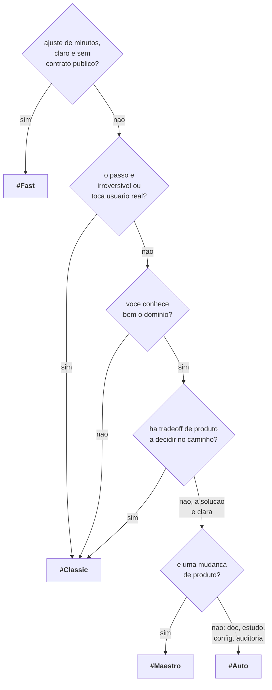

# Modos de condução

Um modo responde a **uma** pergunta: quantas vezes o ciclo para e espera por você?

Nos três modos de ciclo completo, ele não responde nenhuma outra. Não muda o que é verificado,
não muda quantas fases existem, não muda o rigor da evidência. Essa distinção e a coisa mais
importante deste documento. O `#Fast` é a exceção declarada: roda só a GO e, em troca, não
autoriza push sozinho e não toca contrato público.

```text
O modo afrouxa a PAUSA. O modo NUNCA afrouxa a VERIFICACAO.
```

---

## O espectro



Você escolhe escrevendo a #TAG no próprio pedido:

```text
arrumar o filtro de data do relatorio, ele ignora o fuso do usuario #Maestro
```

O adaptador de host extrai a tag chamando o núcleo (`ork modos --do-pedido`), e a validação
contra `conduction.allowed_modes` também e do núcleo. Sem #TAG, vale o
`conduction.default_mode` do manifesto (`classic`, de fábrica).

---

## Os quatro, em detalhe

Fonte de verdade: `ork modos`. As tabelas abaixo reproduzem o que o comando imprime.

### `#Classic`: 4 blocos, 3 pausas (o padrão)

```text
GOAL* / PLAN* / GO-CHECK* / SHIP-MASTER
```

| Aspecto | Detalhe |
| --- | --- |
| **Slugs de sessão** | `goal`, `plan`, `f34`, `f56` |
| **Pausa sobre** | objetivo, plano, evidências (com autorização de push antecipada) |
| **Use quando** | Premissas delicadas com entrega confiável |

O ponto de equilíbrio, e por isso o padrão de fábrica. Você discute objetivo e plano com
calma, porque é ali que a maior parte do desperdício nasce. Depois disso, implementação e
verificação andam juntas e voltam para você **com as evidências na mão**, e você autoriza o
push antecipadamente naquela mesma pausa.

O MASTER fecha sozinho, com o índice derivado do ledger; a sua nota, quando vier, sobrescreve.

### `#Maestro`: 3 blocos, 1 pausa

```text
GOAL-PLAN* / GO-CHECK-SHIP / MASTER
```

| Aspecto | Detalhe |
| --- | --- |
| **Slugs de sessão** | `f12`, `f345`, `master` |
| **Pausa sobre** | premissas |
| **Use quando** | Solução clara e ágil, sem muito risco ou tradeoff |

Você investe a sua atenção uma vez, na frente: aprova premissas e plano. Depois disso a thread
implementa, verifica e entrega sozinha. Ela ainda para se uma policy `block` reprovar, se o
verify reprovar demais, ou se o limite de escalação estourar.

### `#Auto`: 1 bloco, 0 pausas

```text
GOAL-PLAN-GO-CHECK-SHIP-MASTER
```

| Aspecto | Detalhe |
| --- | --- |
| **Slug de sessão** | `full` |
| **Pausa sobre** | nada |
| **Use quando** | Soluções menores, docs, estudos, pesquisas, configurações, auditorias, migracoes |

Uma sessão, o ciclo inteiro, nenhuma pausa programada. É aqui que a regra central deixa de ser
retórica e vira código: **o `#Auto` ainda para**, e para pelas mesmas coisas que parariam o
`#Classic`.

### `#Fast`: só a GO, 0 pausas

```text
GO
```

| Aspecto | Detalhe |
| --- | --- |
| **Slug de sessão** | `go` |
| **Pausa sobre** | nada |
| **Use quando** | Pedido pequeno e claro, de minutos: um texto, um ajuste, uma função que já tem teste |
| **Runtime padrão** | `claude-bg` com Sonnet e esforço alto; fallback `codex:gpt-5.6-terra:high` |

Sem GOAL, sem PLAN e sem CHECK: a sessão implementa e prova no mesmo passo. Três regras seguram a
velocidade no lugar certo.

- **Prova mínima, em três degraus.** Havendo teste homônimo (`core/src/X.ts` para
  `core/test/X.test.ts`), roda só ele. Sem teste, uma claim de uma linha com até dois comandos
  baratos; o núcleo recusa a claim que roda a suíte inteira do manifesto. Sem teste nem comando
  honesto, `ork claims ausente <thread> --paths A,B --motivo "..."` grava a ausência no ledger
  (`prova_ausente`). Nada de prova fingida, nada de ausência em silêncio.
- **Não autoriza push sozinho.** O `#Fast` commita na worktree. O merge sai por
  `ork ship <thread> --autorizar-push <quem>`, e o `ork ship` reexecuta a verificação e confere
  o CI como em qualquer modo.
- **Não toca contrato público.** Tipos, matriz de modos, ledger, contratos HITL, pulse, MASTER,
  setup, servidor MCP e `core/schemas/` ficam de fora (lista em `core/src/contrato-publico.ts`).
  O commit pelo MCP recusa com `mcp.git.contract.protected` e o `ork ship` recusa com
  `policy.violation`. Mudança de contrato é iniciativa: use `#Classic`, `#Maestro` ou `#Auto`.

As variantes que redesenham blocos (`--ciclo goal-plan` e `--ciclo gap`) são recusadas no
`#Fast`, com erro que nomeia a variante e o modo.

---

## Modos aposentados: `#Look` e `#Ork`

A I-43 aposentou os dois. Em 20/09/2026, de 137 threads do projeto, **3 no total** estavam
nesses dois modos, todas fechadas, e a última foi criada em 03/09. Contra 115 em `#Auto`.
Eles cobravam manutenção (matriz, entrevista de setup, diagramas, adaptadores) e não se
pagavam.

A regra da aposentadoria é uma só, e vale para qualquer mecanismo que saia deste produto:

```text
ESCRITORES PARAM DE PRODUZIR. LEITORES CONTINUAM ACEITANDO PARA SEMPRE.
```

O que **parou**: `ork thread new --modo look`, a #TAG `#Look` num pedido, o `z.enum` do MCP,
a entrevista do `#setup`, `ork modos`. Qualquer um deles devolve a recusa tipada
`modo.aposentado`, com saída diferente de zero, nomeando o substituto vivo. **Ignorar em
silêncio está proibido**: um pedido em `#Look` que virasse `#Auto` sem avisar trocaria o
regime de supervisão do trabalho pelas costas de quem pediu.

O que **continua**, e continua para sempre:

| O que | Por quê |
| --- | --- |
| `ork thread status ork-smokeb0` abre com a tag `#Look` | A thread existe em disco desde 02/09 e o board precisa mostrá-la |
| Um recibo `ork.hitl/v1` com `modo: look` valida | Ele foi assinado com `profundidade: profunda`; negá-lo seria o produto negar o que ele mesmo emitiu |
| Um MASTER log de uma thread `#Ork` continua sendo lido | O contrato é congelado, e o histórico é append-only |
| `orkastery.yaml` antigo com `allowed_modes: [look, ...]` | O arquivo estava certo quando foi escrito; o manifesto emite **aviso**, nunca erro |

Nenhum histórico é migrado. Thread antiga em `#Look` fica em `#Look` em disco para sempre.
O que `ork modos migrar` ajusta é só **configuração** (`orkastery.yaml` e `setup.json`), de
forma idempotente e com backup.

As duas metades têm canário próprio, porque remoção sem canário é aposta e não simplificação:
`ork eval --canario fx-modo-aposentado-leitor` e `--canario fx-modo-aposentado-escritor`.

Se você usava `#Look`, use `#Classic`. Se usava `#Ork`, use `#Classic` também: ele separa
GOAL de PLAN e pausa sobre as evidências.

---

## O que NÃO muda entre os modos

Estes cinco invariantes rodam idênticos em todos os modos (`ork modos` os imprime no rodapé, e
`core/src/modos.ts` os declara como constante):

| Invariante | Consequência prática |
| --- | --- |
| Claims, `verify` e policies rodam iguais em todos os modos | Uma alegação falsa reprova no `#Auto` exatamente como reprovaria no `#Classic` |
| Policy `block` pausa qualquer modo, **inclusive o #Auto** | Segredo no prompt, provider pago ou push direto na base param o ciclo, sem exceção |
| Escalação tipada para humano pausa qualquer modo, **inclusive o #Auto** | `retry.max_tentativas` estourado sobe para o humano, mesmo sem pausa programada |
| Toda entrega fecha com índice derivado do ledger | O MASTER não espera ninguém: o índice sai do ledger, e a nota humana, quando vier, sobrescreve |
| Toda decisão autonoma vai ao ledger | Quem decidiu, com que evidência, por que. Autonomia sem registro seria só ausência de controle |

E vale dizer o que isso significa ao contrário: **um modo mais autônomo não entrega menos
evidência**. Ele entrega a mesma evidência, mais tarde, de uma vez só.

A pausa prevista também não depende do runtime. Desde a I-34, `ork gate request` abre a
pausa de uma fase conduzida por `claude-bg` assim que o observador grava o `phase_result`
dela, como já acontecia com o Codex. Vale o resultado do despacho corrente da fase, e um
resultado de falha de execução (`runtime.unavailable`, `runtime.silencio`, `artifact.missing`)
não abre a pausa: o humano não recebe, para aprovar, uma fase que não terminou. Parecer
negativo (`claims.failed`, `verify.*`, `ci.failed`) é fase concluída e abre a pausa.

### Runtime por bloco, contas e fallback (I-33)

O `#setup` escolhe runtime, modelo e esforço por **bloco** de cada modo, e a ordem de fallback
também é do bloco: todas as fases do bloco compartilham o runtime principal e a mesma ordem.

```bash
ork setup maestro --bloco 2 --fallback codex:gpt-5.5          # um runtime de fallback
ork setup maestro --bloco 2 --fallback codex:gpt-5.5:high      # com esforço
ork setup maestro --bloco 2 --fallback ""                      # remove a ordem
```

Cada entrada é `runtime:modelo[:esforco]`, porque trocar de runtime exige o modelo do runtime
de destino; o runtime do bloco nunca se repete na própria ordem. O campo é opcional no
`ork.setup/v1`: setup antigo continua válido, e a leitura descarta entrada malformada.

### O setup no repositório (I-52)

O setup mora em um de dois lugares, e só um vale de cada vez:

| Arquivo | Onde | Vale para |
| --- | --- | --- |
| `orkastery.setup.json` | raiz do checkout, versionado | todas as máquinas; muda por PR |
| `.orkastery/setup.json` | raiz de estado desta máquina | só esta máquina, enquanto não houver o versionado |

`ork setup versionar` leva o setup que vale agora para `orkastery.setup.json`. Depois do PR,
`ork setup <modo> --bloco N` passa a editar esse arquivo, e o local fica ignorado. `ork setup`
sempre diz, na última linha, de onde vem o que vale.

Os perfis de conta (`ork accounts`) são por **runtime**, não por bloco: o bloco escolhe o
runtime, e o `ork` escolhe o perfil da vez dele, na ordem do store, com login de assinatura
conferido. Quando a conta falha (`runtime.quota-exhausted`, `runtime.auth-missing`), o que pode
trocar sozinho é política do manifesto (D14, D16), igual em todos os modos:

```yaml
runtime_profiles:
  rotate_same_runtime_on_quota: true    # padrão desde a decisão do dono de 19/09/2026 (SECURITY.md)
  rotate_same_runtime_on_auth: true     # padrão; login perdido é disponibilidade
```

Com a troca por cota ligada (o padrão), esgotamento de cota, crédito ou limite do plano marca o
perfil e passa o MESMO prompt para o próximo perfil ativo do mesmo runtime; sem perfil ativo,
segue para o runtime de fallback do bloco e depois para a fila durável até o menor prazo. Rate
limit comum de curta janela (429 por minuto, Retry-After curto, sobrecarga) nunca troca de
perfil: espera a janela na fila. O critério entre os dois é único (D16, ver
[verificacao.md](verificacao.md)). Com `rotate_same_runtime_on_quota: false`, o operador
desliga a troca: o perfil esgotado segura o runtime, o prompt segue para o fallback do bloco e
depois para a fila até o prazo do perfil. A rotação só vale para perfis que o próprio operador
cadastrou e autenticou pelo CLI oficial, para contas que ele tem direito de usar sob os termos
do provedor (a responsabilidade por esses termos é do operador, SECURITY.md), e nunca usa
perfil de API paga. A troca por login perdido segue ligada por padrão. A troca manual e
explícita do operador (`ork accounts`, `ork setup`) continua possível. A autorização segue a mesma regra do resto do retry: num bloco que pausa, a
ação espera `ork gate approve`; no `#Maestro` e no `#Auto`, o `ork` troca sozinho e grava
`runtime_profile_rotated` com quem decidiu, a evidência e a razão. Estourar `retry.max_tentativas` e produção parcial sob cota
esgotada pausam **qualquer** modo, inclusive o `#Auto`. Perfil não é eixo de independência do
CHECK: dois perfis do mesmo runtime não viram dois avaliadores.

---

## Um Maestro, vários canais (I-36)

Existe **um** Maestro, o dono, e vários canais por onde ele conduz a mesma fábrica: o Claude
Code, o Hermes, o OpenClaw, o Codex, o MCP e o CLI. Um pedido que chega por outro canal é o
mesmo dono chegando por outra porta, nunca um intruso a ser derrubado. O que o núcleo garante é
que dois pedidos nunca **executem** juntos na mesma worktree.

| O que acontece | Como |
| --- | --- |
| Um pedido executa | toma a condução da thread (lease `exec:<thread>`), em qualquer canal |
| Um segundo pedido chega | é recusado na hora, com quem conduz e três ações: esperar, acompanhar, assumir |
| Você prefere esperar | repita com `--esperar [min]` e ele segue sozinho quando liberar |
| O pedido é o mesmo | a mesma fase com o mesmo prompt devolve a sessão em andamento, sem sessão nova e sem gastar cota |
| É preciso trocar quem conduz | `ork conducao assumir <thread> --por <quem> --motivo "<por que>"` |
| Quer saber quem conduz | `ork conducao status <thread>`, ou a linha de condução no board, no monitor e no pulse |

A linha é a mesma em todas as telas e em todos os hosts:
`conduzido agora por hermes, sessao 3f88d0ce, fase GO, desde 27/09 10:41`.

- **O canal é declarado pela borda.** `--canal` vence; depois `ORK_CANAL`; depois o que o
  host exporta (`CLAUDECODE=1` no Claude Code, `HERMES_HOME` no gateway do Hermes); o MCP usa o
  host já validado da conexão; o padrão é `cli`. O canal descreve a porta e **não** concede
  autoridade: nenhum gate e nenhuma aprovação dependem dele. Aprovação continua sendo o ingresso
  humano assinado do HITL.
- **A condução de um despacho é da sessão.** O `ork phase run` termina em segundos, mas a sessão
  despachada continua executando. O lease passa para ela e só sai quando a fase termina (o
  resultado da fase no ledger) ou com prova de que a sessão acabou no runtime.
- **Assumir não mata por fora.** O handoff encerra a sessão pelo controle do próprio runtime,
  registra no ledger quem assumiu, de qual canal e por que, e reserva a vez para esse canal por
  15 minutos. Processo local vivo (um `ork verify` rodando) não recebe sinal: o handoff recusa e
  diz como esperar.
- **Condução órfã sai sozinha.** Dono morto (trava do kernel livre) ou sessão encerrada no
  runtime liberam o lease com o evento `conducao_orfa_liberada` e a prova, na próxima tomada ou
  na batida do pulse. Liberar a condução nunca conclui fase.

## Como escolher, sem pensar demais



Regra de bolso: **na dúvida, um degrau mais vigiado**. O custo de uma pausa a mais é um minuto
seu. O custo de uma pausa a menos, no lugar errado, e uma entrega refeita.

---

## Variantes de ciclo

O modo diz **quantas pausas**. A variante de ciclo diz **como a thread nasce**. São coisas
diferentes, e podem ser combinadas (`ork thread new ... --ciclo <variante>`).

| Variante | O que faz | Exige | Muda os blocos do modo |
| --- | --- | --- | --- |
| `greenfield` | Começo do zero, partindo da base do manifesto | worktree isolada | não |
| `merge-branch` | Parte de uma branch que já existe, sem criar branch nova | `--branch <existente>`, worktree isolada | não |
| `goal-plan` | Funde GOAL e PLAN num bloco só | nada | **sim** |
| `gap` | Análise de lacuna: sem GO e sem SHIP. A lacuna é publicada como lacuna | nada | **sim** |
| `feature-xl-faseada` | Feature grande em fatias: o PLAN se compromete com N fatias verificaveis | worktree isolada | não |

Duas combinações que valem a pena conhecer:

- **`#Classic` + `gap`**: investigação com vigilância e nenhuma escrita. Serve para
  "descubra por que isto está lento" sem risco de alguém sair consertando por conta própria.
- **`#Classic` + `feature-xl-faseada`**: a feature grande que você não quer numa thread só. O
  PLAN se compromete com fatias verificaveis, e cada fatia tem verify próprio.

Fonte de verdade: `ork ciclos`.

---

## Uma thread começa a partir de um achado

Quando um auditor periódico encontra alguma coisa, ela não vira um ticket solto: vira uma
thread, com a evidência, a claim e a proposta viajando junto.

```bash
ork audit divida                                  # os achados abertos, com recorrencia
ork thread new "consertar" --from-finding F1 --modo classic
```

Ver [`auditoria.md`](auditoria.md).
