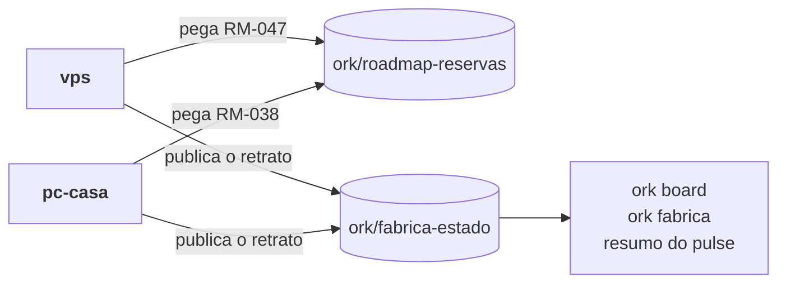

# Várias máquinas

> **Em uma frase:** o mesmo produto conduzido de mais de um computador, sem dois builders no mesmo item e com cada máquina vendo o que as outras estão fazendo.

Use este guia quando você trabalha no mesmo repositório de mais de um lugar (uma VPS, o
computador de casa, o notebook) ou com mais de um builder.

## As cinco peças

| Peça | O que resolve | Comando |
| --- | --- | --- |
| Nome e adesão da máquina | cada máquina aparece uma vez só, com um nome seu | `ork fabrica entrar --maquina <nome>` |
| Reserva do item do roadmap | duas máquinas não pegam o mesmo item | `ork roadmap pegar RM-NNN` ou `ork thread new ... --roadmap RM-NNN` |
| Visão compartilhada | o board e o resumo mostram as outras máquinas | `ork board`, `ork fabrica` e o resumo do pulse |
| Setup versionado | todas despacham cada bloco com o mesmo runtime, modelo e esforço | `ork setup versionar`, e o PR |
| A rede da pessoa | todas as máquinas da pessoa, de qualquer diretório e de todos os projetos | `ork network entrar` e `ork network status` |

A reserva e a visão vivem em branches próprias do remoto, fora da `main` e sem PR:
`ork/roadmap-reservas` e `ork/fabrica-estado`. Cada gravação é um commit em cima da ponta lida,
com push sem força: se outra máquina gravou antes, o `ork` relê e tenta de novo.



## Uma máquina nova

```bash
git clone <remoto> && cd <projeto>
npm install -g @orkastery/cli          # ou o build local do core
# login do runtime pelo CLI dele (Claude Code ou Codex): cada máquina faz o seu
ork fabrica entrar --maquina pc-casa   # nome desta máquina e adesão à fábrica compartilhada
ork roadmap reservas                   # o que já está com alguém
ork thread new "..." --modo auto --roadmap RM-038
```

`ork fabrica entrar` grava o nome e a adesão em `~/.orkastery/maquina.json` (contrato
`ork.maquina/v1`) e publica o primeiro retrato. É um arquivo do usuário, e não uma variável de
ambiente, porque o cron e os gateways não leem o perfil do shell: sem o arquivo, a mesma máquina
apareceria com dois nomes. `ORK_MAQUINA` continua valendo por cima do arquivo, para quem precisa.

A adesão é da máquina, não do projeto: quem clona o repositório não publica nada até entrar. Um
time que quer a fábrica ligada em todas as máquinas pode declarar no `orkastery.yaml`:

```yaml
fabrica:
  compartilhada: true
  remoto: origin
```

`fabrica.remoto` é o **nome** de um remoto do git já configurado no clone (`git remote -v`), e
não uma URL: só passam letras, dígitos, `.`, `_` e `-`, sem `-` no começo, sem `..` e com até
64 caracteres (`origin`, `upstream`, `meu-remoto.2`). O mesmo vale para o `--remoto` de
`ork fabrica` e de `ork roadmap`. Como o manifesto vem de quem fez o repositório, o valor fora
do formato nunca chega ao git: `ork fabrica` (e `publicar`, `entrar`, `sair`) recusa com
`fabrica.remoto-invalido`, `ork roadmap reservas`, `pegar`, `soltar` e `feat` com
`roadmap.remoto-invalido`, e o `ork network roadmap` registra a lacuna `projeto.remoto-invalido`.
A mensagem mostra o valor redigido e curto. Para usar outro servidor, crie o remoto
(`git remote add <nome> <url>`) e ponha o nome no manifesto.

## O que é publicado, e quando

Cada máquina grava só o próprio arquivo, `maquinas/<nome>.json` (contrato
`ork.fabrica-maquina/v1`), e o `FABRICA.md` da branch, legível no GitHub.

| Vai | Nunca vai |
| --- | --- |
| id, nome, modo, fase e status de cada thread não fechada | credencial, token ou login |
| o item do roadmap e a branch da thread | prompt, transcript ou log de sessão |
| se a thread espera você, e o assunto da pausa | caminho local da máquina |
| o merge `ship(<thread>)` que já está na base | resposta a gate ou decisão sua |

A thread cujo `ship(<thread>)` já está na base aparece como entregue, mesmo que ninguém tenha
fechado o MASTER dela: o retrato segue o git, não só o `thread.json`.

Depois de entrar, a máquina publica sozinha, em segundo plano, ao criar thread, despachar fase,
entregar e fechar, e a cada batida do cron do pulse. Retrato igual ao último não vai ao remoto,
salvo uma vez por hora, como sinal de vida. `ork fabrica publicar` publica na hora.

## Ler as outras máquinas

- `ork board` mostra as threads desta máquina e, embaixo, uma seção com as outras.
  `--sem-remoto` usa a última cópia lida, sem rede.
- `ork fabrica` mostra todas as máquinas, com a hora da última publicação de cada uma.
- O resumo do pulse ganha o bloco **Em outras máquinas**, com as threads ativas e quem espera
  você em cada uma.

Pergunta que espera você em outra máquina chega na hora, como a desta, qualquer que seja a
cadência do pulse. Ela se responde **lá**: a thread vive naquela máquina, e é o ingresso daquela
máquina (terminal, Telegram dela ou MCP) que prova que foi você.

## A rede da pessoa: Orkastery Network

A fábrica compartilhada vive no remoto de **um** projeto. A rede junta as máquinas da pessoa, de
todos os projetos, num repositório privado dela na forja, `<usuario>/orkastery-network`
([ADR-001](../conceitos/decisoes/ADR-001-estado-da-rede.md)).

```bash
ork network entrar --maquina pc-casa   # cria a casa privada, se falta, e publica o retrato
ork network status                     # de qualquer diretório: as máquinas, a fonte e as lacunas
ork network sair                       # tira o retrato desta máquina da casa
```

- A identidade vem do `gh` ou do `glab` já autenticados; o `ork` nunca lê token.
- Quem já fez `ork fabrica entrar` é membro da rede sem refazer nada: a batida do pulse publica o retrato quando a casa existe.
- A `ork/fabrica-estado` continua lida: máquina que só publicou lá aparece como vista na fábrica, sem supor adesão.
- Depois de entrar, a máquina publica sozinha na batida do pulse e nos eventos de thread; `ork network publicar` publica na hora.

| Vai para a casa | Nunca vai |
| --- | --- |
| nome, hostname, forja e login | token, senha, chave ou e-mail da conta |
| runtimes e hosts com a versão | plano ou conta paga, perfil de conta e o diretório dele |
| projetos conhecidos, com remoto sem credencial e caminho | caminho de arquivo de credencial (`hosts.yml`, `.credentials.json`, `auth.json`) |
| versão do `ork` e a última batida | prompt, transcript ou log |

Leia o `status` pelo que ele diz que leu: "Não consultado: roadmap, reservas, threads" quer dizer
que isso não foi olhado, não que está vazio. Os campos estão em
[Contratos da rede](../referencia/contratos/rede-rm053.md).

## O roadmap da rede, de qualquer diretório

`ork network roadmap` junta o status report do roadmap, as reservas e as threads de cada máquina,
com a fonte e a hora de cada parte ([RM-054](../roadmap/RM-054-roadmaps-e-threads-da-rede.md)).
Roda de qualquer diretório, inclusive fora de um clone:

```bash
ork network roadmap                                     # o projeto do diretório atual
ork network roadmap --projeto github:orkastery/orkastery  # sem clone: lê a forja, só consulta
ork network roadmap --projeto orkastery --json           # nome do registro ~/.orkastery/projetos.json
```

- O roadmap vem da base remota (`origin/main`), igual para toda máquina; esta máquina entra pelo
  estado local, e as outras pelo retrato publicado.
- Sem clone, a leitura usa a CLI da forja já autenticada (`gh`, `glab`); nenhum token sai dela.
- O que não foi lido sai como lacuna, com o tipo e o que fazer: máquina sem batida há mais de 3 h,
  forja sem login, sem rede. A resposta nunca diz "vazio" por não ter lido.

## Sair

`ork fabrica sair` para de publicar desta máquina e tira o retrato dela da branch. O nome fica
gravado, para quando ela voltar.

## Quando algo não aparece

| Sintoma | O que olhar |
| --- | --- |
| A máquina não aparece nas outras | `.orkastery/monitor/fabrica.log`: cada publicação em segundo plano deixa uma linha, inclusive a que falhou |
| A mesma máquina aparece com dois nomes | `ORK_MAQUINA` num shell diferente do nome do arquivo; `ork fabrica entrar` avisa |
| Sem rede | `ork board --sem-remoto` e `ork fabrica --sem-remoto` mostram a última cópia, com aviso |
| A thread entregue ainda aparece ativa | o merge não tem o assunto `ship(<thread>): ...` |
| `ork network status` mostra `rede.sem-repositorio` | ninguém rodou `ork network entrar` ainda: a primeira máquina cria a casa |
| A rede não publica em segundo plano | `~/.orkastery/rede/rede.log`: cada tentativa deixa uma linha, inclusive a que falhou |
| `ork network entrar` recusa com `rede.nome-em-uso` | outra instalação já usa esse nome: escolha outro com `--maquina`, ou tome-o com `--forcar` (fica no commit). Se a mensagem diz que o retrato tem o hostname desta máquina, pode ser ela mesma com um `~/.orkastery/maquina-id` novo (retome com `--forcar`) ou outra com o mesmo hostname (escolha outro nome) |
| `ork network status` mostra `maquina.nome-em-uso` | outra instalação tomou o nome desta: troque de nome com `ork network entrar --maquina NOME` ou retome-o com `--forcar` |
| Um projeto sumiu do retrato, com um aviso | um valor dele tem cara de segredo (token no nome, e-mail no caminho), o nome foge da regra de nome de projeto (caractere invisível ou de controle, mais de 80) ou o caminho tem caractere invisível: o aviso diz o campo e o padrão |
| `ork network entrar` ou `publicar` recusa com `rede.sem-https` | a forja devolveu a URL da casa sem https (um GitLab próprio servido por http): a rede não manda o token sem TLS; ligue o https na forja |

## O setup por bloco, igual em todas

A escolha de runtime, modelo e esforço por bloco (`ork setup`) vai para o repositório com
`ork setup versionar`, que grava `orkastery.setup.json` ao lado do `orkastery.yaml`. Depois do
PR, todas as máquinas despacham com o mesmo setup, e mudar um bloco vira diff revisado como
código. Sem o arquivo versionado, cada máquina usa o próprio `.orkastery/setup.json`. O
[guia de modos](modos.md) tem o detalhe.
