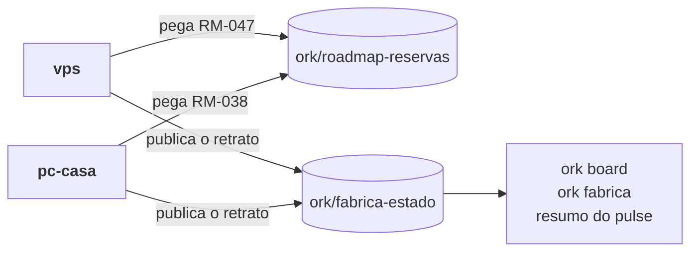

# Várias máquinas

> **Em uma frase:** o mesmo produto conduzido de mais de um computador, sem dois builders no mesmo item e com cada máquina vendo o que as outras estão fazendo.

Use este guia quando você trabalha no mesmo repositório de mais de um lugar (uma VPS, o
computador de casa, o notebook) ou com mais de um builder.

## As quatro peças

| Peça | O que resolve | Comando |
| --- | --- | --- |
| Nome e adesão da máquina | cada máquina aparece uma vez só, com um nome seu | `ork fabrica entrar --maquina <nome>` |
| Reserva do item do roadmap | duas máquinas não pegam o mesmo item | `ork roadmap pegar RM-NNN` ou `ork thread new ... --roadmap RM-NNN` |
| Visão compartilhada | o board e o resumo mostram as outras máquinas | `ork board`, `ork fabrica` e o resumo do pulse |
| Setup versionado | todas despacham cada bloco com o mesmo runtime, modelo e esforço | `ork setup versionar`, e o PR |

A reserva e a visão vivem em branches próprias do remoto, fora da `main` e sem PR:
`ork/roadmap-reservas` e `ork/fabrica-estado`. Cada gravação é um commit em cima da ponta lida,
com push sem força: se outra máquina gravou antes, o `ork` relê e tenta de novo.



## Uma máquina nova

```bash
git clone <remoto> && cd <projeto>
npm install -g @orkastery/cli          # ou o build local do core
# login do runtime pelo CLI dele (Claude Code ou Codex): cada máquina faz o seu
ork fabrica entrar --maquina pc-casa   # nome desta máquina e adesão à fábrica compartilhada
ork roadmap reservas                   # o que já está com alguém
ork thread new "..." --modo auto --roadmap RM-038
```

`ork fabrica entrar` grava o nome e a adesão em `~/.orkastery/maquina.json` (contrato
`ork.maquina/v1`) e publica o primeiro retrato. É um arquivo do usuário, e não uma variável de
ambiente, porque o cron e os gateways não leem o perfil do shell: sem o arquivo, a mesma máquina
apareceria com dois nomes. `ORK_MAQUINA` continua valendo por cima do arquivo, para quem precisa.

A adesão é da máquina, não do projeto: quem clona o repositório não publica nada até entrar. Um
time que quer a fábrica ligada em todas as máquinas pode declarar no `orkastery.yaml`:

```yaml
fabrica:
  compartilhada: true
  remoto: origin
```

## O que é publicado, e quando

Cada máquina grava só o próprio arquivo, `maquinas/<nome>.json` (contrato
`ork.fabrica-maquina/v1`), e o `FABRICA.md` da branch, legível no GitHub.

| Vai | Nunca vai |
| --- | --- |
| id, nome, modo, fase e status de cada thread não fechada | credencial, token ou login |
| o item do roadmap e a branch da thread | prompt, transcript ou log de sessão |
| se a thread espera você, e o assunto da pausa | caminho local da máquina |
| o merge `ship(<thread>)` que já está na base | resposta a gate ou decisão sua |

A thread cujo `ship(<thread>)` já está na base aparece como entregue, mesmo que ninguém tenha
fechado o MASTER dela: o retrato segue o git, não só o `thread.json`.

Depois de entrar, a máquina publica sozinha, em segundo plano, ao criar thread, despachar fase,
entregar e fechar, e a cada batida do cron do pulse. Retrato igual ao último não vai ao remoto,
salvo uma vez por hora, como sinal de vida. `ork fabrica publicar` publica na hora.

## Ler as outras máquinas

- `ork board` mostra as threads desta máquina e, embaixo, uma seção com as outras.
  `--sem-remoto` usa a última cópia lida, sem rede.
- `ork fabrica` mostra todas as máquinas, com a hora da última publicação de cada uma.
- O resumo do pulse ganha o bloco **Em outras máquinas**, com as threads ativas e quem espera
  você em cada uma.

Pergunta que espera você em outra máquina chega na hora, como a desta, qualquer que seja a
cadência do pulse. Ela se responde **lá**: a thread vive naquela máquina, e é o ingresso daquela
máquina (terminal, Telegram dela ou MCP) que prova que foi você.

## Sair

`ork fabrica sair` para de publicar desta máquina e tira o retrato dela da branch. O nome fica
gravado, para quando ela voltar.

## Quando algo não aparece

| Sintoma | O que olhar |
| --- | --- |
| A máquina não aparece nas outras | `.orkastery/monitor/fabrica.log`: cada publicação em segundo plano deixa uma linha, inclusive a que falhou |
| A mesma máquina aparece com dois nomes | `ORK_MAQUINA` num shell diferente do nome do arquivo; `ork fabrica entrar` avisa |
| Sem rede | `ork board --sem-remoto` e `ork fabrica --sem-remoto` mostram a última cópia, com aviso |
| A thread entregue ainda aparece ativa | o merge não tem o assunto `ship(<thread>): ...` |

## O setup por bloco, igual em todas

A escolha de runtime, modelo e esforço por bloco (`ork setup`) vai para o repositório com
`ork setup versionar`, que grava `orkastery.setup.json` ao lado do `orkastery.yaml`. Depois do
PR, todas as máquinas despacham com o mesmo setup, e mudar um bloco vira diff revisado como
código. Sem o arquivo versionado, cada máquina usa o próprio `.orkastery/setup.json`. O
[guia de modos](modos.md) tem o detalhe.
