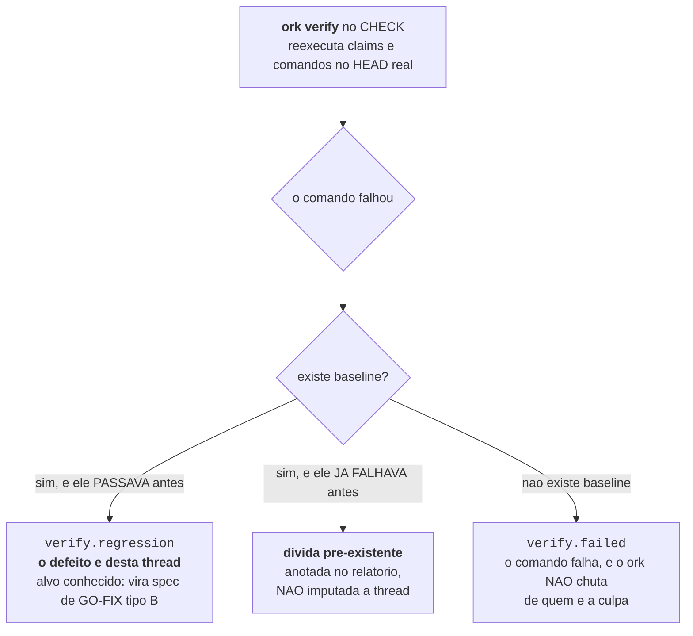
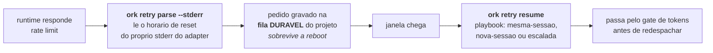
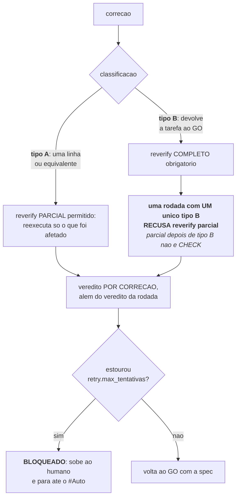

# Verificação: a maquinaria que não acredita em self-report

Este é o produto. Tudo o mais no Orkastery existe para servir a este documento.

A premissa: **um agente afirmando que fez algo não é evidência de que fez.** Nem quando o
agente e bom. Nem quando ele mostra o código. A única coisa que conta é um comando reexecutado
no HEAD real, agora, e a saída que ele produziu.

---

## 1. Claim: a alegação com o comando que a julga

Uma claim tem três partes obrigatorias: **o que se afirma**, **onde**, e **o comando que
comprova**.

```bash
ork claims add <thread> src/relatorio.ts \
  --claim "o filtro respeita o fuso do usuario" \
  --verificar "npm test -- relatorio"
```

Sem `--verificar`, a claim entra como pendente e o gate a reprova com `claims.unverifiable`.
O tratamento e proporcional: anexar o comando (ou retirar a alegação com motivo) e uma
correção de **tipo A**, uma linha, não um GO inteiro.

```bash
ork claims verificar <thread> C3 --comando "npm test -- relatorio"
ork claims retirar   <thread> C2 --motivo "o comando reprovava ate por mencao em comentario"
```

### Alegação negativa

Existe um tipo de afirmação que quase nenhuma ferramenta consegue checar: **"isto nunca
acontece"**. O `ork` verifica pelo comando que a falsearia.

```bash
ork claims add <thread> core/src/ship.ts \
  --claim "o ship nunca prova push por gh api" \
  --verificar "grep -q ls-remote core/src/ship.ts && ! grep -rq 'gh api' core/src/ship.ts"
```

Retirada fica no histórico. O `claims.jsonl` e append-only: uma claim retirada aparece com
`estado: retirada` é o motivo, não desaparece. História que pode ser reescrita não é auditoria.

### O lint do comando (I-53)

O comando de uma claim roda de novo no runner hospedado do CI, a partir do bundle. Três formas
de comando dão problema lá, e o `ork` as aponta no momento em que a claim nasce:

| Forma | No `claims add` | No `ci prepare` | Use no lugar |
| --- | --- | --- | --- |
| a suíte inteira (`npm test`, `npm --prefix core test`) | avisa | **recusa** | `npm --prefix core run test:ci` ou `node --test` no arquivo |
| um SHA intermediário (`git diff 1b16a4a HEAD`) | avisa | avisa | a base carimbada, ou `git merge-base --is-ancestor <sha> HEAD` |
| contagem de commits comparada a um número | avisa | avisa | `git merge-base --is-ancestor <commit> HEAD` |

A recusa vale só para a claim que nasceu com o lint (o campo `lint` na claim). Claim gravada
antes dele recebe aviso e segue: corrigir claim de outra thread é mexer em estado de quem não
pediu. Avisos e recusas do `ci prepare` ficam no ledger da thread, no evento `claim_lint`.

---

## 2. Baseline: separar regressão de dívida

Antes do GO, grave o estado do mundo:

```bash
ork verify <thread> --baseline
```

Isso existe por uma razão de justiça que tem consequência técnica direta:



Sem baseline, todo teste vermelho vira culpa da thread da vez. Isso é falso com frequência e,
pior, ensina o time a ignorar o vermelho. Com baseline, o CHECK diz exatamente uma de três
coisas, e cada uma tem tratamento diferente.

```bash
ork verify <thread>                # reexecuta claims e o verify do manifesto
ork verify <thread> --so-claims    # so as claims
```

O `verify` roda **na worktree da thread**, no commit real, e grava `verify_run` no ledger com o
sha do commit, o diretório, e o resultado por claim.

### Estouro de prazo não é reprovação

Um comando que não termina no prazo não provou nada, nem a favor nem contra. Ele sai com o
motivo `verify.timeout`, fica fora das regressões e das falhas sem baseline, e a alegação dele
continua no estado em que estava. O retry reexecuta, em vez de abrir GO-FIX.

O prazo mora no manifesto e é resolvido uma vez por rodada:

```yaml
verify:
  test: "npm --prefix core test"
  timeout_ms: 600000              # default de cada comando, inclusive os das claims
  timeout_ms_por_comando:
    test: 900000                  # vence o default para este comando
```

Sem nada no manifesto, vale 600 s. O `ork_verify` do MCP usa o mesmo prazo, até o teto de
300 s por comando e 180 s no total da chamada.

### O que o ledger guarda de um comando que falha

Para abrir o GO-FIX sem reexecutar nada, o `verify_run` e o `ship_done` gravam, por comando
que falha:

| Campo | O que é |
| --- | --- |
| `causa` | `exit`, `timeout`, `nao-encontrado` ou `sinal` |
| `prazoMs`, `duracaoMs` | O prazo aplicado e o tempo que o comando levou |
| `testeQueCaiu` | Até 10 testes que o runner reportou como reprovados (`not ok` do `node --test`, `FAIL` de jest e vitest) |
| `trecho` | O fim da saída real, até 1024 caracteres, redigido |

A redação segue a regra do prompt: credencial em URL vira `[credencial redigida]@`, e se
qualquer padrão de segredo casar, o trecho inteiro é descartado e vira
`[trecho omitido: padrao <nome> casou]`. Comando que passa grava só o código 0.

O comando de verificação também nunca herda variável `ORK_HITL_*`: quem prova uma alegação não
pode agir como o dono.

### Compilação única, e só conta o que rodou (I-54)

Quando o manifesto declara `verify.preparo`, o `ork verify` roda esse comando **uma vez**, antes
das claims, e deixa pronta a compilação que cada claim encontraria:

```yaml
verify:
  preparo: "npm --prefix core run build && npm --prefix core run build:test"
```

Duas coisas não mudam com o preparo, e elas são o motivo de ele ser seguro:

- **Cada claim continua rodando o próprio comando, inteiro.** O preparo nunca pula comando nem
  é condição para uma claim passar. O runner do CI (`ork ci run`) roda o mesmo preparo, uma vez,
  antes das claims do bundle: a claim que passa na sua máquina passa no CI pelo mesmo caminho.
- **O produto é conferido do preparo ao fim da rodada.** A identidade é o HEAD, o diff contra
  ele e o conteúdo dos arquivos não rastreados. O `.gitignore` e o `.orkastery/` ficam fora, e
  mtime não conta. Se ela muda no meio da rodada, nenhum veredito vale: o motivo é
  `verify.sem-veredito`, e o retry reexecuta.

Todo comando agora diz se **rodou** (`executado`). Comando que o sistema não chegou a lançar
nunca vira verificado, mesmo com `ok: true`. A claim sai como `verify.sem-veredito` e o estado
anterior dela não muda. Sem `verify.preparo`, nada disso muda o comportamento de antes.

---

## 3. Os 22 motivos tipados de gate

Nenhum bloqueio é uma string de prosa. Todo bloqueio é um destes vinte e dois, e o motivo
determina a ação. Isso é o que torna retry, metrica e auditoria automatizaveis: `ork retry
policy` imprime a tabela a partir do código, que é um mapa total sobre o catálogo (motivo novo
não compila sem política).

| Motivo | Ação | Auto | Por que essa ação |
| --- | --- | --- | --- |
| `artifact.missing` | corrigir-dirigido | sim | O artefato exigido não existe: a fase precisa de spec do que gravar, não de repetição cega do mesmo prompt |
| `claims.failed` | corrigir-dirigido | sim | A alegação reprovou no HEAD real: reexecutar igual reproduz a mesma mentira |
| `claims.unverifiable` | corrigir-dirigido | sim | Alegação sem comando vira correção tipo A: anexar o comando é uma linha |
| `verify.regression` | corrigir-dirigido | sim | Passava na baseline e falha agora: defeito desta thread, com alvo conhecido |
| `verify.failed` | corrigir-dirigido | sim | Falha sem baseline: a correção conserta ou grava a baseline, mas não chuta a culpa |
| `verify.timeout` | reexecutar | sim | O prazo estourou antes de o comando terminar: a prova não chegou ao fim, e carga de máquina não é defeito |
| `verify.sem-veredito` | reexecutar | sim | Um comando não chegou a rodar, ou o produto mudou entre o preparo e o fim da rodada: não há veredito, e a prova certa é rodar de novo, inteira |
| `hitl.formato` | corrigir-dirigido | sim | O pedido HITL saiu fora do formato: quem errou foi o emissor, que reemite com alternativas e uma recomendada |
| `runtime.autoconferencia` | escalar-humano | **não** | O CHECK caiu no mesmo runtime do GO: o que falta é um validador diferente, e escolher o outro runtime é decisão de condução |
| `tree.blocked` | sincronizar-worktree | sim | A árvore andou por baixo da thread: reexecutar antes de rebasar só repete o conflito |
| `lease.busy` | reexecutar | sim | O lease e de outra thread e vai ser liberado. A fila já serializa: nunca furar a fila |
| `conducao.em-andamento` | esperar a vez | sim | Outra condução executa na mesma worktree agora (I-36). A vez chega quando ela terminar; repetir já recebe a mesma recusa, e furar a fila é o incidente de 19/09/2026 |
| `runtime.unavailable` | reexecutar | sim | Falha de infra não é falha de conteúdo: o MESMO prompt, com o mesmo sha256, e redespachado |
| `runtime.silencio` | reexecutar | sim, com prova terminal | Fase sem heartbeat: só redespacha com prova terminal atual da mesma sessão |
| `runtime.rate-limited` | esperar-janela | sim | Rate limit comum, com hora de volta: a fase entra na fila durável e volta na janela seguinte, sem trocar de perfil (D16) |
| `runtime.quota-exhausted` | reexecutar com rotação | sim | A cota, os créditos ou o limite do plano da **conta** acabaram: o perfil sai do rodízio e o mesmo prompt segue no próximo perfil, no runtime de fallback ou na fila (I-33) |
| `runtime.auth-missing` | reexecutar com rotação | sim | A conta perdeu o login: o perfil nunca mais recebe despacho até o login ser refeito pelo próprio CLI (I-33) |
| `runtime.model-unavailable` | reexecutar com troca de destino | sim | O modelo pedido não existe ou a conta não tem acesso a ele (`model_not_found`): o perfil segue no rodízio, e o mesmo prompt vai a outro perfil com o mesmo modelo ou ao fallback do bloco; sem destino, o humano recebe a correção exata (RM-037) |
| `ci.failed` | escalar-humano | **não** | O recibo pertence ao provedor e ao SHA candidato: repetir a fase não cria esse resultado |
| `policy.violation` | escalar-humano | **não** | Policy `block` em qualquer modo: reexecutar sozinho seria a máquina revogando a policy |
| `human.pending` | escalar-humano | **não** | Não é reprovacao, e espera de autorização. Automatizar seria a máquina se autorizando |
| `cost.violation` | **sem-retry** | **nunca** | Cada reexecucao gastaria de novo pelo provider pago |

### As três regras que nenhum modo afrouxa

1. **Custo nunca reexecuta.** `cost.violation` e o único motivo sem retry automático de
   qualquer espécie. A lição que originou essa regra custou dinheiro de verdade, e por isso ela
   e código, não lembrete no README.
2. **O modo afrouxa a pausa, nunca a verificação.** A política de retry e idêntica no `#Classic` e
   no `#Auto`. O que muda e a **autorização**: num bloco que pausa, a ação espera a resposta
   humana ao `ork gate request`; num bloco sem pausa, o `ork` executa e grava a decisão autonoma.
3. **O limite de escalação pausa qualquer modo.** Estouradas as `retry.max_tentativas` do
   manifesto pelo **mesmo motivo** na **mesma fase**, a ação vira `escalar-humano`, inclusive
   no `#Auto`.

---

## 4. Retry tipado

```bash
ork retry policy [--motivo M]        # a tabela acima, com o porque de cada acao
ork retry plan <thread>              # o que o ork FARIA pelo ultimo gate reprovado
ork retry run  <thread> [--reverify] # executa a acao tipada
```

O `plan` **calcula e não executa**, e não gasta tentativa. Ele existe para você ver a decisão
antes de autorizar, principalmente nos modos que pausam.

### A fila durável de rate limit

Quando o runtime bate limite de uso, a fase não morre e você não precisa estar na frente do
computador:



```bash
ork retry list                                  # a fila do projeto
ork retry resume [--id R1] [--ocupacao 0.6]     # retoma na janela seguinte
ork retry cancel R1 --motivo "nao vale mais"    # sai da fila, com motivo registrado
```

Quando o runtime **não** diz a hora do reset, vale `retry.janela_padrao_min` do manifesto. A
diferença entre saber e supor fica registrada.

### Falha da conta: perfis, rotação, fallback e fila (I-33)

Rate limit comum é janela curta, com hora de volta, e nunca troca de perfil. Falha da **conta**
é outra coisa: esgotamento de cota, crédito ou limite do plano vira `runtime.quota-exhausted`,
com `resetEm` quando o runtime diz a hora, pelo critério único descrito logo abaixo (D16);
login ausente ou expirado (`Not logged in`,
`Please run /login`, `codex login`, token expirado, `authentication_failed` com "OAuth session
expired and could not be refreshed", 401) vira `runtime.auth-missing`. O
reconhecimento é por frase da saída real do runtime, e auth ausente vem antes de cota, exceto a
menção ampla a `codex login` (que aparece também em dicas): ela só vale quando o mesmo texto não
traz esgotamento da conta.

**Esgotamento ou rate limit comum (D16).** Pela decisão do dono de 19/09/2026 (ver
[SECURITY.md](../../SECURITY.md)), o critério entre os dois é um só, `naturezaDoLimite` em
`core/src/adapters/claude-bg.ts`, e todo classificador de falha da conta passa por ele: recusa
do despacho claude-bg e codex, transcrição do Claude Code e erro terminal do turno codex. As
regras, pela frase da saída real do runtime e nesta ordem:

1. **Esgotamento explícito**: a conta ficou sem cota, crédito ou saldo (`usage_limit_exceeded`,
   `insufficient_quota`, `out of credits`, `exceeded your current quota`, `credit balance is too
   low`, `billing_error`, spend cap). É esgotamento, com ou sem prazo, mesmo quando a resposta
   vem como HTTP 429.
2. **Janela curta explícita**: o provedor diz que o limite é temporário e não é a cota ("not
   your usage limit", "Request rejected (429)", "Too Many Requests", `rate_limit_exceeded`,
   `rate_limit_error`, overloaded, 529, requisições ou tokens por minuto). É rate limit comum.
3. **Limite do plano** ("usage limit reached", "You've hit your ... limit", "You've reached your
   ... limit", "plan limit"): é esgotamento quando o prazo dito está a 15 minutos ou mais
   (`JANELA_CURTA_MAX_MS`) ou quando o runtime não diz prazo futuro, porque a janela do plano é
   de horas ou dias; é rate limit comum quando o prazo dito é mais curto.
4. **Qualquer outro sinal de limite** (`429`, "rate limit", `rate_limit`, "too many requests",
   "quota exceeded"): rate limit comum. Na dúvida, o perfil não troca.

O prazo dito é lido nas formas reais dos runtimes (N5): epoch, ISO, data e hora local do codex
(`try again at Sep 22nd, 2026 3:05 PM`, ou só `3:05 PM` quando o reset é no mesmo dia), data e
hora do Claude Code (`resets Sep 22, 3pm`, `resets Sep 22, 2027, 3:05pm`, `resets 7pm`) e
durações com dias e partes compostas (`in 4 days 3 hours`, `2d 5h 30m`, `1m30s`). Sem ano, vale o
ano corrente, ou o seguinte quando a data ficou mais de um dia para trás.

Esgotamento pode trocar de perfil no mesmo runtime (política abaixo). Rate limit comum nunca
troca: na recusa do despacho vira `runtime.rate-limited` e espera a janela na fila durável; no
caminho terminal do turno não marca nem troca o perfil e fica com a classificação da I-34
(`runtime.unavailable`), porque o observador não grava pedido na fila.

A classificação vale na recusa do despacho **e no caminho terminal do turno** (D12). O turno
codex que inicia e termina com erro da conta, como no incidente de 18/09 (`task_complete.error`
com `codex_error_info` `usage_limit_exceeded` e "Your workspace is out of credits" no rollout;
`turn/completed` `failed` com `codexErrorInfo` `usageLimitExceeded` no `state.json` do
controller), vira `runtime.quota-exhausted` pelo observador, que marca o perfil na hora e grava
a evidência (`falhaDeConta`) no gate e no `phase_result`. O trecho dessa evidência, que também
vai à `evidencia` do `runtime_profile_rotated`, é a frase que classificou (N4): o código e o
texto do erro, até 200 caracteres com a frase dentro e segredos redigidos, nunca os metadados do
JSON da transcrição. `codexErrorInfo` `unauthorized` vira
`runtime.auth-missing`. No claude-bg, o turno que termina por esgotamento pelo mesmo critério
(limite do plano, como "You've reached your Fable limit" ou "usage limit reached" com o horário
quando o runtime diz, ou sem crédito, `billing_error`), registrado como erro de API na
transcrição do perfil, também vira `runtime.quota-exhausted`. Na transcrição vale o erro de API
que encerrou a sessão, o último (N3): um 429 transitório anterior não esconde o limite do plano
do fim, e um esgotamento anterior não tira o perfil do rodízio quando a sessão morre por um 429
transitório. O código `rate_limit` sozinho não
basta: o Claude Code usa o mesmo código para o 429 transitório ("Request rejected (429)", "not
your usage limit") e para a sobrecarga, e esses não marcam nem trocam o perfil. Só o erro
estruturado do próprio runtime conta: motivo da conta escrito pelo agente vira
`runtime.unavailable`, e turno com erro nunca conta como conclusão.

Os perfis (`ork accounts`) apontam o diretório onde o próprio CLI guarda configuração e login:
`CLAUDE_CONFIG_DIR` no claude-bg, `CODEX_HOME` no codex. O store
`ork.runtime-profiles/v1` fica em `.orkastery/private/runtime-profiles.json` (arquivo 0600,
pasta 0700, dono conferido) e guarda só identidade, diretório e estado de uso. O `ork` nunca
lê, copia ou migra o que o CLI grava no diretório, e nenhuma API key paga entra no caminho:
`cost.violation` segue sem retry. Sem perfil configurado, nada muda: o despacho usa o
ambiente do processo, e a recusa do despacho que a leitura anterior à I-33 já tratava como rate
limit (como `Claude AI usage limit reached|<epoch>`) vai direto à fila durável do B3, sem gate da
conta (N6). Com perfil, o mesmo texto segue o critério da D16.

O perfil que despachou fica no registro da sessão (`phase_dispatch`,
`session_sensor_registered`, `thread.json` e `phase_result`). Reverificação, observador
destacado, `ork sessions watch`, `ork_observe`, liveness e o watcher codex consultam pela
conta desse registro, nunca pelo ambiente do processo `ork`; perfil registrado inválido
recusa a leitura em vez de cair para a conta errada.

A política, na mesma casa do retry:

1. **Marcar a conta.** Cota esgotada tira o perfil do rodízio até `resetEm` ou, sem hora (ou
   com um horário que já passou), até a janela padrão (estimativa declarada); auth ausente tira
   sem prazo. Antes de todo
   despacho com perfil, o login é conferido pelo próprio CLI (`claude auth status --json`,
   `codex login status`) com o env do perfil: perfil reprovado vira `sem-auth` e nunca
   recebe despacho. Só login de assinatura aprova (D13): `authMethod` `claude.ai` sem
   `apiKeySource`, ou "Logged in using ChatGPT"; login por API key, `api_key_helper`, Console
   ou provider de nuvem vira `provider-pago`, nunca despacha e, sem outro perfil elegível,
   bloqueia em `cost.violation`, sem retry. Conferência inconclusiva (timeout, morte por sinal,
   binário ausente ou resposta ilegível) não prova login perdido: o perfil não vira `sem-auth`,
   fica fora só daquele despacho, com a `ultimaFalha` registrada, e é conferido de novo no
   próximo.
2. **Seguir com o MESMO prompt** (mesmo sha256). Outro perfil do mesmo runtime só recebe o
   prompt com a troca ligada no manifesto para o motivo (D14, D16):
   `runtime_profiles.rotate_same_runtime_on_quota` (padrão `true` desde a decisão do dono de
   19/09/2026; o operador desliga com `false`) e `runtime_profiles.rotate_same_runtime_on_auth`
   (padrão `true`). Com a troca ligada, o prompt vai ao próximo perfil ativo do mesmo runtime;
   sem perfil ativo, a cada runtime da ordem de fallback do bloco (`runtime:modelo[:esforco]`,
   o modelo é do runtime de destino, no perfil da vez dele); por último a fila durável, com
   `liberaEm` no menor `esgotadoAte` entre os perfis. Com a troca por cota desligada, o perfil
   esgotado segura o runtime até o prazo, o prompt vai direto ao fallback do bloco e o prazo da
   fila é o do perfil que segura cada runtime da ordem. Rate limit comum não passa por aqui:
   espera a janela na fila, sem troca. Quando só resta auth ausente, não há prazo: a escalação
   vai ao humano em vez de uma fila eterna.
3. **Registrar cada troca** no evento `runtime_profile_rotated` (catálogo do ledger): de qual
   para qual perfil e runtime, a evidência, a razão e quem autorizou.
4. **Frear o laço**: cada redespacho conta como tentativa, e `retry.max_tentativas` escala para
   o humano em qualquer modo.

**Precedência com a prova da I-34 (D11).** (a) Com Stop correlacionado, vale a prova do `ork`:
ela decide concluir ou bloquear em `human.pending`, e cota esgotada nunca reclassifica um
"sem prova" nem conclui fase. (b) Sem Stop correlacionado, `runtime.quota-exhausted` e
`runtime.auth-missing` substituem `runtime.unavailable` quando a transcrição da sessão, no
diretório do perfil, traz erro de API com a frase da conta; texto do agente nunca vira motivo.
(c) A rotação só redespacha quando a prova do `ork` confirma que o intervalo do despacho não
produziu nada: artefato da fase gravado, commit registrado, entrega registrada ou, no GO, HEAD
movido ou worktree alterada contam como produção, e a dúvida conta como produção. O HEAD do
GO fica no registro do despacho (`session_sensor_registered`) nos dois runtimes; no codex ele é
lido antes do despacho (N1), então um `git commit` feito pela sessão no shell, fora do
`ork_git_commit` e sem evento no ledger, aparece como HEAD movido. Registro sem HEAD (sessão
anterior a esta regra, ou git sem resposta no despacho) é dúvida: conta como produção. Sessão que
morre por cota depois de produzir vira `human.pending` com o diagnóstico de produção parcial
sob cota esgotada, nunca conclusão nem redespacho sobre a worktree alterada, e nada entra na
fila durável para ser retomado sozinho. A contagem de
commit herda a dívida (12) da I-34: `mcp_git_committed` não carrega `sessionId`, então um
commit de outra origem no intervalo também conta, sempre a favor de escalar.

A fila continua no mesmo `fila.jsonl`: o pedido só ganha `runtime`, `perfil` e `motivo`
opcionais, e pedido antigo continua legível. Na retomada (D15), o `ork` tenta o runtime original
e depois cada runtime da ordem de fallback do bloco, e despacha no primeiro cujo perfil da vez
voltou, porque o prazo que liberou a fila pode ter sido o do fallback. Sem nenhum, o pedido volta
à fila com o próximo prazo posterior ao instante da retomada (ou a janela padrão declarada), e a
tentativa conta no limite: nada vence de novo na mesma chamada.

### Modelo inacessível na conta (RM-037)

Quando a transcrição da sessão traz `model_not_found` ("There's an issue with the selected model"),
o motivo é `runtime.model-unavailable`, não `runtime.unavailable`, que repetiria o mesmo modelo na
mesma conta. A conta funciona para os outros modelos, então o perfil não sai do rodízio. O
`ork retry run` manda o mesmo prompt ao próximo perfil do mesmo runtime com o mesmo modelo e
depois ao fallback do bloco, com o modelo de cada runtime, e nunca de novo a um destino que já
recusou o modelo na fase. A troca vai ao `runtime_profile_rotated` com o modelo de origem e o de
destino, e `--dry-run` mostra para onde e com que modelo o prompt iria. Sem destino, a fase
escala ao humano com a correção:
`ork setup <modo> --bloco N --model <modelo acessível>`, ou `--fallback runtime:modelo` no mesmo
bloco.

### A conta é do usuário, não do projeto (I-49)

Quando um projeto marca uma conta como esgotada, sem login ou com credencial paga, o estado vai
também para `~/.orkastery/private/contas.json`, e as outras fábricas do mesmo usuário leem esse
registro antes de escolher o perfil: nenhuma despacha numa conta que outra já viu esgotada. A
chave é o runtime mais o caminho real do diretório da conta, e nada ali é segredo.

O registro só escurece. Ele nunca devolve ao rodízio um perfil que o projeto tirou, uso
bem-sucedido ou login reconferido limpa a marca, e leitura com problema vale registro vazio, com
o despacho seguindo como antes. `ork accounts list` mostra o que o despacho enxerga.

### Lacuna conhecida: inventário e governança pela conta do processo

`ork sessions --global`, o check "governanca de sessoes" do `ork doctor`, o `ork pulse`, o
panorama do Maestro e o controle de sessão nativa do HITL ainda consultam a conta do processo
`ork`. Com N perfis, o inventário é incompleto por construção: uma sessão da conta B não aparece
para quem roda na conta A. O despacho, a observação e a rotação não dependem disso, porque
resolvem pela conta do registro da sessão. Publicado como lacuna.

`ork sessions stop|logs|attach` saíram da lacuna (RM-037): a sessão é procurada na conta do
processo e em cada perfil claude-bg do projeto, inclusive desativado, e o comando roda com o
`CLAUDE_CONFIG_DIR` da conta onde ela está; o `attach` imprime o comando com esse prefixo. Achada
em mais de uma conta, a chave é recusada e o id completo resolve.

---

## 5. GO-FIX e CHECK-REVERIFY

O melhor sub-loop do método era manual: o CHECK reprovava, um humano lia o relatório, escrevia
a spec da correção, mandava de volta ao GO, e depois lembrava de reexecutar o CHECK inteiro.
Agora e código, sem afrouxar nada.

```bash
ork fix open     <thread> [--reverify]        # abre a rodada de correcoes
ork fix list     <thread> [--rodada N]        # as correcoes e o veredito de cada uma
ork fix reverify <thread> [--parcial]         # CHECK-REVERIFY, veredito POR correcao
```

### A spec da correção nasce do verify, não de prosa

Cada correção carrega quatro coisas, todas extraidas do resultado real:

| Aspecto | Detalhe |
| --- | --- |
| **motivo tipado** | o que reprovou, dos doze |
| **alvo exato** | qual claim, qual comando, qual artefato |
| **comando que julga** | o mesmo que reprovou, não um parecido |
| **saída real** | o texto que a execução produziu quando falhou |

É por isso que o GO-FIX não vira "tente de novo com mais atenção". Ele vira uma spec.

### Tipo A e tipo B



O veredito e **por correção**, e não só da rodada. Uma rodada com quatro correções em que três
passaram e uma falhou não e "a rodada falhou": e um mapa de exatamente o que ainda falta.

---

## 6. Policies executaveis

O manifesto declara policies, e o `ork` as **executa** nos gates, por severidade.

```yaml
policies:
  provider: block             # despacho redirecionado para provider pago
  segredo_em_prompt: block    # segredo entrando no texto do prompt
  push_direto_na_base: block  # push na branch base sem passar pelo ship
  verify_regression: warn     # bloco com GO despachado sem baseline gravada
  verify_failed: warn         # a mesma conferencia, com o nome que o loop tambem propoe
  runtime_unavailable: warn   # bloco despachado sem runtime de fallback declarado
  tree_blocked: warn          # ship com a branch da thread atras da base
```

| Severidade | Efeito |
| --- | --- |
| `block` | Para o ciclo em **qualquer** modo, inclusive o `#Auto`. Vira `policy.violation`, que escala para humano e não tem retry automático |
| `warn` | Registra e segue: grava `policy_warn` no ledger da thread e imprime uma linha com a correção exata. Nunca para o ciclo |
| `off` | Não avalia |

As quatro policies de baixo nasceram do loop de aprendizado (RM-008, fatia 3): são as lições
que se repetiram em 3 ou mais threads e que o `ork` confere sem ambiguidade.

| Policy | Gate | Confere | Correção que ela imprime |
| --- | --- | --- | --- |
| `verify_regression` / `verify_failed` | despacho | o bloco que contém GO sai sem baseline | `ork verify <thread> --baseline` |
| `runtime_unavailable` | despacho | o bloco não declara runtime de fallback | `ork setup <modo> --bloco N --fallback <runtime:modelo>` |
| `tree_blocked` | ship | a ponta da base não está contida na branch da thread | `ork worktree sync <thread>` |

Elas só avaliam com os fatos da thread; sem thread, como na checagem de ambiente do CLI, ficam
em silêncio. O `ork licoes` diz, em cada proposta, se ela já pode ser declarada assim.

A política `provider_policy: subscription-only` do bloco `runtime` é o que da sentido a policy
`provider`: ela declara que este projeto só despacha pela assinatura local, e transforma
qualquer redirecionamento para provider pago em `cost.violation`, o único motivo sem retry.

---

## 7. As outras coisas que o `ork` recusa como evidência

A desconfiança não para no agente.

### Do próprio despacho

Depois de mandar a fase, o `ork` volta ao runtime e confere que a sessão existe
(`phase_dispatch_verified`). Se não existe, ele grava `phase_dispatch_failed`, **com o par
`model`/`effort` efetivos**, e não finge que despachou.

### Da conclusão de uma sessão claude-bg (I-34)

Silêncio não conclui fase, e um Stop hook sozinho também não. Desde a I-34, o observador de
sessão, iniciado pelo próprio despacho, só grava `fase_concluida` para uma sessão `claude --bg`
com três coisas juntas: um `runtime_stop` do hook do plugin correlacionado ao despacho (mesma
fase, mesmo `despachoEm`, sem atividade posterior), o estado `done` em
`claude agents --json --all` para o mesmo `sessionId` e o mesmo `cwd` do despacho, e uma prova
conferida pelo próprio `ork` no intervalo do despacho (o que a sessão declara, inclusive o SHA de
um commit, só conta depois de conferido no disco ou no Git). O `done` não é terminal de processo nem
fonte independente do agente: o Claude Code o deriva do texto final da sessão, por expressões
regulares e, fora delas, por uma chamada de modelo (medido na versão 2.1.278). Por isso ele é
condição necessária, nunca suficiente. A notificação de ociosidade (`idle_prompt`) e o fim de
um subagente (`SubagentStop`) que chegam depois do Stop não contam como atividade.

A prova do lado do `ork`, no intervalo que vai do despacho até o próximo despacho de outra sessão
da thread. O intervalo tem fim também para os artefatos: arquivo com mtime no próximo despacho ou
depois dele é da sessão seguinte, então observar uma sessão antiga (`ork sessions watch --once`)
não conta o artefato gravado pela sessão que veio depois.

| Fase | Prova exigida |
| --- | --- |
| GOAL e PLAN | `docs/goal.md` ou `docs/plan.md` gravado no intervalo (sha diferente do registrado no despacho, mtime antes do próximo despacho) |
| GO | pelo menos um commit conferido no Git da worktree do despacho e a worktree limpa (`git status --porcelain` vazio). O SHA vem de `mcp_git_committed` ou do sensor `commit` com o `sessionId` do despacho, e só conta se existir (`git cat-file -e <sha>^{commit}`), for ancestral ou igual ao HEAD atual e não for ancestral nem igual ao HEAD que a worktree tinha no despacho, gravado na fonte do despacho. Sem esse HEAD (sessão registrada antes da regra, ou cwd sem Git), não há prova |
| CHECK | `docs/check.md` gravado no intervalo com exatamente um veredito legível (PASSOU, PRECISA DE MUDANCA ou BLOQUEADO) |
| MASTER | `score_proposto` |
| SHIP | `ship_done` |

| O runtime mostra | O `ork` grava |
| --- | --- |
| `done` e Stop correlacionado, com a prova da fase | `fase_concluida`; com pausa prevista, `gate_blocked` `human.pending` |
| `done` e Stop correlacionado, sem a prova da fase | `gate_blocked` `human.pending`, com o que faltou em `fonte` e em `provaOrk`; no PLAN sem `docs/plan.md` novo, `gate_blocked` `artifact.missing` |
| `done` sem Stop, ou com bloqueio posterior ao Stop | nada; passados 10 minutos, o observador encerra com diagnóstico (`session_watcher_error`) e sem gate |
| estado desconhecido, ou consulta ao `claude agents` falhando, por mais de 10 minutos | o mesmo diagnóstico, sem gate |
| `stopped` depois de Stop correlacionado | a regra da prova: com ela, `fase_concluida` (sem `conclusaoNativa`, porque não houve `done`); sem ela, `gate_blocked` `human.pending` com diagnóstico (no PLAN, `artifact.missing`) |
| `failed` depois de Stop correlacionado | `gate_blocked` `human.pending` com diagnóstico: a sessão falhou depois de encerrar o turno e o humano decide; nunca conclusão nem reexecução automática |
| `failed` ou `stopped` sem Stop correlacionado | `gate_blocked` `runtime.unavailable` |
| `blocked` com processo vivo e Stop correlacionado, sem `sessao_bloqueada` depois dele e sem `status` ocupado, em duas leituras separadas por pelo menos um intervalo do observador (5 s) | a pausa humana: com a prova da fase, `gate_blocked` `human.pending` (a fase tem a prova e o humano decide); sem ela, o motivo da prova (no PLAN, `artifact.missing`). Nunca `fase_concluida` direto: `blocked` é o Claude Code dizendo que o texto final pediu resposta (RM-037) |
| `working` ou `blocked` sem processo vivo em duas leituras seguidas, depois de Stop correlacionado | a regra da prova: com ela, `fase_concluida` (sem `conclusaoNativa`, porque não houve `done`); sem ela, `gate_blocked` `human.pending` (no PLAN, `artifact.missing`) |
| `working` ou `blocked` sem processo vivo em duas leituras seguidas, sem Stop correlacionado | `gate_blocked` `runtime.unavailable` |
| sessão ausente da consulta por mais de 10 minutos | `gate_blocked` `runtime.unavailable` |

Sem prova para concluir nem para bloquear, o observador não inventa `runtime.unavailable`: esse
motivo reexecuta o mesmo prompt, e a fase pode ter terminado. Pelo mesmo motivo, processo morto,
sessão encerrada (`stopped`) ou sessão `failed` depois de um Stop correlacionado não vira
`runtime.unavailable`: redespachar um GO concluído sobre a worktree já alterada é o dano que a
regra evita. O `ork_observe` aplica a mesma tabela à leitura única que faz, então as duas
leituras não divergem para o mesmo estado; a única diferença é de rótulo: sem Stop e sem
`phase_result` registrado, a sessão `stopped` aparece como `encerrada-pelo-condutor`, com a
classificação que o watcher grava (`gate_blocked:runtime.unavailable`) em
`classificacaoDoWatcher`. O caso sem prova para concluir nem para bloquear fica com o radar de
liveness, que não trata `done` como terminal de retry automático e leva a decisão ao humano.
Um Stop posterior a um pedido de permissão resolve o bloqueio (o turno só termina depois da
resposta). Uma sessão que ainda esperava tarefa ou subagente em background apareceu como
`working` numa única amostragem (19/09/2026); como o estado sai do texto do agente, isso não é
garantia, e é a prova do lado do `ork` que impede a conclusão prematura.

Um CHECK claude-bg concluído assim não vale como revisão independente para o Maestro:
`maestro-authority` continua recusando revisor sem recibo autenticado de conclusão CHECK. O
`phase_result` do CHECK guarda o parecer (sha e veredito) e o último `verify_run` do intervalo,
com o HEAD verificado.

O CLI do Claude não expõe código de saída: o `phase_result` grava `exitCode: null` com
`exitCodeFonte: unavailable` e guarda como evidência o registro nativo limitado, com o `name`
reduzido a hash, sem prompt. Nenhum motivo tipado novo foi criado.

```bash
ork sessions watch --thread <thread> --once   # uma observação, idempotente
```

Quando o `phase_result` claude-bg é `human.pending` sem conclusão provada (falta a prova do
`ork`, ou a sessão ficou `failed` depois do Stop), ele carrega o diagnóstico em `diagnostico`, e
o `gate_blocked` do mesmo resultado o carrega em `detalhe`. Nos modos com pausa humana prevista
ao fim da fase, o pedido aberto por `ork gate request` leva esse diagnóstico na pergunta e na
recomendação, e a opção de aprovar diz "Aprovar sem conclusão provada (conferi a entrega)" em
vez de "Aprovar com as evidências apresentadas".

### Lacuna conhecida: `human.pending` sem prova em fase que não fecha bloco com pausa

O `ork gate request` com `human.pending` só abre pedido HITL na última fase de um bloco com
pausa (`core/src/hitl-gates.ts:145`, com `pausaNaThread` em `core/src/thread.ts:330`). Em toda
fase que não fecha bloco com pausa o pedido é recusado com "modo não prevê pausa humana nesta
fase". Na matriz de `core/src/modos.ts` isso inclui o #Auto inteiro, o #Maestro fora do PLAN
(GOAL, GO, CHECK, SHIP e MASTER) e GO, SHIP e MASTER no #Classic. Nesses casos nenhum pedido
HITL pode ser aberto para uma fase que terminou sem prova. A pausa, porém, é propriedade da
THREAD e não do modo: `pausaNaThread` lê `thread.blocos`, então uma thread com bloco declarado
(por variante de ciclo, ou legada em modo aposentado) pausa onde os blocos dela dizem. A rota de escalação é decisão de contrato pendente do dono (achado 10 do CHECK da
`ork-i34claudebgr`, 19/09/2026). Até lá, o diagnóstico fica no `phase_result` (`diagnostico` e
`provaOrk`) e aparece no `ork monitor` e no `ork pulse` como detalhe da pausa `human.pending` da
fase, a partir do `detalhe` do `gate_blocked` gravado pelo watcher.

### Da execução concorrente na mesma worktree (I-36)

Em 19/09/2026 duas sessões de canais diferentes rodaram build e teste ao mesmo tempo na
worktree da mesma thread. O `verify` gravou `code: -1` como reprovação: era a corrida entre as
duas, não uma alegação falsa. Desde a I-36, nada executa na worktree de uma thread sem a
**condução** dela, o lease `exec:<thread>`:

- `ork verify` (e `--baseline`), `ork fix open`, `ork fix reverify`, `ork retry run`,
  `ork phase run` e o `ork_verify` do MCP tomam o mesmo lease, em qualquer canal;
- o segundo pedido sai na hora, sem executar comando nenhum, com o motivo
  `conducao.em-andamento`, quem conduz (canal, sessão ou processo, fase, desde quando, sha do
  prompt) e as três ações: esperar a vez, acompanhar e assumir. O CLI sai com código `3`;
- `--esperar [min]` é a opção de quem prefere esperar a vez a receber a recusa;
- a sessão que já conduz a fase **reentra** pela identidade do despacho, que o `ork` entrega a
  ela por sessão (`ORK_DISPATCH_ID` e `ORK_DISPATCH_THREAD`) e no servidor MCP (`--dispatch`).
  Nunca por PID ou cwd. No claude-bg, a identidade vai em `--settings {"env":...}` e fica fora do
  ambiente do processo `claude`: o daemon de cada conta guarda o ambiente de quem o iniciou e o
  passava a todas as sessões reserva, e uma sessão chegou a nascer com a identidade de outra
  thread (RM-037). Dentro de uma sessão Claude, o CLI só aceita a identidade que o ledger da
  thread liga ao `CLAUDE_CODE_SESSION_ID` dela; par herdado de outra sessão é recusado.

O prazo do lease vem do teto real da operação e é renovado enquanto ela roda, mas não é prova:
dono processo prova vida pela trava do kernel (`flock`), e sessão, pelo resultado da fase no
ledger ou pelo próprio runtime. O detalhe está em [Modos](modos.md#um-maestro-vários-canais-i-36).

### Do modelo declarado

O par `model`/`effort` e resolvido **uma única vez** e o **mesmo objeto** vai ao runtime
adapter e ao ledger. Não existe caminho de código em que o ledger diga um modelo e o
`claude --bg` receba outro. Vale para sucesso, para falha e para `--dry-run`.

```bash
ork phase list <thread>    # o historico, com o modelo e o esforco REAIS de cada bloco
```

Quem passa só `--model` está pedindo o despacho mais capaz: o `ork` assume `--effort high` e
grava isso como fato, em vez de deixar a combinação implicita.

### Do prompt

O texto exato despachado e gravado em `.orkastery/threads/<id>/prompts/`, com o **sha256 no
nome do arquivo**, e o hash vai ao ledger. Você audita o que foi pedido, palavra por palavra.

```bash
ork prompt render <thread> --fase GO --pedido "..."   # o texto exato, com o sha256
ork prompt lint                                       # reprova template quebrado ANTES do despacho
```

### Do push

O `ork ship` não considera o push feito pelo código de saída do `git push`, que mente em rede
instável, e **nunca** por `gh api`. A prova e `git ls-remote` batendo com o sha local.

### Do auditor

`ork audit verify <rodada>` reexecuta as claims dos achados. Um auditor também não tem direito
a self-report. Ver [`auditoria.md`](auditoria.md).

### Da medida de janela

Quando nenhuma fonte sabe medir a ocupação do contexto, o gate de tokens sai `unavailable` e
**não rotaciona**, registrando `decididoPor: ausencia-de-medida`. Ver
[`memoria-e-handoff.md`](memoria-e-handoff.md).

---

## 8. Os canários: testar a condução, não só as funções

209 testes de unidade cobrem o código. Os **canários** cobrem outra coisa: os jeitos conhecidos
de a condução falhar como sistema.

```bash
ork eval --so-canarios
```

| Canario | O cenário | O que ele exige |
| --- | --- | --- |
| `fx-happy` | Thread aberta, fase montada com prompt gravado, claim verificada no HEAD real | O caminho feliz ainda anda, com prompt hasheado e verify verde |
| `fx-hallucination` | O agente cita arquivo e teste que **não existem** no repositório | O `verify` reprova, com `claims.failed`, mesmo nó modo `#Auto` |
| `fx-stale-base` | A branch base avança depois de a thread carimbar a sua base | Detecção de base movida, com o caminho de sincronização |
| `fx-concurrency` | Duas threads pedindo região que se cruza | Fila FIFO com `lease.busy` e posição, **nunca** escrita por cima |
| `fx-schema-drift` | MASTER log com contrato, escala ou catálogo de classes alterados | Recusa em todos: contrato trocado, score fora da escala, classe inventada, fase fora do ciclo, justificativa vazia, evidência ausente |
| `fx-wiki-destroy` | Operação destrutiva sobre conteúdo existente | Bloqueio antes do dano |

Um canario não pergunta se uma função retorna o valor certo. Ele pergunta se **o sistema
inteiro ainda recusa a coisa errada**.
