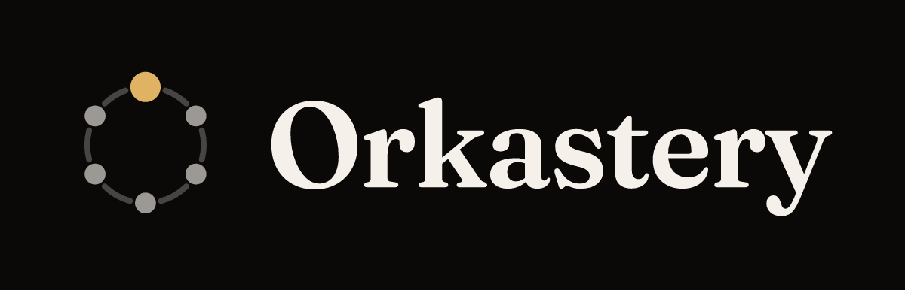

# Orkastery para o Claude Code



[English](README.md) · **Português**

> Uma fábrica de software de agentes de IA que prova o próprio trabalho: threads em paralelo, resultado verificado e decisão curta só quando importa.

Este plugin leva ao Claude Code o ciclo de condução do Orkastery. Cada tarefa vira uma thread com seis fases (GOAL, PLAN, GO, CHECK, SHIP, MASTER), conduzida pelo CLI `ork` local em uma worktree própria do git. Uma alegação só vale depois que o `ork verify` reexecuta o comando dela no HEAD real, e uma pergunta só chega a você quando a decisão é mesmo sua, com as alternativas e uma recomendada.

## O que o plugin traz

| Componente | O que é |
| --- | --- |
| 18 skills | Roteadores finos para o CLI `ork`: as skills de fase, as de governança (triagem de decisão, guardião da narrativa, guardião do roadmap, checagem de escopo), estado e rastro da thread e quatro revisores do CHECK |
| 8 comandos | `/orkastery:ork`, `/orkastery:goal`, `/orkastery:plan`, `/orkastery:go`, `/orkastery:check`, `/orkastery:ship`, `/orkastery:master`, `/orkastery:onboarding` |
| 6 subagentes | `ork-goal`, `ork-plan`, `ork-go`, `ork-check`, `ork-ship`, `ork-master`, um por fase, para cada fase rodar com contexto próprio |
| 5 checklists | As referências que os revisores aplicam: eixos de code review, segurança, padrões de teste, performance e definição de pronto |

A metodologia mora no CLI, não no plugin. Quando uma skill e o CLI divergem, vale o CLI.

## O que ele precisa

1. Node 20 ou mais novo e `git`.
2. O CLI, pelo npm: `npm install -g @orkastery/cli` e depois `ork doctor`.
3. No seu repositório: `ork init` e depois `ork mcp install --project . --host claude-code`. Esse segundo comando grava o servidor MCP `orkastery` no `.mcp.json` do projeto; as skills chamam as ferramentas dele.

Sem o CLI, as skills não têm para onde rotear. O plugin é para sessões do Claude Code abertas dentro de um repositório.

## Instalação

```bash
claude plugin marketplace add orkastery/orkastery
claude plugin install orkastery@orkastery
```

Depois abra uma sessão no seu repositório e diga `orkastery maestro`, ou rode `/orkastery:ork`.

## O que ele executa, envia e guarda

- O plugin só leva Markdown e imagens: skills, comandos, subagentes e checklists. Não tem hook, não tem servidor MCP próprio, não tem script e não faz requisição de rede.
- As instruções pedem ao Claude que rode o CLI `ork` local e que chame as ferramentas MCP `orkastery` que o `ork mcp install` configurou no seu projeto. Os dois rodam na sua máquina.
- O CLI `ork` guarda o estado em arquivos sob `.orkastery/` no seu repositório. Não roda serviço hospedado, não abre porta de rede e não chama API de modelo; enquanto uma fase roda, pode manter processos auxiliares locais daquela sessão, como o observador de sessão. Acesso à rede só acontece pelos programas que você já usa e configura, como o remoto do git quando uma thread é entregue.
- O guard `PreToolUse` e os sensores de sessão não fazem parte deste plugin. Eles vêm com `ork adapter install claude-code`, restritos a um projeto. Use um dos dois caminhos de instalação: os dois se chamam `orkastery`.

## Idioma

As skills e a saída do CLI estão em português do Brasil hoje.

## Links

- Código e issues: [github.com/orkastery/orkastery](https://github.com/orkastery/orkastery)
- Documentação: [orkastery.com](https://orkastery.com/)
- Privacidade: [PRIVACY.md](https://github.com/orkastery/orkastery/blob/main/marketplaces/PRIVACY.md)
- Relato de segurança: [SECURITY.md](https://github.com/orkastery/orkastery/blob/main/SECURITY.md)
- Licença: MIT
