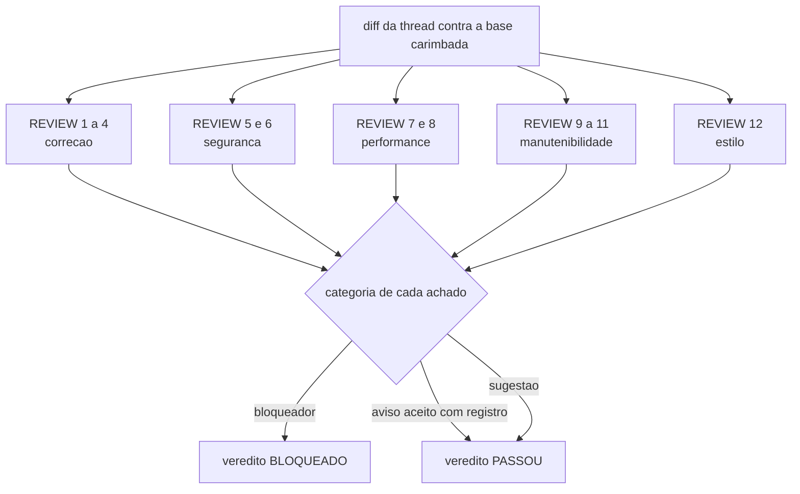

# Code Review Axes

Os cinco eixos que o CHECK percorre e a regra que categoriza todo achado. Nenhum eixo e opcional:
um eixo sem achado sai como "nenhum" explicito, porque silencio nao e evidencia de que se olhou.
Os itens sao numerados uma unica vez no arquivo inteiro. Cite um item como `REVIEW 7`.

**Fontes:** `core/src/verify.ts`, `core/src/gates.ts`, `core/src/claims.ts`,
[definition-of-done.md](definition-of-done.md), [security-checklist.md](security-checklist.md).

## Eixo 1, correcao

| # | Verificacao | Como se comprova |
|---|---|---|
| 1 | O codigo faz o que o PLAN disse que faria, e o que ele nao faz esta dito. Diferenca entre o entregue e o planejado e achado, mesmo quando o entregue e melhor. | Diff contra as tarefas do PLAN. |
| 2 | Casos de borda declarados no PLAN tem teste ou tem uma linha dizendo por que nao tem. | Suite reexecutada por `ork verify <thread>`. |
| 3 | Erro nao e engolido: todo caminho de falha ou trata, ou propaga com contexto, ou falha alto. Captura vazia e bloqueador. | Leitura do diff, apoiada pelos testes de caminho de falha. |
| 4 | Nenhum arquivo ou teste citado pelo runtime falta no diff. Citacao sem lastro e alucinacao, categorizada bloqueador. | `ork verify <thread>`, que reexecuta as claims no HEAD real. |

## Eixo 2, seguranca

| # | Verificacao | Como se comprova |
|---|---|---|
| 5 | A lista de [security-checklist.md](security-checklist.md) foi percorrida no escopo do diff e do historico da branch, e o resultado esta no relatorio. | A secao de seguranca do relatorio de CHECK, citando `SEC n` por achado. |
| 6 | Zero bloqueadores de seguranca. Esta e condicao dura: com um bloqueador aberto o veredito e BLOQUEADO, em qualquer modo de conducao, inclusive `#Auto`. | O veredito do relatorio contra a contagem de bloqueadores. O modo afrouxa a pausa, nunca a verificacao. |

## Eixo 3, performance

| # | Verificacao | Como se comprova |
|---|---|---|
| 7 | Custo assintotico das estruturas tocadas foi olhado quando o diff mexe em laco sobre colecao que cresce com o uso, e o achado traz a ordem de grandeza, nao um adjetivo. | Leitura do diff, com o numero medido quando ha como medir. |
| 8 | Regressao de performance so e afirmada com medida. Sem medida, o item sai `unavailable` com o motivo, nunca como suposicao apresentada como dado. | [performance-checklist.md](performance-checklist.md) e a origem declarada de cada numero. |

## Eixo 4, manutenibilidade

| # | Verificacao | Como se comprova |
|---|---|---|
| 9 | Nomes dizem o que a coisa e, e o codigo novo se parece com o codigo em volta: mesma densidade de comentario, mesmo idioma, mesmo idioma de nomes. Codigo que precisa de tour guiado para ser lido e achado. | Leitura do diff contra os arquivos vizinhos. |
| 10 | Duplicacao introduzida foi apontada com o lugar de onde ela deveria vir. Apontar duplicacao sem apontar o dono e sugestao vazia. | Diff contra o modulo que ja resolve o problema. |
| 11 | O diff nao carrega mudanca fora do escopo da thread. Melhoria oportunista sem tarefa e scope creep, e vira proposta, nunca commit escondido. | `git show --stat` contra os `touch_paths` do PLAN. |

## Eixo 5, estilo

| # | Verificacao | Como se comprova |
|---|---|---|
| 12 | Lint e formatador do projeto passam, e o que eles nao cobrem segue a convencao do arquivo vizinho. Estilo nunca vira bloqueador sozinho: ele e sugestao, exceto quando quebra ferramenta do projeto, e ai ja e correcao. | Os comandos de `verify:` do manifesto. |

## A regra de categorizacao

Todo achado, em qualquer eixo, sai com exatamente uma categoria.

- **Bloqueador**: impede o merge. Correcao errada, alucinacao com lastro provado, bloqueador de
  seguranca, quebra de contrato publico sem ratificacao.
- **Aviso**: passa apenas com registro nominal de quem aceitou e por que. Aviso aceito sem registro
  e o mesmo que aviso escondido.
- **Sugestao**: nao segura nada e nao exige registro; vira proposta de roadmap quando importa.

Achado sem categoria nao existe: e opiniao. E categoria nao se negocia por pressa: um bloqueador
rebaixado para aviso porque a entrega estava perto e o defeito de processo que este eixo existe
para tornar visivel.

## Recomendacoes (nao sao gate nesta maquina)

- Analise estatica alem do lint (complexidade ciclomatica, deteccao de duplicacao por ferramenta):
  este repositorio nao tem essas ferramentas, entao os eixos 4 e 5 sao percorridos por leitura e o
  relatorio diz isso, em vez de reportar um numero que ninguem produziu.
