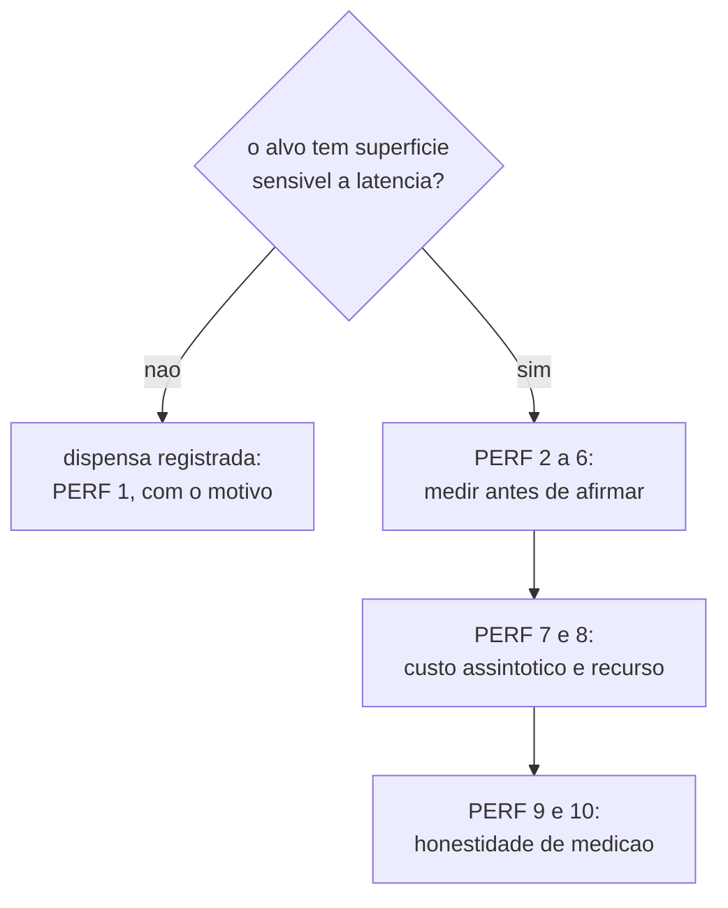

# Performance Checklist

A auditoria condicional: ela roda quando o alvo tem superficie que sofre com latencia, e quando nao
tem, ela e dispensada por um contrato escrito, nunca por esquecimento. Os itens sao numerados uma
unica vez no arquivo inteiro. Cite um item como `PERF 2`.

**Fontes:** [code-review-axes.md](code-review-axes.md) (eixo 3),
[definition-of-done.md](definition-of-done.md), `core/src/verify.ts`.

## O contrato de dispensa

| # | Verificacao | Como se comprova |
|---|---|---|
| 1 | Quando o alvo nao tem superficie web nem caminho sensivel a latencia, a auditoria e dispensada com uma linha dizendo qual e o alvo e por que ele nao tem essa superficie. Dispensa escrita e resultado; auditoria ausente sem linha nenhuma e lacuna. | A secao de performance do relatorio de CHECK, que existe sempre, mesmo quando o conteudo dela e a dispensa. |

## Medir antes de afirmar

| # | Verificacao | Como se comprova |
|---|---|---|
| 2 | Toda afirmacao de performance traz numero, unidade e como o numero foi obtido. "Ficou mais rapido" sem medida e opiniao, e opiniao nao passa em gate. | A tabela de medidas do relatorio, com o comando que produziu cada numero. |
| 3 | Ha medida antes e depois, na mesma maquina e no mesmo regime. Comparar medida de maquinas diferentes e comparar maquinas, nao codigo. | As duas execucoes, com a maquina e o regime declarados. |
| 4 | A medida foi repetida o suficiente para separar sinal de ruido, e a variacao esta dita. Uma unica execucao vira `estimated`, nunca `runtime_reported`. | O numero de repeticoes no relatorio. |
| 5 | O caminho medido e o caminho do usuario, nao o microbenchmark conveniente. Ganho em funcao que ninguem chama no caminho quente e sugestao, nao resultado. | O trecho do fluxo real que a medida cobre. |
| 6 | Regressao de performance detectada e categorizada como qualquer outro achado: bloqueador, aviso com registro, ou sugestao. | [code-review-axes.md](code-review-axes.md), regra de categorizacao. |

## Custo assintotico e recurso

| # | Verificacao | Como se comprova |
|---|---|---|
| 7 | Laco sobre colecao que cresce com o uso foi olhado, e a ordem de grandeza esta dita. Quadratico escondido em dado pequeno e defeito com data marcada. | Leitura do diff nos pontos que iteram sobre estado acumulado. |
| 8 | Trabalho repetido dentro de laco (leitura de arquivo, chamada de processo, parse do mesmo dado) foi apontado, ou dito que nao ha. No `ork`, ler o ledger inteiro por evento seria exatamente esse defeito. | Leitura do diff contra os pontos de I/O. |

## Honestidade de medicao

| # | Verificacao | Como se comprova |
|---|---|---|
| 9 | Todo numero carrega a origem: `runtime_reported`, `estimated` ou `unavailable`. E a mesma disciplina do gate de tokens do `ork`, que prefere dizer "nao medivel" a inventar uma ocupacao de janela. | A origem colada em cada numero do relatorio. |
| 10 | O que nao foi medido aparece como `unavailable` com o motivo, nunca como zero, nunca como ausencia silenciosa. Lacuna publicada e lacuna; lacuna escondida vira numero falso na proxima leitura. | A secao de metricas do relatorio. |

## Recomendacoes (nao sao gate nesta maquina)

- Ferramenta de profile de navegador (Lighthouse, traces de CPU): nao instalada aqui. Auditoria de
  performance web de alvo com superficie web sai `unavailable` com o motivo enquanto for assim.
- Benchmark continuo com historico: fora do alcance desta maquina; comparacao antes e depois e
  feita na propria thread, com `PERF 3` explicito.
