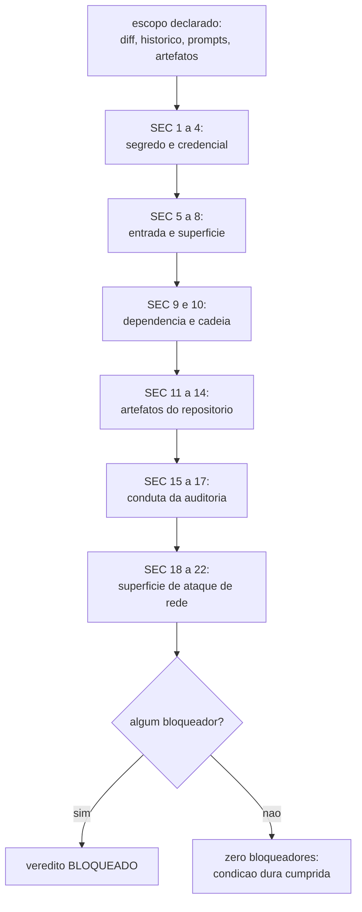

# Security Checklist

A lista normativa que a auditoria de seguranca do CHECK percorre, cuja condicao dura de passagem e
zero bloqueadores no relatorio consolidado. Ela eleva verificacao que ja existe no nucleo e nao
inventa nenhuma. Os itens sao numerados uma unica vez no arquivo inteiro. Cite um item como `SEC 5`.

**Fontes:** `core/src/policies.ts` (padroes de segredo e policies bloqueantes),
`core/src/doctor.ts`, `core/src/ship.ts`, `core/src/gates.ts`,
`core/src/superficie.ts` (varredura deterministica da superficie de ataque de rede,
regras SP8..SP12 do pack `security-privacy`),
[definition-of-done.md](definition-of-done.md).

## Segredo e credencial

| # | Verificacao | Como se comprova |
|---|---|---|
| 1 | Nenhum segredo na arvore de trabalho: token, chave de API, senha, bloco de chave privada, string de conexao e string de alta entropia com cara de credencial, incluindo arquivos `.env`, fixtures de teste e configs de exemplo. | Leitura do diff da branch mais varredura da arvore. O relatorio nomeia a ferramenta usada ou diz que a passagem foi manual. |
| 2 | Nenhum segredo no historico atras da branch. Segredo commitado e depois apagado continua vazado. | `git log -p <base>..HEAD` sobre o intervalo inteiro, nao so a arvore. Bloqueador ate a credencial ser rotacionada e o historico limpo, com a rotacao verificada e nao prometida. |
| 3 | Nenhuma credencial real em prompt despachado. O gate `phase.dispatch` do `ork` avalia a policy `segredo_em_prompt` ANTES de gravar o prompt em disco: prompt reprovado nao chega a existir como arquivo, porque gravar um prompt com credencial cria um segundo vazamento dentro do proprio repositorio. | `ork phase run` sai com motivo tipado `policy.violation`; o ledger registra o nome do padrao e a linha, nunca o trecho casado. |
| 4 | Nenhuma credencial real em artefato de thread, ledger, saida de comando capturada ou no proprio relatorio de auditoria. Relatorio de vazamento que imprime o segredo e um segundo vazamento. | Leitura dos artefatos que a thread produziu. Placeholder redigido passa e e declarado como tal; credencial e referenciada por localizacao e forma redigida. |

## Entrada e superficie

| # | Verificacao | Como se comprova |
|---|---|---|
| 5 | Toda entrada que atravessa fronteira de confianca e validada no lado que confia, e nao no lado que chama. Validacao so no cliente conta como ausente. | Leitura do diff nos pontos de entrada tocados. |
| 6 | Nenhuma concatenacao de entrada em SQL, shell, caminho de arquivo ou template renderizado. O nucleo `ork` executa comando por lista de argumentos, sem shell interpolado, e o mesmo padrao vale para o codigo revisado. | Leitura do diff; qualquer construcao de comando por concatenacao e bloqueador. |
| 7 | Autenticacao e autorizacao verificadas por operacao, nao por tela: quem pode ler nem sempre pode escrever, e o teste que prova isso existe ou o achado e aviso com registro. | Testes de autorizacao na suite, reexecutados por `ork verify`. |
| 8 | Desserializacao de dado nao confiavel nao instancia tipo arbitrario, e todo `JSON.parse` de arquivo de estado tem erro tratado com o caminho no texto do erro. | Leitura do diff sobre os pontos de leitura de estado. |

## Dependencia e cadeia de suprimento

| # | Verificacao | Como se comprova |
|---|---|---|
| 9 | Nenhuma dependencia nova sem justificativa no PLAN. Dependencia que entra sem tarefa e scope creep com superficie de ataque. | Diff dos arquivos de manifesto de pacote contra as tarefas do PLAN. |
| 10 | Vulnerabilidade conhecida nas dependencias declaradas foi consultada, e o resultado esta no relatorio com a data e a ferramenta. Onde nao ha ferramenta, o item sai `unavailable` com o motivo. | `npm audit` onde ha dependencia de producao declarada. |

## Artefatos do repositorio

| # | Verificacao | Como se comprova |
|---|---|---|
| 11 | Nenhum comando destrutivo em massa em script, hook ou documentacao que alguem vai copiar: `rm -rf` com caminho variavel nao ancorado, `git add -A`, `git checkout -- .`, `git reset --hard` sem alvo, `push --force`. | Varredura dos diretorios tocados. O guard `PreToolUse` do adaptador Claude Code bloqueia estes mesmos comandos em tempo de execucao. |
| 12 | Nenhum push direto na branch base. A policy `push_direto_na_base` do manifesto e bloqueante e reprova entrega em que origem e destino sao a mesma branch. | `ork ship` sai com `policy.violation` antes de tocar no remoto. |
| 13 | Nenhum despacho por provider pago quando a politica e `subscription-only`. Variavel de ambiente que redireciona o `claude` para provider pago e bloqueador, porque o custo aparece na fatura e nao no gate. | `ork doctor` e a policy `provider`, avaliada no gate `phase.dispatch` e no `ship`. |
| 14 | Permissao de arquivo criado por script nao amplia acesso: nada de `chmod 777`, nada de arquivo de estado com bit de execucao. | Leitura do diff dos scripts e hooks. |

## Conduta da auditoria

| # | Verificacao | Como se comprova |
|---|---|---|
| 15 | O escopo auditado esta declarado antes dos achados: quais diretorios, qual intervalo de historico, quais artefatos. Auditoria sem escopo declarado nao e reproduzivel e nao vale como evidencia. | O cabecalho da secao de seguranca do relatorio. |
| 16 | Cada achado sai categorizado bloqueador, aviso ou sugestao, com o item `SEC n` que ele viola. Achado sem numero de item e opiniao. | A tabela de achados do relatorio. |
| 17 | Ausencia de achado e afirmada como resultado de verificacao, com o que foi olhado. "Nada encontrado" sem escopo e diferente de "auditado e limpo", e a diferenca fica escrita. | O texto da secao, contra `SEC 15`. |

## Superficie de ataque de rede

O que o produto PUBLICA. Os itens 5 a 8 olham o dado que entra por uma fronteira; estes olham
a fronteira em si: quais rotas e endpoints existem, quem pode chama-los e a que custo. O pack
`security-privacy` audita esta secao com varredura DETERMINISTICA (`ork audit surface`, regras
SP8 a SP12), que roda dentro de `ork audit run security-privacy` e grava cada achado no board
de divida com evidencia `arquivo:linha` e o comando que a reexecuta.

| # | Verificacao | Como se comprova |
|---|---|---|
| 18 | Toda rota de servidor HTTP/API declarada em producao passa por camada de autenticacao/autorizacao, ou e publica por decisao registrada (login, cadastro, health, webhook assinado). Rota publica por esquecimento e bloqueador. | `ork audit surface --regra SP8`. O achado traz a definicao da rota com `arquivo:linha`, o framework reconhecido e o comando que prova a ausencia de guarda no bloco da rota ou no arquivo. |
| 19 | Endpoint de administracao ou operacao (admin, console, debug, swagger/openapi, health detalhado, metricas, `pprof`, metadados de cluster) nao esta acessivel de fora: ha restricao de rede (allowlist, rede interna) ou oAuth/basic auth. Health que devolve versao, hostname, banco ou dependencia e endpoint de operacao, nao de saude. | `ork audit surface --regra SP9`, mais a configuracao de rede ou o middleware citado com `arquivo:linha`. |
| 20 | Rota exposta tem limite de taxa por IP e por identidade, com atencao especial ao caminho de autenticacao, recuperacao de senha, OTP, busca, exportacao e qualquer rota publica que altera estado. Sem limite, uma requisicao paga um brute-force. | `ork audit surface --regra SP10`. Middleware de limite, cota ou rpm citado na rota, no roteador que a monta ou no gateway, com o arquivo e a linha. |
| 21 | CORS nao combina origem global com credenciais, e origem aberta nao aparece em servico que trafega dado pessoal ou sessao. Lista explicita de origens, sempre. | `ork audit surface --regra SP11`. O achado cita a configuracao com `arquivo:linha`, o curinga de origem e a flag de credenciais, cada um com o comando que o reexecuta. |
| 22 | A definicao da rota declara o esquema do payload na borda (schema, validador, modelo tipado), e a recusa do payload invalido acontece antes do handler. Complementa o item 5, que olha o USO do dado dentro do handler. | `ork audit surface --regra SP12`, com a definicao da rota e a ausencia de esquema no ponto de entrada. |

Achado que a varredura marca com confianca `baixa` (ha middleware que o `ork` nao classifica,
framework nao reconhecido, marcador presente no arquivo e ausente no bloco da rota) sai como
**aviso que pede confirmacao humana**, nunca como bloqueador: a maquina diz onde olhar, e quem
decide se procede e a pessoa.

## Recomendacoes (nao sao gate nesta maquina)

- Varredura por ferramenta dedicada de segredo (gitleaks, trufflehog): nao instalada aqui. Os
  padroes de `core/src/policies.ts` cobrem chave da Anthropic, da OpenAI, de acesso AWS, token do
  GitHub, chave privada PEM e atribuicao de segredo em texto, e a auditoria diz que cobriu essas
  classes e nao outras.
- Analise de composicao de software e assinatura de artefato: fora do alcance desta maquina; sai
  `unavailable` com o motivo, nunca como passagem silenciosa.
- Teste dinamico da superficie (varredura de portas, fuzzing de endpoint, DAST): fora do alcance.
  A varredura dos itens 18 a 22 e ESTATICA e le a definicao de rota no codigo: ela nao ve rota
  gerada em tempo de execucao, nem proxy, gateway ou WAF na frente do servico. Onde houver essa
  camada, o achado continua valendo como pergunta e e resolvido com a evidencia da camada, nunca
  em silencio.
