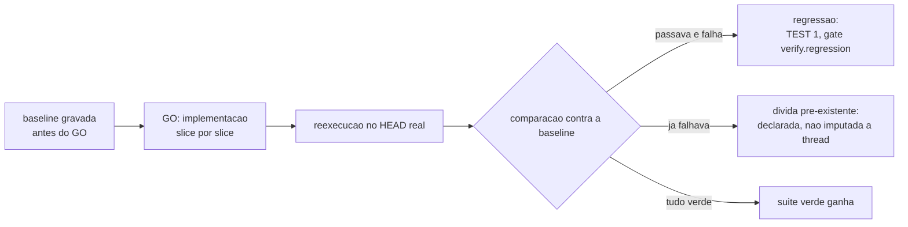

# Testing Patterns

O que uma suite precisa provar e como uma suite verde e ganha honestamente. Os itens sao numerados
uma unica vez no arquivo inteiro. Cite um item como `TEST 3`.

**Fontes:** `core/src/verify.ts` (baseline e reexecucao), `core/src/claims.ts`,
[definition-of-done.md](definition-of-done.md), [code-review-axes.md](code-review-axes.md).

## O que a suite prova

| # | Verificacao | Como se comprova |
|---|---|---|
| 1 | Existe baseline gravada antes do GO. Sem ela, uma falha nao distingue regressao de divida pre-existente, e a thread leva culpa por defeito que ja estava la, ou pior, esconde o que ela mesma quebrou. | `ork verify <thread> --baseline` antes do GO. |
| 2 | Todo criterio de sucesso do GOAL tem um comando que o comprova. Criterio que nao vira comando nao e criterio, e adjetivo. | As claims da thread, com `--verificar`. |
| 3 | Numa demanda de correcao, existe um teste que reproduz o defeito e que falhava antes da correcao. Correcao cujo defeito nunca foi reproduzido nao pode provar que corrigiu nada. | O teste novo, rodado contra o commit anterior a correcao. |
| 4 | O caminho de falha tem teste, nao so o caminho feliz. Suite que so exercita o sucesso mede otimismo. | Leitura da suite contra os casos de borda do PLAN. |
| 5 | Teste novo falha quando a implementacao e revertida. Teste que passa com e sem a mudanca nao testa a mudanca. | Reverter localmente e rodar, ou mutar a linha central e conferir a reprovacao. |

## Como a suite verde e ganha

| # | Verificacao | Como se comprova |
|---|---|---|
| 6 | A suite roda no HEAD real, no diretorio de trabalho da thread. Passagem relatada por agente nao e passagem. | `ork verify <thread>` reexecuta os comandos do manifesto e as claims, e carimba o commit real. |
| 7 | Nenhum teste foi desligado, marcado para pular ou afrouxado para fechar a entrega. Pular teste e mudanca de escopo com registro, nunca ajuste de rota silencioso. | Diff sobre os arquivos de teste, procurando teste removido, `skip` e assercao relaxada. |
| 8 | Nenhuma assercao foi trocada pelo valor que o codigo produz hoje sem que alguem tenha dito por que o valor certo mudou. Ajustar o esperado ao observado e a forma mais comum de transformar defeito em contrato. | Diff das assercoes contra a intencao declarada no PLAN. |
| 9 | Teste nao depende de rede, de credencial paga nem de relogio de parede. Fixture deterministica e o padrao; o que precisa de mundo externo fica fora do gate e e declarado. | Rodar a suite offline. No `ork`, os canarios de `ork eval` montam repositorio git temporario e nao tocam a rede. |
| 10 | Teste nao depende de outro teste nem da ordem de execucao. Estado compartilhado entre casos e defeito, mesmo quando a suite esta verde hoje. | Rodar em ordem embaralhada ou isoladamente o caso suspeito. |

## Contagem e cobertura

| # | Verificacao | Como se comprova |
|---|---|---|
| 11 | A contagem de testes reportada e a que o comando imprimiu, colada da saida real. Numero de suite digitado de memoria nao e evidencia. | A saida do runner no relatorio da entrega. |
| 12 | Cobertura e reportada com origem: `runtime_reported` quando a ferramenta mediu, `estimated` quando alguem estimou e disse que estimou, `unavailable` quando nao ha ferramenta. Lacuna e publicada como lacuna, nunca como zero. | A secao de metricas do relatorio. |

## Recomendacoes (nao sao gate nesta maquina)

- Cobertura por ferramenta: este repositorio nao tem uma instalada, entao a cobertura sai
  `unavailable` por `TEST 12`, e nao estimada por conveniencia.
- Teste de mutacao para provar `TEST 5` de forma automatica: fora do alcance desta maquina; a prova
  aqui e manual e declarada como manual.
