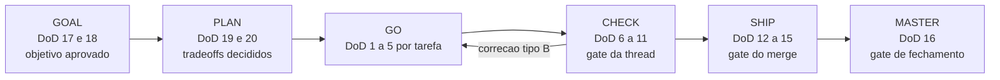

# Definition of Done

As condicoes universais que uma entrega cumpre antes de ser chamada de pronta. Consolida os gates
que o nucleo `ork` ja executa e nao inventa doutrina propria. Os itens sao numerados uma unica vez
no arquivo inteiro, para que um reviewer escreva um numero e todo humano e toda skill resolvam a
mesma linha. Cite um item como `DoD 4`.

**Fontes:** `core/src/phase.ts` (contrato das fases), `core/src/claims.ts`, `core/src/verify.ts`,
`core/src/gates.ts`, `core/src/policies.ts`, `core/src/ship.ts`, `core/src/master.ts`,
`core/src/worktree.ts`, `core/src/leases.ts`, `core/src/retry.ts`, `core/src/fix.ts`,
`core/src/ratelimit.ts` (bloco B3: retry tipado, GO-FIX/CHECK-REVERIFY e fila de rate limit).

## Toda tarefa, antes de o GO chamar de pronta

| # | Verificacao | Como se comprova |
|---|---|---|
| 1 | Um commit atomico por tarefa, no maximo cinco arquivos alterados, com a thread e a tarefa na mensagem (exemplo: `ork-checkout T3: extrai o calculo de frete`). | `git log --oneline` e `git show --stat` na branch da thread. Acima de cinco arquivos a tarefa volta ao PLAN para ser fatiada. |
| 2 | O verify da tarefa declarado no PLAN foi executado e passou. | Rode o comando. Passagem relatada nao e passagem: `ork verify <thread>` reexecuta no HEAD real. |
| 3 | Verificacao anti-alucinacao: todo arquivo que o runtime citou existe no diff e todo teste que ele citou existe e passa. | Toda alegacao vira `ork claims add ... --verificar "<comando>"`, e `ork verify <thread>` reexecuta. Divergencia sai como motivo tipado `claims.failed`. |
| 4 | Trabalho dentro da worktree da thread, com a base carimbada no `thread.json`, nunca na arvore principal. | `ork worktree audit <thread>` confere no proprio git e sai diferente de zero se divergir. |
| 5 | Toda decisao delegada relevante foi registrada no ledger com quem decidiu, com que evidencia e por que. O qualificador carrega peso: formatacao e nome interno tambem sao delegaveis, e exigir evento para cada um deles e escalacao indevida, que a auditoria pesa igual a subclassificacao. | `ork phase list <thread>` sobre o `ledger.jsonl` da thread. |

## Toda thread, antes de o gate de CHECK passar

| # | Verificacao | Como se comprova |
|---|---|---|
| 6 | A suite completa esta verde, incluindo os comandos de `verify:` do manifesto, e a saude de codigo passa: typecheck, lint e cobertura com origem declarada. | `ork verify <thread>`. Todo numero carrega `runtime_reported`, `estimated` ou `unavailable`; lacuna e publicada como lacuna, nunca como zero. |
| 7 | A comparacao e contra a baseline gravada antes do GO, separando regressao de divida pre-existente. | `ork verify <thread> --baseline` antes do GO e `ork verify <thread>` depois. Comando que passava na baseline e falha agora sai como `verify.regression`; o que ja falhava antes sai como divida, nao como culpa da thread. |
| 8 | Os cinco eixos de review (correcao, seguranca, performance, manutenibilidade, estilo) trazem achados ou um "nenhum" explicito, cada um categorizado bloqueador, aviso ou sugestao. | A tabela dos cinco eixos do relatorio de CHECK, conforme [code-review-axes.md](code-review-axes.md). |
| 9 | A auditoria de seguranca reporta zero bloqueadores, e a auditoria de performance web ou rodou ou declara por que o alvo nao tem superficie web. | As secoes de auditoria do relatorio, conforme [security-checklist.md](security-checklist.md) e [performance-checklist.md](performance-checklist.md). |
| 10 | Correcoes classificadas com honestidade: tipo A e uma linha ou equivalente, registrada, com as verificacoes afetadas reexecutadas; tipo B devolveu a tarefa ao GO, e esta rodada de CHECK e a reexecucao completa. | `ork fix open <thread>` deriva uma correcao por motivo tipado, com a spec exata e o comando que a julga; `ork fix reverify <thread>` da o veredito POR correcao e RECUSA reexecucao parcial quando ha tipo B. Os eventos `go_fix_opened` e `check_reverify` do ledger contra as contagens do relatorio. Estas contagens medem a qualidade do PLAN e do GO, nao a do reviewer. |
| 11 | O relatorio esta no diretorio da thread com exatamente um veredito (PASSOU, PRECISA DE MUDANCA, BLOQUEADO), todo aviso aceito tem seu registro, e o gate foi resolvido pelo caminho certo. | `ork gate approve <thread> evidencias --por <quem>` para decisao humana, ou o evento de decisao autonoma do modo, que so um veredito PASSOU pode tomar. Falha de verify, falha anti-alucinacao, qualquer CHECK com correcao tipo B, desvio de envelope, veredito diferente de PASSOU e emergencia sobem sempre para o humano, em qualquer modo. |

## Todo merge, antes de o SHIP fechar

| # | Verificacao | Como se comprova |
|---|---|---|
| 12 | Guarda de contrato: nada no diff final muda contrato publico versionado (schema de telemetria, contrato de interface, layout de estado, tipos de evento) sem decisao de classe 2 ratificada. | `git diff <base>...HEAD` sobre esses arquivos e o id do gate que ratificou, no ledger. Sem ratificacao nao ha merge. |
| 13 | O merge passou pela fila serializada, atualizado contra a base mais recente, revalidado por inteiro sempre que a atualizacao trouxe mudanca, com a guarda de `DoD 12` reexecutada contra o diff final. | `ork ship <thread> --para <base>` toma o lease `main-tree`; a atualizacao pode trazer mudanca que toca contrato, entao um veredito calculado antes dela descreve um diff que nao existe mais. |
| 14 | O push foi provado por comando, nao relatado. | O `ork ship` compara o sha local com `git ls-remote` no remoto e grava `pushVerificado` no ledger. Push relatado sem sha do remoto conta como push nao acontecido. |
| 15 | Passo irreversivel so acontece com autorizacao do modo: push, merge e delecao exigem a pausa que a #TAG previu ou uma autorizacao antecipada registrada. | `ork gate approve <thread> push --por <quem>`, visivel em `ork phase list <thread>`. |

## Todo fechamento, antes de a thread morrer

| # | Verificacao | Como se comprova |
|---|---|---|
| 16 | Existe MASTER log valido contra o contrato congelado `ork.master-log/v1`, com POSTMORTEM tipado, classes de falha do catalogo fixo, score inteiro de 0 a 5 e justificativa nao vazia. Uma entrega sem MASTER log nao aconteceu. | `ork master <thread> --score N --justificativa "<texto>"`. O comando recusa score fora da escala, score sem justificativa e classe fora do catalogo, e nao grava nada quando recusa. |

## Toda thread, no seu inicio

| # | Verificacao | Como se comprova |
|---|---|---|
| 17 | O objetivo do GOAL e verificavel: criterios observaveis (latencia, cobertura, comportamento), nunca adjetivos. Numa demanda de correcao, reproduzir o defeito e criterio obrigatorio. | O GOAL vira claims com comando de verificacao; criterio que nao vira comando nao e criterio. |
| 18 | As premissas estao escritas. Premissa implicita e a maior fonte de retrabalho e e tratada como defeito de processo, nao como esperteza. | A secao de premissas do GOAL e as claims que as amarram. |
| 19 | O PLAN traz tarefas com `touch_paths` consultaveis e um verify executavel por tarefa. | O PLAN da thread e os leases `path:<glob>` que ele justifica. |
| 20 | As decisoes D1..Dn tem domicilio unico e ficam travadas depois de decididas; reabrir e decisao nova, com registro, nunca edicao silenciosa. | O ledger da thread, onde a decisao aparece com quem decidiu e quando. |

## Recomendacoes (nao sao gate nesta maquina)

- Cobertura de teste com numero: este repositorio nao tem ferramenta de cobertura instalada, entao
  a cobertura e reportada `unavailable` em vez de estimada.
- Auditoria de dependencia por ferramenta: `npm audit` roda onde ha dependencia declarada; o nucleo
  `ork` tem apenas dependencias de desenvolvimento, e isso e dito no relatorio em vez de virar um
  zero conveniente.
